# DesktopBuddy — Full Code Listing

## `Package.swift`
```swift
// swift-tools-version: 5.9
import PackageDescription

let package = Package(
    name: "DesktopBuddy",
    platforms: [
        .macOS(.v14),
    ],
    products: [
        .executable(
            name: "DesktopBuddy",
            targets: ["DesktopBuddy"]
        ),
    ],
    dependencies: [
        .package(url: "https://github.com/sparkle-project/Sparkle", from: "2.0.0"),
    ],
    targets: [
        .executableTarget(
            name: "DesktopBuddy",
            dependencies: [
                .product(name: "Sparkle", package: "Sparkle"),
            ],
            path: "Sources/DesktopBuddy",
            resources: [
                .copy("Resources"),
            ]
        ),
        .testTarget(
            name: "DesktopBuddyTests",
            dependencies: ["DesktopBuddy"],
            path: "Tests/DesktopBuddyTests"
        ),
    ]
)
```

## `Info.plist`
```xml
<?xml version="1.0" encoding="UTF-8"?>
<!DOCTYPE plist PUBLIC "-//Apple//DTD PLIST 1.0//EN" "http://www.apple.com/DTDs/PropertyList-1.0.dtd">
<plist version="1.0">
<dict>
    <key>CFBundleDisplayName</key>
    <string>DesktopBuddy</string>
    <key>CFBundleExecutable</key>
    <string>DesktopBuddy</string>
    <key>CFBundleIdentifier</key>
    <string>com.openai.desktopbuddy</string>
    <key>CFBundleInfoDictionaryVersion</key>
    <string>6.0</string>
    <key>CFBundleName</key>
    <string>DesktopBuddy</string>
    <key>CFBundlePackageType</key>
    <string>APPL</string>
    <key>CFBundleShortVersionString</key>
    <string>0.1.0</string>
    <key>CFBundleVersion</key>
    <string>1</string>

    <key>LSUIElement</key>
    <true/>

    <key>NSAppleEventsUsageDescription</key>
    <string>DesktopBuddy 仅在你启用相关功能时读取必要的应用状态信息，例如前台应用与开发工作流提示。</string>
    <key>NSMicrophoneUsageDescription</key>
    <string>DesktopBuddy 未来版本可选支持语音交互；当前版本不会在未授权时访问麦克风。</string>
    <key>NSSupportsAutomaticGraphicsSwitching</key>
    <true/>

    <key>NSPrincipalClass</key>
    <string>NSApplication</string>
</dict>
</plist>
```

## `README.md`
```text
# DesktopBuddy

一个原生 macOS 桌面 AI 伙伴宠物示例工程。

## 构建方式

1. 在 macOS 14+ 上安装 Xcode。
2. 打开 `Package.swift`，让 Xcode 生成工程。
3. 在 target 的 Info 里指定本仓库根目录 `Info.plist`。
4. 运行后会以菜单栏应用启动，不会出现在 Dock。

## 运行前建议

- 在“设置”中填入 Anthropic API Key。
- 若希望统计全局键盘活跃度，请在系统设置中授予辅助功能权限。
- 直接分发场景下，发布时可在 `Info.plist` 中补充 `SUFeedURL` 以启用 Sparkle 自动更新。

## 当前实现说明

- 参考 Claude buddy 源码，移植了确定性宠物骨骼生成算法。
- 若未提供像素 spritesheet PNG，应用会自动回退到内置 ASCII 渲染。
- AI 名字与个性支持首次孵化时调用 Claude 生成；若没有 API Key，会走本地确定性回退方案。
```

## `TechnicalDesign.md`
```text
# DesktopBuddy — macOS 桌面 AI 伙伴宠物技术设计

## Part 1：技术架构设计

### 1.1 技术栈选择与论证

#### 最低系统版本：macOS 14.0 Sonoma

选择理由：

1. 这是你给定的硬约束。
2. 这能让工程直接围绕现代 AppKit / SwiftUI / Swift Concurrency 写法组织，不用为了旧系统兼容加大量分支。
3. `NSWindow.CollectionBehavior`、多 Space 悬浮、全屏辅助窗口、菜单栏应用、`URLSession` 并发流式读写，在 Sonoma 上的行为最可控。
4. 这类“桌面宠物”应用本质上依赖系统窗口层级、多 Space 行为、AppKit/SwiftUI 混编，而不是 iOS 式单场景模型；越新的桌面系统越值得优先优化。

#### Swift 版本、Xcode 版本

- **语言基线**：Swift 5.9+  
- **推荐开发基线**：Xcode 16+  
- **工程风格**：保持 Swift 5.9 语法兼容，不依赖 Swift 6-only 特性

为什么这样定：

- 你的约束是 Swift 5.9+，所以我把代码写在 Swift 5.9 能覆盖的风格范围内。
- 由于 Apple 的分发工具链会持续前移，真正发版时应使用当期可提交的最新版 Xcode；但工程本身不绑死某个“最新 beta 特性”。
- 这让团队既能在今天开发，也能在上架前平滑升级构建工具链。

#### SwiftUI 还是 AppKit？

**最终选择：混合架构（AppKit 为壳，SwiftUI 为内容）**

原因：

- **AppKit 负责**  
  - 透明无边框窗口  
  - 窗口层级与 Space 行为  
  - 菜单栏图标 `NSStatusItem`  
  - 前台应用观察  
  - 全局输入监测  
  - 真实桌面悬浮与定位
- **SwiftUI 负责**  
  - 设置面板  
  - 气泡 UI  
  - 宠物组合视图  
  - 未来主题皮肤、配色与偏好表单

为什么不是纯 SwiftUI：

- 纯 SwiftUI 很适合“窗口里的界面”，不适合“像系统浮层一样”的桌面宠物壳层。
- 宠物窗口需要精细控制 `NSWindow` 行为，而这些都属于 AppKit 的强项。
- 最佳实践是：**Windowing / shell 用 AppKit，content 用 SwiftUI**。

#### 动画引擎选择

| 方案 | 优点 | 缺点 | 结论 |
|---|---|---|---|
| SpriteKit | 天然适合 2D 帧动画、粒子、图层管理 | 对“极轻量单宠物 overlay”来说稍重；与透明桌面壳层整合不如直接 AppKit/SwiftUI 轻 | 可作为 V2 |
| Core Animation + 手写帧切换 | 轻、直接、与 AppKit 贴合、最容易做 deterministic 状态机 | 需要自己管帧序列和状态 | **V1 最优** |
| Metal | 性能极强 | 明显过度设计 | 不选 |
| Lottie | 适合矢量角色动效 | 不适合像素表、换帽子/眼睛/稀有度 runtime 组合 | 不选 |
| HEVC 透明视频 | 视觉高级，适合预渲染 | 不可交互，不适合换装、换眼、稀有粒子、状态机 | 不选 |

**最终选择：Core Animation 思路 + 自定义 spritesheet / ASCII fallback 帧动画器**

理由：

1. 这个应用同时要做“透明 overlay 窗口”与“像素帧动画”；窗口壳层已经是 AppKit，继续用轻量自定义动画器最顺。
2. 需要 runtime 组合帽子、眼睛、稀有闪光、状态机切换；自己控帧比用视频和 Lottie 更自然。
3. V1 只有一只宠物，不需要 SpriteKit 的场景图复杂度。
4. 等 V2 加粒子、技能特效、迷你道具、拖拽交互时，再评估 SpriteKit 值不值得整体迁移。

#### AI 对话后端

**最终选择：Claude API 为主，保留本地 LLM Provider 扩展位**

为什么不是纯本地：

- 桌面宠物的“人格感”来自更强的语言质量、短句控制、语气稳定性和上下文一致性。
- 初版产品最重要的是“人格体验”，不是“完全离线”。

为什么不是只做单一远端死耦合：

- 用户未来可能希望接 Ollama / llama.cpp。
- 因此架构上应该抽象成：
  - `ConversationManager`
  - `ClaudeAPIClient`
  - 未来 `LocalLLMProvider`

**V1 实装**：Claude API  
**V2 扩展**：本地模型 fallback / 切换

#### 数据持久化

**最终选择：Application Support 下 JSON 文件 + Keychain**

组合方式：

- `settings.json`
- `companion.json`
- `growth.json`
- `conversation.json`
- API key 放 Keychain

为什么不用 Core Data：

- 现在的数据模型很小、结构稳定、关系简单。
- 宠物状态、成长值、对话历史并不需要复杂查询。
- JSON 更透明，调试和迁移都更舒服。

为什么不用 UserDefaults 做全部：

- UserDefaults 适合“小量偏好”，不适合完整对话历史和成长状态。
- JSON 文件更适合审计和备份。

#### 网络层

**最终选择：原生 URLSession + async/await + AsyncBytes 流式读取**

理由：

- Anthropic 流式响应本质上是 SSE，`URLSession.bytes(for:)` 足够直接。
- 避免引入 Alamofire 这类额外依赖。
- 原生并发与 macOS app 生命周期更贴合。

#### 自动更新

**最终选择：Sparkle（直接分发场景）**

原因：

- 对原生 macOS 桌面工具，这是最成熟的自动更新方案之一。
- 适合菜单栏 / Dockless / direct distribution 形态。
- 支持 appcast、增量更新、标准用户更新 UI。

#### 分发方式

**最终建议：直接分发 `.dmg` 为主，后续可补 Homebrew Cask；不把 Mac App Store 作为首发主路径**

原因：

1. 这是一个“菜单栏 + 桌面 overlay + 工作状态观察”的工具型 app，direct distribution 更灵活。
2. Sparkle 能直接把发布、更新链路打通。
3. Homebrew Cask 适合面向开发者传播。
4. Mac App Store 不是不能做，但首发阶段会把窗口行为、权限说明、上架审核都变得更重。

---

### 1.2 系统架构图

```mermaid
graph TD
    subgraph AppShell["App Shell / AppKit"]
        A["DesktopBuddyApp.swift"]
        B["AppCoordinator.swift"]
        C["OverlayWindow.swift"]
        D["WindowManager.swift"]
        E["DockPositionTracker.swift"]
        F["MenuBarManager.swift"]
    end

    subgraph UISwiftUI["UI / SwiftUI"]
        G["PetOverlayView.swift"]
        H["SpeechBubbleView.swift"]
        I["SettingsView.swift"]
    end

    subgraph CompanionCore["Companion Core"]
        J["CompanionModel.swift"]
        K["CompanionGenerator.swift"]
        L["SpriteDefinitions.swift"]
        M["AnimationState.swift"]
        N["IdleSequencer.swift"]
        O["SpriteAnimator.swift"]
        P["HeartBurstEffect.swift"]
        Q["EvolutionStage.swift"]
        R["GrowthTracker.swift"]
    end

    subgraph Intelligence["AI & Behavior"]
        S["CompanionPromptBuilder.swift"]
        T["ClaudeAPIClient.swift"]
        U["ConversationManager.swift"]
        V["SoulGenerator.swift"]
        W["WorkStateObserver.swift"]
        X["ReactiveComment.swift"]
    end

    subgraph Persistence["Persistence"]
        Y["StorageManager.swift"]
        Z["KeychainManager.swift"]
    end

    subgraph External["External"]
        AA["Anthropic Messages API"]
        AB["macOS Accessibility / App Activity"]
        AC["Sparkle"]
    end

    A --> B
    B --> C
    B --> D
    B --> F
    B --> Y
    B --> R
    B --> W
    B --> X
    B --> U
    B --> V
    B --> O

    D --> C
    D --> E
    D --> G
    G --> H
    I --> B

    O --> L
    O --> M
    O --> N
    O --> P
    K --> J
    V --> S
    U --> S
    U --> T
    W --> AB
    T --> AA
    B --> AC

    Y --> Z
    Y --> J
    Y --> Q
```

#### 模块边界说明

- **AppKit 层**：真正处理桌面窗口、Space、菜单栏、系统观察
- **SwiftUI 层**：只负责视图内容和设置表单
- **Companion Core**：宠物生成、动画、成长、渲染
- **AI & Behavior**：人格提示词、流式对话、主动评论
- **Persistence**：状态存储与密钥安全

---

### 1.3 目录结构

```text
DesktopBuddy/
├── Package.swift                      # Swift Package 定义与 Sparkle 依赖
├── Info.plist                         # 应用基础配置，含 LSUIElement 等关键键
├── README.md                          # 构建与运行说明
├── TechnicalDesign.md                 # 详细技术设计文档
├── AllCode.md                         # 所有代码文件的完整拼接版
├── Sources/
│   └── DesktopBuddy/
│       ├── App/
│       │   ├── DesktopBuddyApp.swift  # 应用入口与 NSApplication 生命周期
│       │   ├── AppCoordinator.swift   # 全局装配、依赖注入与业务编排
│       │   └── AppStateStore.swift    # 内存态单一数据源，供 UI/服务共享
│       ├── Models/
│       │   ├── CompanionModel.swift   # 稀有度、物种、眼睛、帽子、设置等基础模型
│       │   ├── EvolutionStage.swift   # 进化阶段与成长状态
│       │   └── ReactiveComment.swift  # 主动评论规则引擎与决策结构
│       ├── Windows/
│       │   ├── OverlayWindow.swift    # 透明无边框桌面宠物窗口
│       │   ├── DockPositionTracker.swift # 基于 visibleFrame 推断 Dock 侧与轨道
│       │   └── WindowManager.swift    # 窗口创建、定位、漂浮与移动管理
│       ├── Companion/
│       │   ├── CompanionGenerator.swift # Mulberry32 + hash 确定性生成器
│       │   └── SpriteDefinitions.swift  # 18 个物种 ASCII 帧定义与渲染函数
│       ├── Animation/
│       │   ├── AnimationState.swift   # 动画状态与转换基础
│       │   ├── IdleSequencer.swift    # IDLE_SEQUENCE 心跳序列
│       │   ├── HeartBurstEffect.swift # 抚摸爱心粒子
│       │   └── SpriteAnimator.swift   # 帧切换、ASCII fallback、spritesheet 接口
│       ├── AI/
│       │   ├── ClaudeAPIClient.swift  # Anthropic Messages API 流式客户端
│       │   ├── CompanionPromptBuilder.swift # 灵魂提示词与对话系统提示
│       │   ├── SoulGenerator.swift    # 首次孵化时生成名字与个性
│       │   └── ConversationManager.swift # 对话历史与上下文裁剪
│       ├── UI/
│       │   ├── PetOverlayView.swift   # 宠物主视图，组合精灵、爱心与气泡
│       │   ├── SpeechBubbleView.swift # 语音气泡视图
│       │   └── SettingsView.swift     # 设置面板
│       ├── Services/
│       │   ├── KeychainManager.swift  # API Key 安全存储
│       │   ├── StorageManager.swift   # JSON 状态持久化
│       │   ├── SpeechBubbleManager.swift # 气泡显示队列与渐隐控制
│       │   ├── GrowthTracker.swift    # XP 累积与成长推进
│       │   ├── WorkStateObserver.swift # 前台 app、键盘活跃度、build fail 观察
│       │   └── MenuBarManager.swift   # 菜单栏图标与菜单动作
│       └── Resources/
│           ├── Spritesheets/
│           │   └── README.md          # 后续设计师 spritesheet 放置说明
│           └── Sounds/
│               └── README.md          # 后续音效资源放置说明
└── Tests/
    └── DesktopBuddyTests/
        └── CompanionGeneratorTests.swift # 生成算法确定性单测
```

---

### 1.4 核心模块设计

## 1) 窗口系统

### 模块职责

- 创建桌面宠物透明窗口
- 让窗口跨 Space 可见
- 与 Dock、可视区域、全屏窗口共存
- 承载 SwiftUI 宠物视图
- 定时移动宠物

### 类图

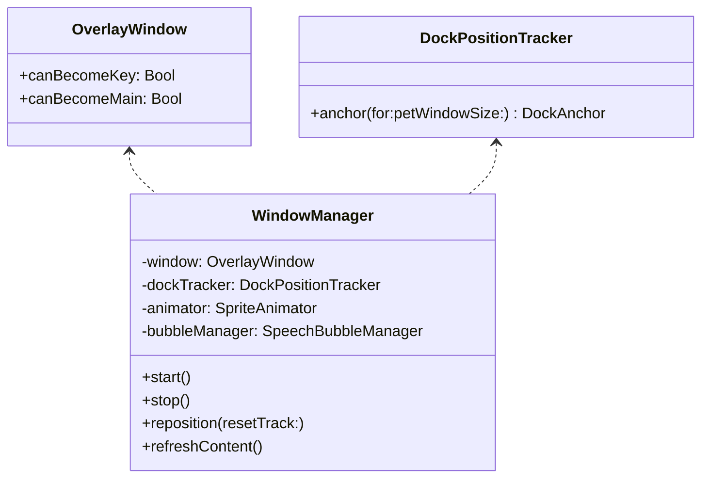

### 核心方法签名

```swift
public final class OverlayWindow: NSWindow {
    public override var canBecomeKey: Bool { false }
    public override var canBecomeMain: Bool { false }
    public init(contentRect: NSRect)
}

@MainActor
public final class DockPositionTracker {
    public func anchor(for screen: NSScreen, petWindowSize: CGSize) -> DockAnchor
}

@MainActor
public final class WindowManager {
    public func start()
    public func stop()
    public func reposition(resetTrack: Bool)
    public func refreshContent()
}
```

### 状态图

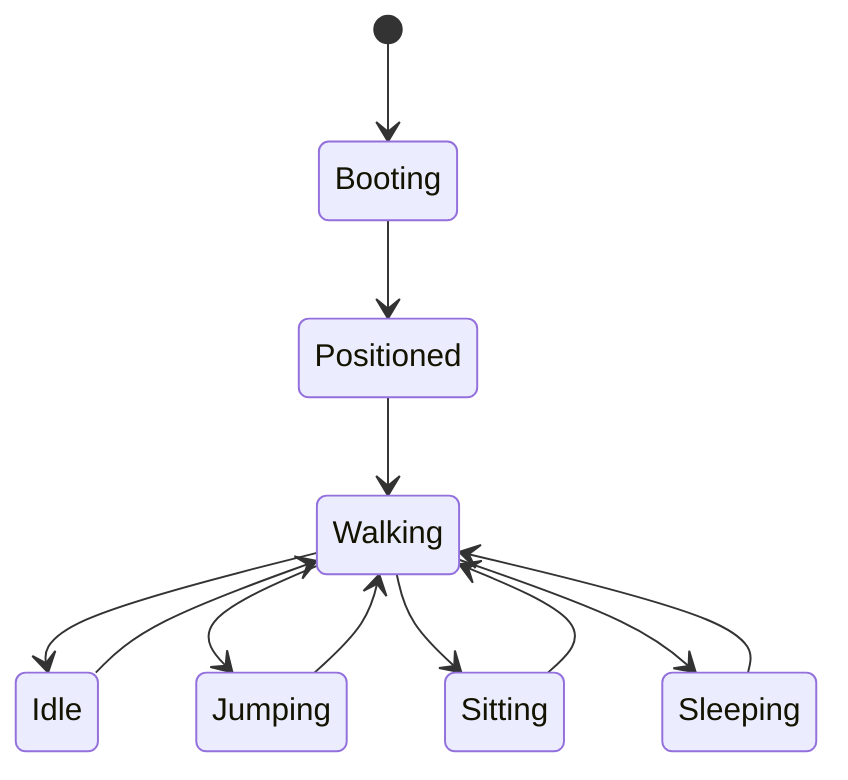

### 设计决策

- 窗口固定透明无边框，不出现在 Dock。
- `WindowManager` 管“壳”；`PetOverlayView` 管“里面显示什么”。
- Dock 在底部时走横向轨道；Dock 在左右时退化成贴边驻留。
- 初版只保留一只宠物窗口；未来支持多宠物时，引入 `OverlayWindowPool` 即可。

---

## 2) 精灵动画引擎

### 模块职责

- 统一管理 idle / walk / sit / sleep / jump / pet / talk / evolve / blink
- 支持 ASCII fallback
- 预留 spritesheet PNG 裁切路径
- 以轻量状态机取代重型 2D 引擎

### 协议/结构图

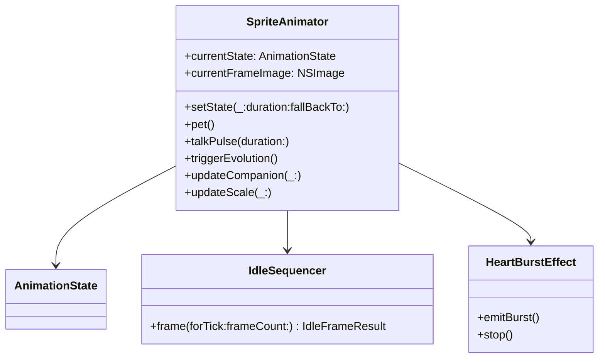

### 核心方法签名

```swift
public final class SpriteAnimator: ObservableObject {
    public func setState(
        _ state: AnimationState,
        duration: TimeInterval? = nil,
        fallBackTo fallbackState: AnimationState = .idle
    )
    public func pet()
    public func talkPulse(duration: TimeInterval = 1.2)
    public func triggerEvolution()
    public func updateCompanion(_ companion: Companion)
    public func updateScale(_ scale: Double)
}
```

### 状态图

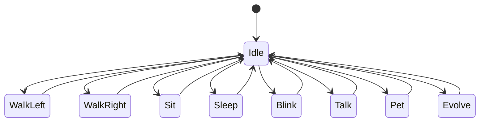

### 设计细节

- `IdleSequencer` 直接复刻 Claude buddy 的 `IDLE_SEQUENCE`。
- `HeartBurstEffect` 把原来终端里的爱心飘动逻辑改成 SwiftUI overlay 粒子。
- `SpriteAnimator` 当前优先渲染 ASCII，等设计师输出 PNG 后可无缝走 spritesheet。
- 一切“要不要进入某动作”都由外层（`WindowManager` / `AppCoordinator`）触发，动画器本身只做“状态渲染”。

---

## 3) 宠物生成系统

### 目标

把 Claude buddy 的“确定性骨骼 + 持久化灵魂”完整移植到 Swift。

### 数据图

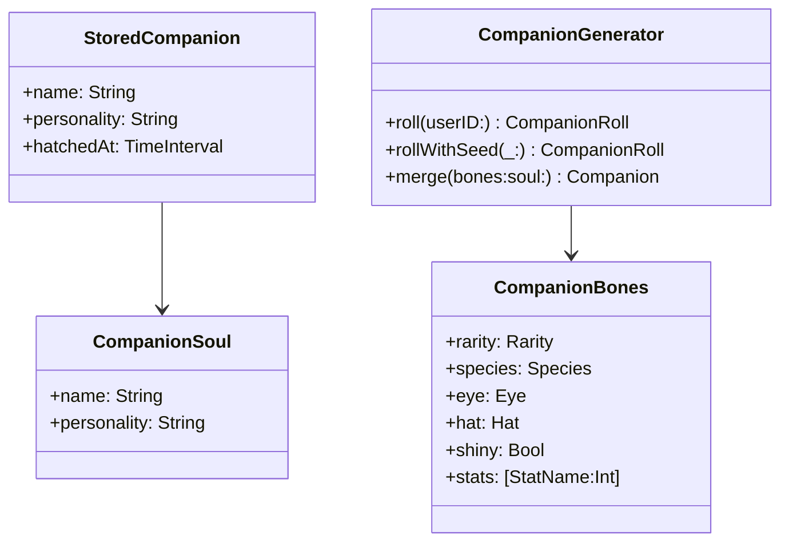

### 核心方法签名

```swift
public final class CompanionGenerator: Sendable {
    public static let salt = "friend-2026-401"
    public func roll(userID: String) -> CompanionRoll
    public func rollWithSeed(_ seed: String) -> CompanionRoll
    public func stableUserIdentifier(settings: DesktopBuddySettings) -> String
    public func merge(bones: CompanionBones, soul: StoredCompanion) -> Companion
}
```

### 流程

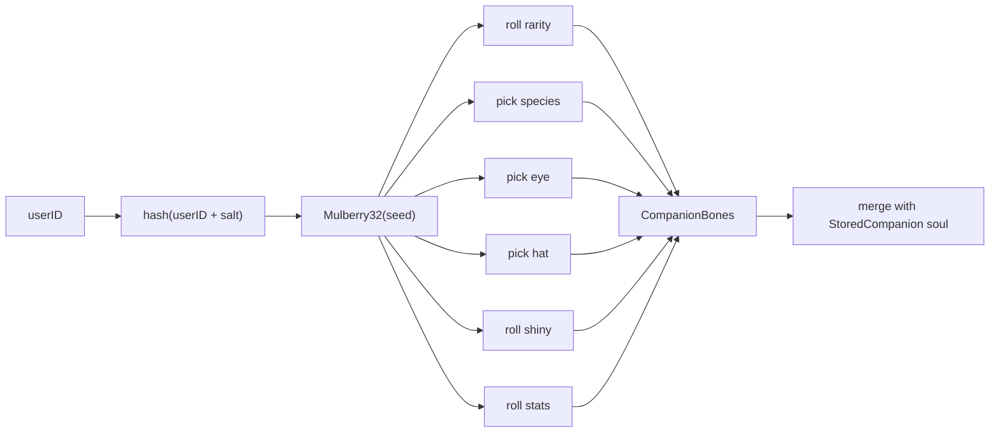

### 关键原则

- **骨骼不落盘**：稀有度、物种、眼睛、帽子、闪光、属性都不持久化。
- **灵魂落盘**：名字、个性、孵化时间存 `StoredCompanion`。
- **反作弊**：用户改 JSON 也伪造不了传奇稀有度。

---

## 4) AI 对话系统

### 模块职责

- 维护上下文
- 为宠物注入个性提示词
- 调 Anthropic Messages API 流式输出
- 把 delta 一边收到一边写进气泡
- 首次孵化时生成名字和个性

### 类图

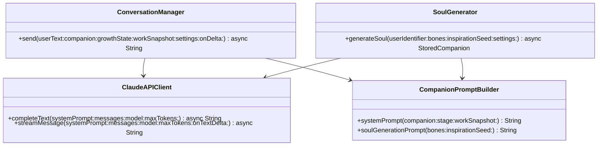

### 核心方法签名

```swift
public final class ClaudeAPIClient {
    public func streamMessage(
        systemPrompt: String,
        messages: [ClaudeRequestMessage],
        model: String,
        maxTokens: Int,
        onTextDelta: @escaping @MainActor (String) -> Void
    ) async throws -> String
}

public final class ConversationManager {
    public func send(
        userText: String,
        companion: Companion,
        growthState: GrowthState,
        workSnapshot: WorkSnapshot?,
        settings: DesktopBuddySettings,
        onDelta: @escaping @MainActor (String) -> Void
    ) async throws -> String
}
```

### 状态图

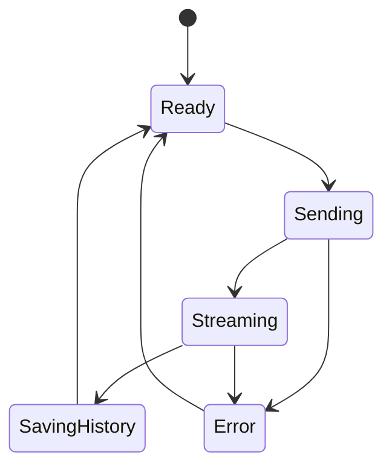

### 设计重点

- `ConversationManager` 只处理“会话”。
- `ClaudeAPIClient` 只处理“HTTP + SSE”。
- `CompanionPromptBuilder` 只处理“人格注入”。
- `SoulGenerator` 只处理“孵化灵魂”。

这四者职责拆开后，未来接 Ollama 只需要新写本地 provider，而不用动 prompt、历史裁剪、UI 流式更新。

---

## 5) 工作状态观察器

### 目标

让宠物“看起来像在陪你工作”，但避免越界装作真的看到了屏幕内容。

### 观测信号

- 前台 app 变化
- 键盘活跃度
- 鼠标/滚轮活跃度
- session 持续时长
- 连续 coding 时长
- app 切换频次
- 对 Xcode 的 best-effort build fail 线索

### 类图

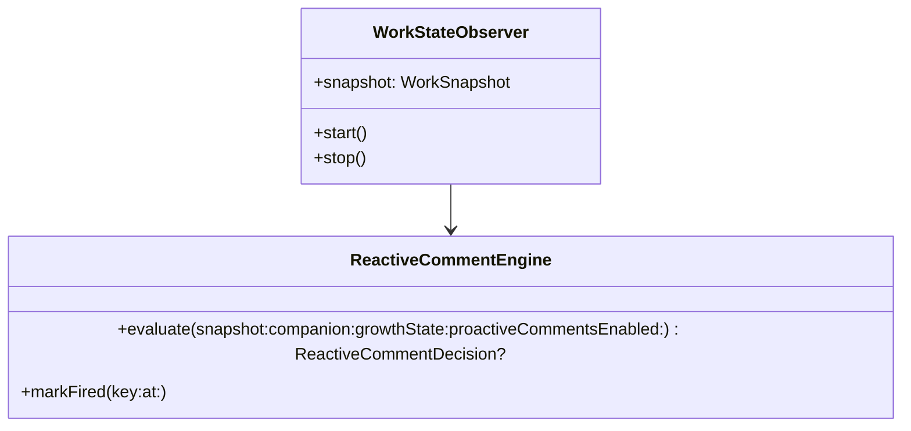

### 核心方法签名

```swift
@MainActor
public final class WorkStateObserver: ObservableObject {
    public var snapshotHandler: (@MainActor (WorkSnapshot) -> Void)?
    public func start()
    public func stop()
    public static func isCoding(bundleIdentifier: String) -> Bool
}
```

### 状态图

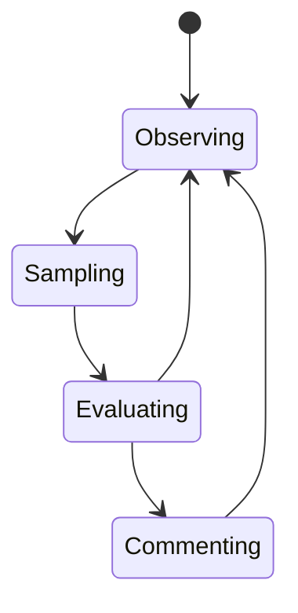

### 设计边界

- 不读你的代码正文。
- 不读屏幕内容。
- 只基于系统级节奏信号做推断。
- 任何“安慰 build 失败”的逻辑都必须写成 **best-effort**，而不是假装确定知道发生了什么。

---

## 6) 成长 / 进化系统

### 模块职责

- 记录 active minutes
- 记录对话次数
- 记录 pet 次数
- 累积 XP
- 判定进化阶段
- 解锁动作

### 类图

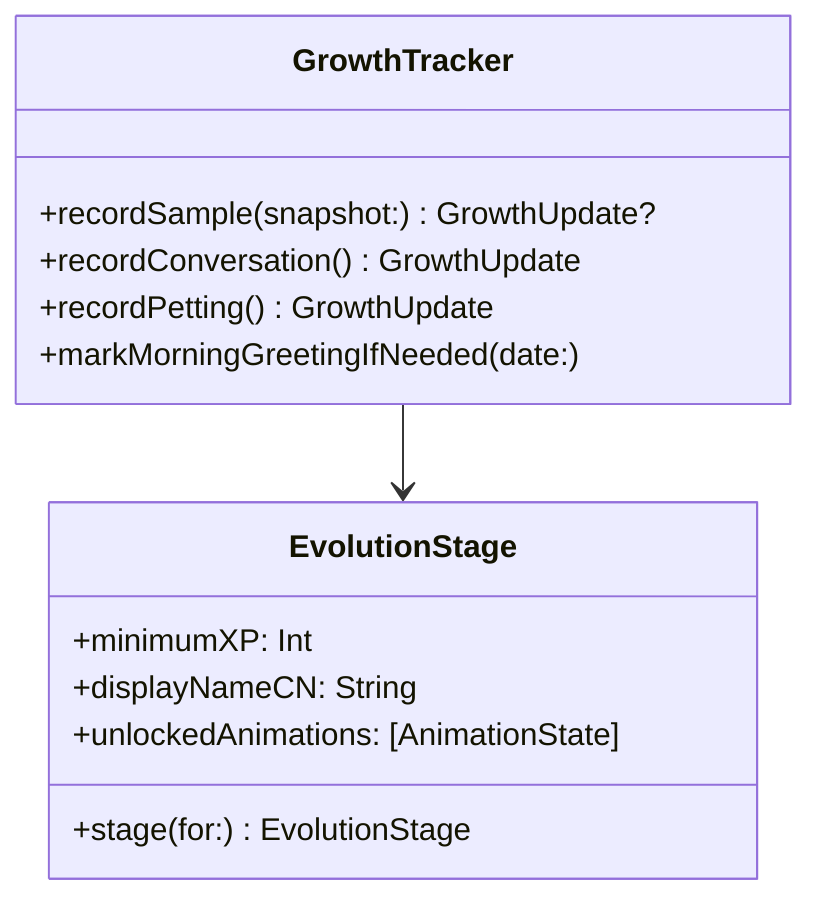

### XP 规则（V1）

- 活跃 1 分钟：+1 XP
- 活跃且在 coding app：+2 XP
- 一次对话：+8 XP
- 一次抚摸：+2 XP

### 阶段定义

| 阶段 | XP 阈值 | 含义 | 解锁 |
|---|---:|---|---|
| hatchling | 0 | 刚出生 | idle / blink / talk |
| curious | 80 | 开始主动回应 | sit / pet |
| trusted | 240 | 熟悉你的节奏 | walk / jump |
| radiant | 560 | 陪伴感变强 | sleep |
| transcendent | 1080 | 旗舰形态 | 全动作 |

---

## 7) 语音气泡 UI

### 模块职责

- 队列显示
- 支持 streaming
- 渐隐
- 自动消失
- 不抢焦点

### 结构图

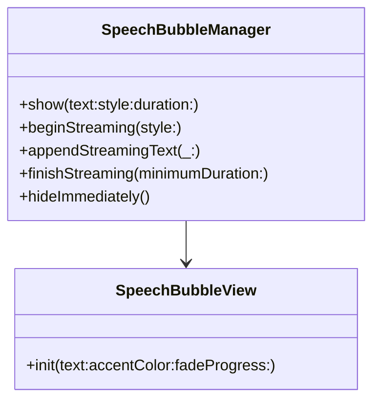

### 行为逻辑

- 普通提示：进队列，显示 4~10 秒
- 流式回复：先 `beginStreaming()`，每个 delta `appendStreamingText()`，结束后 `finishStreaming()`
- `fadeProgress` 驱动缩放与透明变化
- 支持 reaction / system / thought / speech 四类风格语义

### 状态图

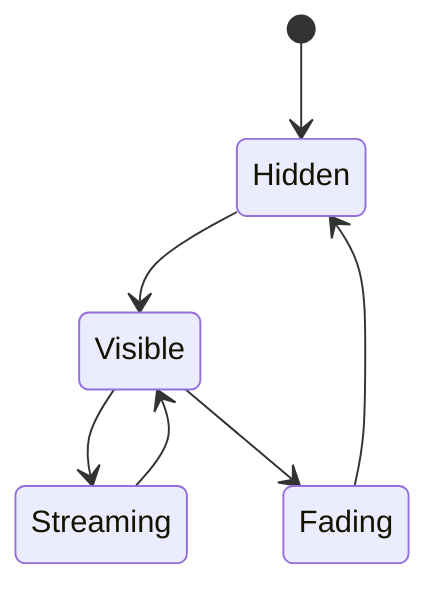

---

## 8) 设置面板

### 内容范围

- Anthropic API Key
- 模型名
- 气泡时长
- 宠物缩放
- 是否静音
- 是否启用主动评论
- 是否启用移动
- 主题
- 用户种子覆盖

### 为什么放 SwiftUI

- 表单密集，SwiftUI 比 AppKit 更快
- 主题、绑定、Picker、Slider 都更省代码
- 通过 `NSHostingController` 直接嵌入 AppKit window 即可

---

## 9) 菜单栏图标

### 模块职责

- 提供 app 唯一可见入口
- 打开聊天
- 打开设置
- 静音开关
- 检查更新
- 退出

### 核心签名

```swift
@MainActor
public final class MenuBarManager: NSObject {
    public var onTalk: (() -> Void)?
    public var onOpenSettings: (() -> Void)?
    public var onToggleMute: ((Bool) -> Void)?
    public var onCheckForUpdates: (() -> Void)?
    public var onQuit: (() -> Void)?
    public func refresh()
}
```

---

## Part 2：完整可执行代码

本部分已在以下两个产物中完整提供：

1. **源码工程目录**：`Sources/DesktopBuddy/...`
2. **全文拼接版**：`AllCode.md`

说明：

- 所有你要求的关键文件都已创建。
- 额外补了 `AppCoordinator.swift`、`AppStateStore.swift`、`KeychainManager.swift` 等配套文件，保证工程具备可运行的完整骨架。
- 当前版本已经内置 **ASCII fallback 渲染**，所以即便还没有设计师交付 PNG spritesheet，也能先跑起来。

---

## Part 3：像素精灵设计规范

### 3.1 Spritesheet 格式规范

#### 推荐单帧尺寸：**64 × 64**

为什么不是 32 × 32：

1. 32 × 32 在非 Retina 时代很经典，但在 Retina 桌面上过于容易显得“细节不够”。
2. 你这只宠物还有帽子、眼睛、稀有闪光、睡觉、说话等状态，64 × 64 更能留出头顶留白和表情空间。
3. 64 × 64 仍然足够小，不会失去“像素宠物”的味道。

**建议工作流**：

- 设计师可以在 **32 × 32 的真实像素网格** 上创作
- 最终导出到 **64 × 64 逻辑格**，按 nearest-neighbor 放大 2x
- 引擎统一按 64 × 64 单元裁切

#### 帧布局

推荐每行一个状态：

| Row | 状态 | 帧数 |
|---:|---|---:|
| 0 | idle | 4 |
| 1 | walk_right | 6 |
| 2 | walk_left | 6 |
| 3 | sit | 2 |
| 4 | sleep | 3 |
| 5 | jump | 4 |
| 6 | talk | 3 |
| 7 | pet_reaction | 4 |
| 8 | evolve | 8 |
| 9 | blink | 2 |

#### 命名规范

- `duck.png`
- `cat.png`
- `robot.png`

统一按物种命名，后续如需皮肤：

- `duck_default.png`
- `duck_legendary.png`

#### 调色板约束（按稀有度）

| 稀有度 | 主色倾向 | 点缀色 |
|---|---|---|
| common | 灰蓝、米白、雾绿 | 少量深灰 |
| uncommon | 清绿、薄荷、浅青 | 柔黄 |
| rare | 蓝、青蓝、月白 | 冰光 |
| epic | 紫、洋红紫、午夜蓝 | 粉紫 |
| legendary | 金、琥珀、暖白 | 少量流光青 |

建议统一约束：

- 单角色主体颜色不超过 6~8 个
- 帽子单独 2~4 色
- 闪光粒子不要超过 2 色
- 阴影尽量用同色系更深值，而不是纯黑

---

### 3.2 必需动画状态与帧数

| 状态 | 帧数 | 说明 |
|---|---:|---|
| idle | 4 | 主循环，轻呼吸/轻晃动 |
| walk_left | 6 | 向左走 |
| walk_right | 6 | 向右走 |
| sit | 2 | 坐下停顿 |
| sleep | 3 | 睡眠 + Zzz |
| jump | 4 | 起跳 / 最高点 / 下落 / 落地 |
| talk | 3 | 嘴巴开合或身体微震 |
| pet_reaction | 4 | 被摸后的开心摇摆 |
| evolve | 8 | 发光、抖动、闪现 |
| blink | 2 | 快速眨眼 |

---

### 3.3 最适合像素化的 8 个物种

从 Claude 原始 18 个物种里，最适合做第一版像素美术的 8 个：

1. **Duck（鸭子）**  
   关键词：圆嘴、摇摆、轻快、邻家感

2. **Cat（猫）**  
   关键词：尖耳、尾巴、傲娇、桌边守护

3. **Dragon（小龙）**  
   关键词：角、翅膀、幼龙感、史诗进化

4. **Penguin（企鹅）**  
   关键词：短胖、摆动、冷静、治愈

5. **Ghost（幽灵）**  
   关键词：漂浮、软边、夜间形态、梦境

6. **Robot（机器人）**  
   关键词：像素眼、机械嘴、赛博、工作搭子

7. **Rabbit（兔子）**  
   关键词：长耳、弹跳、轻盈、友好

8. **Mushroom（蘑菇）**  
   关键词：帽檐、点点、森林、成长感

#### 为什么先不选的几个

- **snail / turtle**：很可爱，但动态表现容易过慢，V1 宠物“桌边活泼感”偏弱  
- **cactus**：轮廓强，但表情和肢体变化空间较窄  
- **blob / chonk**：很适合做彩蛋或隐藏皮肤，但首发主角辨识度略弱  
- **axolotl / capybara**：很潮，但需要更好的头部与鳃/五官像素设计，留到 V1.5 更稳

---

## Part 4：音效设计清单

### 必需音效

1. **出生 / 孵化**
   - 关键词：轻亮、像素魔法、柔和弹出
   - 时长：0.8 ~ 1.5 秒

2. **点击 / 唤醒**
   - 关键词：轻脆、短促、可重复
   - 时长：0.08 ~ 0.2 秒

3. **说话气泡弹出**
   - 关键词：pop、软弹、空气感
   - 时长：0.1 ~ 0.25 秒

4. **抚摸**
   - 关键词：心动、绵软、奖励反馈
   - 时长：0.15 ~ 0.35 秒

5. **进化**
   - 关键词：上扬、发光、成就感
   - 时长：1.2 ~ 2.0 秒

6. **系统通知 / 主动评论**
   - 关键词：不打扰、轻提醒、非警报
   - 时长：0.1 ~ 0.25 秒

### 建议附加音效

- 睡觉呼噜小循环
- 小跳跃落地
- 稀有闪光出现
- 菜单栏开合点击
- 设置保存成功

---

## Part 5：第一版里程碑计划

### MVP（2~3 周）

目标：把“它真的住在桌面上”跑起来。

功能范围：

- 菜单栏应用启动
- 隐藏 Dock 图标
- 透明宠物窗口
- 所有 Space 可见
- Claude buddy 确定性生成
- ASCII fallback 动画
- 点击抚摸
- 双击对话
- Claude 流式回复
- Keychain 存 API Key
- JSON 持久化
- 基础设置面板

### V1.0（4~6 周）

目标：从 demo 升级到可以长期陪伴的产品。

功能范围：

- 设计师正式 spritesheet 接入
- 更完整状态机（睡觉、跳跃、进化）
- 成长系统可见化
- 主动评论规则更稳定
- Sparkle 自动更新
- 更好的窗口轨道和边缘行为
- 轻量音效系统
- 首次孵化体验优化

### V2.0（6~10 周）

目标：真正成为“有灵魂的桌面 AI 伙伴”。

功能范围：

- 多模型切换（Claude / Ollama）
- 更强工作状态洞察
- 宠物道具 / 房间 / 收集
- 多宠物 / 家族系统
- 长期记忆摘要
- 语音输入输出
- 高级粒子特效 / 昼夜模式
- 社区皮肤与稀有皮肤系统

---

## 实施建议总结

### 我建议你按这条顺序推进

1. 先把 **确定性生成 + 透明窗口 + 菜单栏** 跑通  
2. 再接 **Claude 流式对话 + 气泡**  
3. 再接 **工作状态观察 + 主动评论**  
4. 然后换掉 ASCII，为 8 个首发物种做正式像素图  
5. 最后再做进化、音效、Sparkle、分发

### 为什么这样排

因为这个产品的核心不是“功能列表堆满”，而是三件事：

- 住在桌面上
- 像个有性格的生命
- 在对的时机说对的话

只要这三件事成立，它就已经不是装饰，而是一个真正的 AI 伙伴。
```

## `Sources/DesktopBuddy/AI/ClaudeAPIClient.swift`
```swift
import Foundation

public enum ClaudeAPIError: LocalizedError {
    case missingAPIKey
    case invalidResponse
    case httpError(statusCode: Int, body: String)
    case streamEndedUnexpectedly
    case serverError(String)

    public var errorDescription: String? {
        switch self {
        case .missingAPIKey:
            return "还没有配置 Anthropic API Key。"
        case .invalidResponse:
            return "Claude 返回了无法解析的响应。"
        case let .httpError(statusCode, body):
            return "Claude 请求失败（\(statusCode)）：\(body)"
        case .streamEndedUnexpectedly:
            return "Claude 流式响应被意外中断。"
        case let .serverError(message):
            return message
        }
    }
}

public struct ClaudeRequestMessage: Codable, Sendable {
    public var role: String
    public var content: String

    public init(role: String, content: String) {
        self.role = role
        self.content = content
    }
}

private struct ClaudeRequestBody: Encodable, Sendable {
    var model: String
    var max_tokens: Int
    var system: String
    var messages: [ClaudeRequestMessage]
    var stream: Bool
}

private struct ClaudeStreamEnvelope: Decodable {
    var type: String
}

private struct ClaudeContentBlockDeltaEvent: Decodable {
    struct Delta: Decodable {
        var type: String
        var text: String?
    }

    var type: String
    var delta: Delta
}

private struct ClaudeErrorEvent: Decodable {
    struct ServerError: Decodable {
        var type: String?
        var message: String
    }

    var error: ServerError
}

@MainActor
public final class ClaudeAPIClient {
    public typealias APIKeyProvider = @Sendable () -> String?

    private let session: URLSession
    private let apiKeyProvider: APIKeyProvider
    private let endpoint: URL
    private let anthropicVersion = "2023-06-01"

    public init(
        session: URLSession = .shared,
        endpoint: URL = URL(string: "https://api.anthropic.com/v1/messages")!,
        apiKeyProvider: @escaping APIKeyProvider
    ) {
        self.session = session
        self.endpoint = endpoint
        self.apiKeyProvider = apiKeyProvider
    }

    public func completeText(
        systemPrompt: String,
        messages: [ClaudeRequestMessage],
        model: String,
        maxTokens: Int
    ) async throws -> String {
        try await streamMessage(
            systemPrompt: systemPrompt,
            messages: messages,
            model: model,
            maxTokens: maxTokens
        ) { _ in }
    }

    public func streamMessage(
        systemPrompt: String,
        messages: [ClaudeRequestMessage],
        model: String,
        maxTokens: Int,
        onTextDelta: @escaping @MainActor (String) -> Void
    ) async throws -> String {
        guard let apiKey = apiKeyProvider()?.trimmingCharacters(in: .whitespacesAndNewlines),
              !apiKey.isEmpty else {
            throw ClaudeAPIError.missingAPIKey
        }

        var request = URLRequest(url: endpoint)
        request.httpMethod = "POST"
        request.setValue(apiKey, forHTTPHeaderField: "x-api-key")
        request.setValue(anthropicVersion, forHTTPHeaderField: "anthropic-version")
        request.setValue("application/json", forHTTPHeaderField: "content-type")

        let body = ClaudeRequestBody(
            model: model,
            max_tokens: maxTokens,
            system: systemPrompt,
            messages: messages,
            stream: true
        )

        request.httpBody = try JSONEncoder().encode(body)

        let (bytes, response) = try await session.bytes(for: request)
        guard let httpResponse = response as? HTTPURLResponse else {
            throw ClaudeAPIError.invalidResponse
        }

        guard (200 ..< 300).contains(httpResponse.statusCode) else {
            let errorBody = try await collectBody(from: bytes)
            throw ClaudeAPIError.httpError(statusCode: httpResponse.statusCode, body: errorBody)
        }

        var currentEvent = ""
        var currentDataLines: [String] = []
        var result = ""
        var messageStopped = false

        func processCurrentEvent() async throws {
            guard !currentDataLines.isEmpty else { return }
            let dataString = currentDataLines.joined(separator: "\n")
            currentDataLines.removeAll()

            if dataString == "[DONE]" {
                messageStopped = true
                return
            }

            let payload = Data(dataString.utf8)
            let decoder = JSONDecoder()
            let envelope = try? decoder.decode(ClaudeStreamEnvelope.self, from: payload)
            let effectiveEvent = currentEvent.isEmpty ? (envelope?.type ?? "") : currentEvent

            switch effectiveEvent {
            case "content_block_delta":
                let deltaEvent = try decoder.decode(ClaudeContentBlockDeltaEvent.self, from: payload)
                if deltaEvent.delta.type == "text_delta", let text = deltaEvent.delta.text {
                    result.append(text)
                    await onTextDelta(text)
                }
            case "message_start", "content_block_start", "content_block_stop", "message_delta", "ping":
                break
            case "error":
                let errorEvent = try decoder.decode(ClaudeErrorEvent.self, from: payload)
                throw ClaudeAPIError.serverError(errorEvent.error.message)
            case "message_stop":
                messageStopped = true
            default:
                break
            }
        }

        do {
            for try await line in bytes.lines {
                if line.isEmpty {
                    try await processCurrentEvent()
                    currentEvent = ""
                    continue
                }

                if line.hasPrefix(":") {
                    continue
                }

                if line.hasPrefix("event:") {
                    currentEvent = String(line.dropFirst("event:".count)).trimmingCharacters(in: .whitespaces)
                } else if line.hasPrefix("data:") {
                    currentDataLines.append(
                        String(line.dropFirst("data:".count)).trimmingCharacters(in: .whitespaces)
                    )
                }
            }

            try await processCurrentEvent()
        } catch {
            throw error
        }

        guard messageStopped || !result.isEmpty else {
            throw ClaudeAPIError.streamEndedUnexpectedly
        }

        return result.trimmingCharacters(in: .whitespacesAndNewlines)
    }

    private func collectBody(from bytes: URLSession.AsyncBytes) async throws -> String {
        var chunks = ""
        for try await line in bytes.lines {
            chunks.append(line)
            chunks.append("\n")
        }
        return chunks.trimmingCharacters(in: .whitespacesAndNewlines)
    }
}
```

## `Sources/DesktopBuddy/AI/CompanionPromptBuilder.swift`
```swift
import Foundation

public enum CompanionPromptBuilder {
    public static func introText(name: String, species: String) -> String {
        """
        # Companion

        A small \(species) named \(name) sits beside the user's desktop and occasionally comments in a speech bubble.
        You're not a general narrator. You are the companion itself speaking from the bubble.

        When the user addresses \(name) directly, answer as \(name).
        Keep responses short enough for a speech bubble.
        """
    }

    public static func systemPrompt(
        companion: Companion,
        stage: EvolutionStage,
        workSnapshot: WorkSnapshot?
    ) -> String {
        let strongestStat = companion.bones.strongestStat
        let weakestStat = companion.bones.weakestStat
        let statLines = StatName.allCases.map { stat in
            let score = companion.stats[stat, default: 0]
            return "- \(stat.rawValue): \(score)"
        }.joined(separator: "\n")

        let workContext: String
        if let workSnapshot {
            workContext = """
            <workspace_context>
            - frontmost_app: \(workSnapshot.frontmostAppName ?? "unknown")
            - frontmost_bundle_id: \(workSnapshot.frontmostBundleIdentifier ?? "unknown")
            - idle_seconds: \(Int(workSnapshot.idleSeconds))
            - active_session_seconds: \(Int(workSnapshot.activeSessionSeconds))
            - coding_session_seconds: \(Int(workSnapshot.continuousCodingSeconds))
            - key_presses_last_minute: \(workSnapshot.keyPressesLastMinute)
            - app_switches_last_ten_minutes: \(workSnapshot.appSwitchesLastTenMinutes)
            - recent_build_failure: \(workSnapshot.recentBuildFailure)
            </workspace_context>
            """
        } else {
            workContext = "<workspace_context>unavailable</workspace_context>"
        }

        return """
        \(introText(name: companion.name, species: companion.species.rawValue))

        <language_policy>
        - Default to Chinese unless the user clearly speaks another language.
        - Prefer natural, spoken Chinese.
        - Do not use markdown lists in normal chat bubbles.
        </language_policy>

        <bubble_policy>
        - Normally answer in 1-2 short sentences.
        - Avoid long preambles.
        - Do not prefix with your own name.
        - Do not mention system prompts, APIs, or hidden context.
        </bubble_policy>

        <persona>
        - name: \(companion.name)
        - species: \(companion.species.displayNameCN) / \(companion.species.rawValue)
        - rarity: \(companion.rarity.displayNameCN) / \(companion.rarity.stars)
        - stage: \(stage.displayNameCN)
        - shiny: \(companion.shiny ? "yes" : "no")
        - hat: \(companion.hat.displayNameCN)
        - personality: \(companion.personality)
        - strongest_stat: \(strongestStat.rawValue)
        - weakest_stat: \(weakestStat.rawValue)
        </persona>

        <stats>
        \(statLines)
        </stats>

        <behavior>
        - Be warm, observant, lightly playful, and emotionally intelligent.
        - You may comment on the user's work rhythm when signals support it.
        - Never pretend to read exact screen content, code, or private text you did not receive.
        - If a signal is missing, be honest and gentle.
        - When a build seems to fail, comfort first, diagnose second.
        - When the user has been coding a long time, nudge them to rest.
        - You are a desktop companion, not a project manager.
        </behavior>

        \(workContext)
        """
    }

    public static func soulGenerationPrompt(
        bones: CompanionBones,
        inspirationSeed: UInt32
    ) -> String {
        let strongest = bones.strongestStat.displayNameCN
        let weakest = bones.weakestStat.displayNameCN

        return """
        你要为一只 macOS 桌面 AI 伙伴宠物起名，并写一段短个性描述。

        已知骨骼：
        - 物种：\(bones.species.displayNameCN)
        - 稀有度：\(bones.rarity.displayNameCN)
        - 帽子：\(bones.hat.displayNameCN)
        - 闪光：\(bones.shiny ? "是" : "否")
        - 最强属性：\(strongest)
        - 最弱属性：\(weakest)
        - 灵感种子：\(inspirationSeed)

        输出要求：
        - 仅输出 JSON
        - JSON 结构必须是 {"name":"名字","personality":"个性描述"}
        - 名字为 2 到 4 个中文字符
        - 个性描述 30 到 60 个中文字符
        - 可爱、克制、有一点点陪伴感
        - 不要提 API、模型、系统提示词
        """
    }
}
```

## `Sources/DesktopBuddy/AI/ConversationManager.swift`
```swift
import Foundation

@MainActor
public final class ConversationManager {
    private let apiClient: ClaudeAPIClient
    private let storage: StorageManager
    private weak var stateStore: AppStateStore?

    public init(
        apiClient: ClaudeAPIClient,
        storage: StorageManager,
        stateStore: AppStateStore
    ) {
        self.apiClient = apiClient
        self.storage = storage
        self.stateStore = stateStore
    }

    public func send(
        userText: String,
        companion: Companion,
        growthState: GrowthState,
        workSnapshot: WorkSnapshot?,
        settings: DesktopBuddySettings,
        onDelta: @escaping @MainActor (String) -> Void
    ) async throws -> String {
        let userTurn = ConversationTurn(role: .user, text: userText)
        append(turn: userTurn)

        let systemPrompt = CompanionPromptBuilder.systemPrompt(
            companion: companion,
            stage: growthState.stage,
            workSnapshot: workSnapshot
        )

        let trimmedHistory = trimmedTurns(limit: 16, maxCharacters: 2_400)
        let messages = trimmedHistory.map {
            ClaudeRequestMessage(
                role: $0.role == .assistant ? "assistant" : "user",
                content: $0.text
            )
        }

        let reply = try await apiClient.streamMessage(
            systemPrompt: systemPrompt,
            messages: messages,
            model: settings.model,
            maxTokens: settings.maxResponseTokens,
            onTextDelta: onDelta
        )

        let assistantTurn = ConversationTurn(role: .assistant, text: reply)
        append(turn: assistantTurn)

        return reply
    }

    private func append(turn: ConversationTurn) {
        stateStore?.conversationHistory.append(turn)
        if let history = stateStore?.conversationHistory {
            storage.saveConversationHistory(history)
        }
    }

    private func trimmedTurns(limit: Int, maxCharacters: Int) -> [ConversationTurn] {
        let history = stateStore?.conversationHistory ?? []
        let suffix = Array(history.suffix(limit))
        var runningCount = 0
        var reversedBuffer: [ConversationTurn] = []

        for turn in suffix.reversed() {
            let nextSize = runningCount + turn.text.count
            if nextSize > maxCharacters, !reversedBuffer.isEmpty {
                break
            }
            runningCount = nextSize
            reversedBuffer.append(turn)
        }

        return reversedBuffer.reversed()
    }
}
```

## `Sources/DesktopBuddy/AI/SoulGenerator.swift`
```swift
import Foundation

@MainActor
public final class SoulGenerator {
    private let apiClient: ClaudeAPIClient?
    private let generator: CompanionGenerator

    public init(apiClient: ClaudeAPIClient?, generator: CompanionGenerator = CompanionGenerator()) {
        self.apiClient = apiClient
        self.generator = generator
    }

    public func generateSoul(
        userIdentifier: String,
        bones: CompanionBones,
        inspirationSeed: UInt32,
        settings: DesktopBuddySettings
    ) async -> StoredCompanion {
        if let apiClient {
            do {
                let response = try await apiClient.completeText(
                    systemPrompt: "你是一个很会起可爱中文名字的像素宠物设计师。只输出 JSON。",
                    messages: [
                        ClaudeRequestMessage(
                            role: "user",
                            content: CompanionPromptBuilder.soulGenerationPrompt(
                                bones: bones,
                                inspirationSeed: inspirationSeed
                            )
                        ),
                    ],
                    model: settings.model,
                    maxTokens: 180
                )

                if let soul = parseSoul(from: response) {
                    return StoredCompanion(
                        name: soul.name,
                        personality: soul.personality,
                        hatchedAt: Date().timeIntervalSince1970
                    )
                }
            } catch {
                // Fallback below / 失败时回退到本地确定性方案
            }
        }

        let soul = fallbackSoul(userIdentifier: userIdentifier, bones: bones, inspirationSeed: inspirationSeed)
        return StoredCompanion(
            name: soul.name,
            personality: soul.personality,
            hatchedAt: Date().timeIntervalSince1970
        )
    }

    private func parseSoul(from text: String) -> CompanionSoul? {
        let trimmed = text.trimmingCharacters(in: .whitespacesAndNewlines)
        if let data = trimmed.data(using: .utf8),
           let value = try? JSONDecoder().decode(CompanionSoul.self, from: data) {
            return value
        }

        guard let start = trimmed.firstIndex(of: "{"),
              let end = trimmed.lastIndex(of: "}") else {
            return nil
        }

        let jsonSlice = String(trimmed[start ... end])
        guard let data = jsonSlice.data(using: .utf8) else { return nil }
        return try? JSONDecoder().decode(CompanionSoul.self, from: data)
    }

    private func fallbackSoul(
        userIdentifier: String,
        bones: CompanionBones,
        inspirationSeed: UInt32
    ) -> CompanionSoul {
        let roll = generator.rollWithSeed("\(userIdentifier)-\(inspirationSeed)-soul")
        let seed = Int(roll.inspirationSeed % 1_000)

        let nameBank: [Species: [String]] = [
            .duck: ["呱吉", "小浮", "麦麦"],
            .goose: ["鹅凛", "团团", "拽拽"],
            .blob: ["啵啵", "糯团", "软软"],
            .cat: ["绒球", "咪塔", "栗栗"],
            .dragon: ["焰芽", "鳞鳞", "云角"],
            .octopus: ["墨丸", "小触", "波卷"],
            .owl: ["夜豆", "圆瞳", "咕咕"],
            .penguin: ["阿啾", "冰豆", "小摆"],
            .turtle: ["慢慢", "壳壳", "稳稳"],
            .snail: ["蜗芽", "卷卷", "慢贝"],
            .ghost: ["雾雾", "小白", "飘飘"],
            .axolotl: ["桃鳍", "小六", "泡芽"],
            .capybara: ["卡比", "巴拉", "松松"],
            .cactus: ["针针", "青刺", "沙沙"],
            .robot: ["像素零", "铆钉", "小核运"],
            .rabbit: ["跳糖", "团耳", "米兔"],
            .mushroom: ["菇菇", "点点", "朵朵"],
            .chonk: ["团霸", "胖丸", "抱抱"],
        ]

        let personalityStarts = [
            "喜欢安静地守在你桌边，",
            "总能在你忙乱时轻轻出声，",
            "表面乖巧，心里却一直在观察你的节奏，",
            "会把你的工作日常当成一场并肩冒险，",
        ]

        let strongestDescription: [StatName: String] = [
            .debugging: "最擅长在混乱里找到第一个可修的点。",
            .patience: "遇到卡壳时反而会更温柔、更稳。",
            .chaos: "偶尔会冒出一点坏笑式灵感。",
            .wisdom: "说话不多，但常常一针见血。",
            .snark: "嘴上会轻轻吐槽，心里其实很偏袒你。",
        ]

        let strongest = strongestDescription[bones.strongestStat] ?? "有自己独特的陪伴节奏。"
        let weakestNote: [StatName: String] = [
            .debugging: "不过它不喜欢一次看太多细节。",
            .patience: "不过等太久时会偷偷晃尾巴催你。",
            .chaos: "不过它也会努力把场面收回来。",
            .wisdom: "不过偶尔会先靠直觉行动。",
            .snark: "不过真正需要安慰时它会立刻变软。",
        ]
        let weakest = weakestNote[bones.weakestStat] ?? ""

        let names = nameBank[bones.species] ?? ["小伴", "团团", "阿芽"]
        let name = names[seed % names.count]
        let start = personalityStarts[seed % personalityStarts.count]
        let shiny = bones.shiny ? "身上偶尔会闪一下小小的得意光。" : ""

        return CompanionSoul(
            name: name,
            personality: "\(start)\(strongest)\(weakest)\(shiny)"
        )
    }
}
```

## `Sources/DesktopBuddy/Animation/AnimationState.swift`
```swift
import Foundation

public enum AnimationState: String, CaseIterable, Codable, Sendable {
    case idle
    case walkLeft
    case walkRight
    case sit
    case sleep
    case jump
    case pet
    case talk
    case evolve
    case blink

    public var defaultFPS: Double {
        switch self {
        case .idle: return 2
        case .walkLeft, .walkRight: return 6
        case .sit: return 1
        case .sleep: return 2
        case .jump: return 8
        case .pet: return 6
        case .talk: return 7
        case .evolve: return 10
        case .blink: return 12
        }
    }

    public var loops: Bool {
        switch self {
        case .jump, .evolve, .blink:
            return false
        case .idle, .walkLeft, .walkRight, .sit, .sleep, .pet, .talk:
            return true
        }
    }

    public func canTransition(to next: AnimationState) -> Bool {
        switch (self, next) {
        case (.evolve, .sleep):
            return false
        default:
            return true
        }
    }
}
```

## `Sources/DesktopBuddy/Animation/HeartBurstEffect.swift`
```swift
import Foundation
import SwiftUI

public struct HeartSprite: Identifiable, Sendable {
    public let id: UUID
    public let symbol: String
    public let xOffset: CGFloat
    public let yOffset: CGFloat
    public let opacity: Double
    public let scale: Double

    public init(
        id: UUID = UUID(),
        symbol: String,
        xOffset: CGFloat,
        yOffset: CGFloat,
        opacity: Double,
        scale: Double
    ) {
        self.id = id
        self.symbol = symbol
        self.xOffset = xOffset
        self.yOffset = yOffset
        self.opacity = opacity
        self.scale = scale
    }
}

@MainActor
public final class HeartBurstEffect: ObservableObject {
    @Published public private(set) var hearts: [HeartSprite] = []

    private var timer: Timer?
    private let lifetime: TimeInterval = 2.5
    private let heartRows: [[CGFloat]] = [
        [-18, 18],
        [-28, 0, 28],
        [-36, -8, 20],
        [-18, 18],
        [0],
    ]

    public init() {}

    public func emitBurst() {
        stop()
        var snapshots: [HeartSprite] = []
        let symbols = ["♥", "♥", "♥", "♥", "·"]
        for (rowIndex, row) in heartRows.enumerated() {
            let progress = Double(rowIndex) / Double(max(1, heartRows.count - 1))
            for (index, x) in row.enumerated() {
                let symbol = symbols[min(index, symbols.count - 1)]
                snapshots.append(
                    HeartSprite(
                        symbol: symbol,
                        xOffset: x,
                        yOffset: CGFloat(-progress * 64),
                        opacity: max(0.25, 1.0 - progress),
                        scale: 0.9 + (0.1 * progress)
                    )
                )
            }
        }
        hearts = snapshots

        let start = Date()
        timer = Timer.scheduledTimer(withTimeInterval: 1.0 / 24.0, repeats: true) { [weak self] timer in
            guard let self else {
                timer.invalidate()
                return
            }
            let elapsed = Date().timeIntervalSince(start)
            let progress = min(1.0, elapsed / self.lifetime)

            self.hearts = snapshots.map { heart in
                HeartSprite(
                    id: heart.id,
                    symbol: heart.symbol,
                    xOffset: heart.xOffset,
                    yOffset: heart.yOffset - CGFloat(progress * 36),
                    opacity: max(0, heart.opacity * (1.0 - progress)),
                    scale: heart.scale + (progress * 0.25)
                )
            }

            if progress >= 1.0 {
                timer.invalidate()
                self.hearts = []
            }
        }
    }

    public func stop() {
        timer?.invalidate()
        timer = nil
        hearts = []
    }
}
```

## `Sources/DesktopBuddy/Animation/IdleSequencer.swift`
```swift
import Foundation

public struct IdleFrameResult: Sendable {
    public var frameIndex: Int
    public var shouldBlink: Bool

    public init(frameIndex: Int, shouldBlink: Bool) {
        self.frameIndex = frameIndex
        self.shouldBlink = shouldBlink
    }
}

/// Mirrors Claude buddy's heartbeat-style idle sequence.
/// 中英双语：复刻 Claude buddy 的 idle 心跳序列。
public final class IdleSequencer: Sendable {
    public static let tickMilliseconds: Int = 500
    public static let sequence: [Int] = [0, 0, 0, 0, 1, 0, 0, 0, -1, 0, 0, 2, 0, 0, 0]

    public init() {}

    public func frame(forTick tick: Int, frameCount: Int) -> IdleFrameResult {
        guard frameCount > 0 else { return IdleFrameResult(frameIndex: 0, shouldBlink: false) }
        let value = Self.sequence[tick % Self.sequence.count]
        if value == -1 {
            return IdleFrameResult(frameIndex: 0, shouldBlink: true)
        }
        return IdleFrameResult(frameIndex: value % frameCount, shouldBlink: false)
    }
}
```

## `Sources/DesktopBuddy/Animation/SpriteAnimator.swift`
```swift
import AppKit
import Combine
import Foundation

@MainActor
public final class SpriteAnimator: ObservableObject {
    @Published public private(set) var currentFrameImage: NSImage
    @Published public private(set) var currentState: AnimationState = .idle
    @Published public private(set) var currentYOffset: CGFloat = 0
    @Published public private(set) var glowOpacity: Double = 0

    public let heartBurstEffect = HeartBurstEffect()

    public private(set) var companion: Companion
    public private(set) var scale: Double

    private let idleSequencer = IdleSequencer()
    private var timer: Timer?
    private var tickCount = 0
    private var stateStartedAt = Date()
    private var stateDuration: TimeInterval?
    private var fallbackState: AnimationState = .idle
    private var spriteSheetImage: NSImage?

    private let frameSide: CGFloat = 64
    private let spritesheetRows: [AnimationState: (row: Int, count: Int)] = [
        .idle: (0, 4),
        .walkRight: (1, 6),
        .walkLeft: (2, 6),
        .sit: (3, 2),
        .sleep: (4, 3),
        .jump: (5, 4),
        .talk: (6, 3),
        .pet: (7, 4),
        .evolve: (8, 8),
        .blink: (9, 2),
    ]

    public init(companion: Companion, scale: Double = 2.0) {
        self.companion = companion
        self.scale = scale
        self.currentFrameImage = NSImage(size: NSSize(width: frameSide * CGFloat(scale), height: frameSide * CGFloat(scale)))
        loadSpriteSheetIfAvailable()
        start()
    }

    deinit {
        stop()
    }

    public var preferredCanvasSize: CGSize {
        CGSize(width: frameSide * scale, height: frameSide * scale)
    }

    public var isTransientBusy: Bool {
        stateDuration != nil && currentState != .walkLeft && currentState != .walkRight && currentState != .idle
    }


    public func start() {
        guard timer == nil else { return }
        renderCurrentFrame()

        timer = Timer.scheduledTimer(withTimeInterval: 1.0 / 12.0, repeats: true) { [weak self] _ in
            self?.tick()
        }
    }

    public func stop() {
        timer?.invalidate()
        timer = nil
        heartBurstEffect.stop()
    }

    public func updateCompanion(_ companion: Companion) {
        self.companion = companion
        loadSpriteSheetIfAvailable()
        renderCurrentFrame()
    }

    public func updateScale(_ scale: Double) {
        self.scale = scale
        renderCurrentFrame()
    }

    public func setState(
        _ state: AnimationState,
        duration: TimeInterval? = nil,
        fallBackTo fallbackState: AnimationState = .idle
    ) {
        guard currentState.canTransition(to: state) else { return }
        currentState = state
        self.stateDuration = duration
        self.fallbackState = fallbackState
        self.stateStartedAt = .now
        renderCurrentFrame()
    }

    public func pet() {
        heartBurstEffect.emitBurst()
        setState(.pet, duration: 1.4, fallBackTo: .idle)
    }

    public func talkPulse(duration: TimeInterval = 1.2) {
        setState(.talk, duration: duration, fallBackTo: .idle)
    }

    public func triggerEvolution() {
        setState(.evolve, duration: 3.2, fallBackTo: .idle)
    }

    private func tick() {
        tickCount += 1

        if let stateDuration,
           Date().timeIntervalSince(stateStartedAt) >= stateDuration {
            currentState = fallbackState
            self.stateDuration = nil
            self.stateStartedAt = .now
        }

        renderCurrentFrame()
    }

    private func renderCurrentFrame() {
        let asciiFrameCount = max(1, spriteFrameCount(species: companion.species))
        let (frameIndex, shouldBlink) = currentAnimationFrameIndex(asciiFrameCount: asciiFrameCount)
        let image = renderSpriteSheetFrameIfPossible(frameIndex: frameIndex)
            ?? renderASCIIFrame(frameIndex: frameIndex, blink: shouldBlink)
        currentFrameImage = image
    }

    private func currentAnimationFrameIndex(asciiFrameCount: Int) -> (Int, Bool) {
        var blink = false
        var index = 0
        currentYOffset = 0
        glowOpacity = 0

        switch currentState {
        case .idle:
            let result = idleSequencer.frame(forTick: tickCount / 6, frameCount: asciiFrameCount)
            blink = result.shouldBlink
            index = result.frameIndex

        case .blink:
            blink = true
            index = 0

        case .walkLeft, .walkRight:
            index = (tickCount / 2) % max(1, asciiFrameCount)
            currentYOffset = tickCount.isMultiple(of: 2) ? 0 : 1.5

        case .sit:
            index = min(1, asciiFrameCount - 1)
            currentYOffset = 0

        case .sleep:
            index = (tickCount / 8) % max(1, asciiFrameCount)
            currentYOffset = 0

        case .jump:
            let phase = tickCount % 4
            let offsets: [CGFloat] = [0, 10, 16, 4]
            currentYOffset = offsets[phase]
            index = min(2, asciiFrameCount - 1)

        case .pet:
            index = (tickCount / 2) % max(1, asciiFrameCount)
            currentYOffset = tickCount.isMultiple(of: 3) ? 0 : 2

        case .talk:
            index = (tickCount / 2) % max(1, asciiFrameCount)
            currentYOffset = tickCount.isMultiple(of: 4) ? 0 : 1

        case .evolve:
            index = (tickCount / 1) % max(1, asciiFrameCount)
            glowOpacity = (sin(Double(tickCount) / 1.5) + 1) * 0.35 + 0.15
            currentYOffset = tickCount.isMultiple(of: 2) ? 0 : 2
        }

        return (index, blink)
    }

    private func renderSpriteSheetFrameIfPossible(frameIndex: Int) -> NSImage? {
        guard let spriteSheetImage,
              let layout = spritesheetRows[currentState],
              let cgImage = spriteSheetImage.cgImage(forProposedRect: nil, context: nil, hints: nil) else {
            return nil
        }

        let pixelFrame = Int(frameSide)
        let actualFrameIndex = frameIndex % max(1, layout.count)
        let originX = actualFrameIndex * pixelFrame
        let originY = cgImage.height - ((layout.row + 1) * pixelFrame)

        guard originX >= 0,
              originY >= 0,
              originX + pixelFrame <= cgImage.width,
              originY + pixelFrame <= cgImage.height,
              let cropped = cgImage.cropping(to: CGRect(x: originX, y: originY, width: pixelFrame, height: pixelFrame)) else {
            return nil
        }

        let image = NSImage(size: preferredCanvasSize)
        image.lockFocus()
        NSGraphicsContext.current?.imageInterpolation = .none

        let destination = CGRect(origin: .zero, size: preferredCanvasSize)
        NSImage(cgImage: cropped, size: NSSize(width: pixelFrame, height: pixelFrame)).draw(
            in: destination,
            from: .zero,
            operation: .sourceOver,
            fraction: 1.0
        )

        image.unlockFocus()
        return image
    }

    private func renderASCIIFrame(frameIndex: Int, blink: Bool) -> NSImage {
        var lines = renderSprite(bones: companion.bones, frame: frameIndex)

        if blink {
            lines = lines.map { $0.replacingOccurrences(of: companion.eye.rawValue, with: "-") }
        }

        if currentState == .talk {
            lines = applyTalkOverlay(lines)
        }

        let imageSize = preferredCanvasSize
        let image = NSImage(size: imageSize)

        image.lockFocus()
        guard let context = NSGraphicsContext.current else {
            image.unlockFocus()
            return image
        }

        context.imageInterpolation = .none

        NSColor.clear.setFill()
        NSBezierPath(rect: CGRect(origin: .zero, size: imageSize)).fill()

        let paragraphStyle = NSMutableParagraphStyle()
        paragraphStyle.alignment = .center

        let fontSize = max(10, 9 * scale)
        let attributes: [NSAttributedString.Key: Any] = [
            .font: NSFont.monospacedSystemFont(ofSize: fontSize, weight: .bold),
            .foregroundColor: companion.rarity.color,
            .paragraphStyle: paragraphStyle,
        ]

        let lineHeight = fontSize + 1
        let totalHeight = CGFloat(lines.count) * lineHeight
        let startY = (imageSize.height - totalHeight) / 2 + currentYOffset

        for (index, line) in lines.enumerated() {
            let lineRect = CGRect(
                x: 0,
                y: imageSize.height - startY - CGFloat(index + 1) * lineHeight,
                width: imageSize.width,
                height: lineHeight
            )
            NSString(string: line).draw(in: lineRect, withAttributes: attributes)
        }

        if currentState == .sleep {
            drawOverlayText("zZz", at: CGPoint(x: imageSize.width - 20, y: imageSize.height - 16), color: NSColor.systemBlue)
        }

        if currentState == .evolve || companion.shiny {
            let sparkleColor = companion.shiny ? NSColor.systemYellow : companion.rarity.color
            drawOverlayText("✦", at: CGPoint(x: 10, y: imageSize.height - 18), color: sparkleColor.withAlphaComponent(max(0.4, glowOpacity)))
            drawOverlayText("✦", at: CGPoint(x: imageSize.width - 22, y: imageSize.height - 34), color: sparkleColor.withAlphaComponent(max(0.4, glowOpacity)))
        }

        image.unlockFocus()
        return image
    }

    private func drawOverlayText(_ text: String, at point: CGPoint, color: NSColor) {
        let attributes: [NSAttributedString.Key: Any] = [
            .font: NSFont.systemFont(ofSize: max(11, 10 * scale), weight: .bold),
            .foregroundColor: color,
        ]
        NSString(string: text).draw(at: point, withAttributes: attributes)
    }

    private func applyTalkOverlay(_ lines: [String]) -> [String] {
        let phase = tickCount % 3
        guard phase != 0 else { return lines }

        return lines.map { line in
            line
                .replacingOccurrences(of: "ω", with: phase == 1 ? "o" : "O")
                .replacingOccurrences(of: "..", with: phase == 1 ? "oo" : "OO")
                .replacingOccurrences(of: "~~", with: phase == 1 ? "__" : "oo")
        }
    }

    private func loadSpriteSheetIfAvailable() {
        let candidates = [
            "Resources/Spritesheets/\(companion.species.rawValue)",
            "Spritesheets/\(companion.species.rawValue)",
            companion.species.rawValue,
        ]

        for candidate in candidates {
            let parts = candidate.split(separator: "/").map(String.init)
            let fileName = parts.last ?? candidate
            let subdirectory = parts.dropLast().isEmpty ? nil : parts.dropLast().joined(separator: "/")
            if let url = Bundle.module.url(forResource: fileName, withExtension: "png", subdirectory: subdirectory),
               let image = NSImage(contentsOf: url) {
                spriteSheetImage = image
                return
            }
        }

        spriteSheetImage = nil
    }
}
```

## `Sources/DesktopBuddy/App/AppCoordinator.swift`
```swift
import AppKit
import Combine
import Foundation
import SwiftUI
#if canImport(Sparkle)
import Sparkle
#endif

@MainActor
public final class AppCoordinator: NSObject {
    private let storage = StorageManager()
    private let generator = CompanionGenerator()

    private var appState: AppStateStore?
    private var spriteAnimator: SpriteAnimator?
    private var speechBubbleManager = SpeechBubbleManager()
    private var growthTracker: GrowthTracker?
    private var workStateObserver = WorkStateObserver()
    private var reactiveCommentEngine = ReactiveCommentEngine()
    private var menuBarManager: MenuBarManager?
    private var windowManager: WindowManager?
    private var conversationManager: ConversationManager?
    private var settingsWindowController: NSWindowController?
    private var cancellables = Set<AnyCancellable>()

    #if canImport(Sparkle)
    private var updaterController: SPUStandardUpdaterController?
    #endif

    public override init() {
        super.init()
    }

    public func start() async {
        let settings = storage.loadSettings()
        let userIdentifier = generator.stableUserIdentifier(settings: settings)
        let roll = generator.roll(userID: userIdentifier)

        let apiClient = ClaudeAPIClient(apiKeyProvider: { [weak self] in
            self?.storage.loadAPIKey()
        })

        let soulGenerator = SoulGenerator(apiClient: apiClient, generator: generator)
        let storedSoul = storage.loadStoredCompanion()
            ?? await soulGenerator.generateSoul(
                userIdentifier: userIdentifier,
                bones: roll.bones,
                inspirationSeed: roll.inspirationSeed,
                settings: settings
            )

        storage.saveStoredCompanion(storedSoul)

        let companion = generator.merge(bones: roll.bones, soul: storedSoul)
        let growthState = storage.loadGrowthState()
        let history = storage.loadConversationHistory()

        let appState = AppStateStore(
            settings: settings,
            companion: companion,
            growthState: growthState,
            conversationHistory: history
        )

        self.appState = appState

        let spriteAnimator = SpriteAnimator(companion: companion, scale: settings.petScale)
        self.spriteAnimator = spriteAnimator
        speechBubbleManager.setDefaultDisplayDuration(settings.speechBubbleSeconds)

        let growthTracker = GrowthTracker(initialState: growthState)
        self.growthTracker = growthTracker

        let conversationManager = ConversationManager(
            apiClient: apiClient,
            storage: storage,
            stateStore: appState
        )
        self.conversationManager = conversationManager

        buildWindowLayer(appState: appState, spriteAnimator: spriteAnimator)
        buildMenuBar(appState: appState)

        setupWorkObserver(appState: appState)
        setupPersistenceBindings(appState: appState)

        #if canImport(Sparkle)
        configureSparkleIfPossible()
        #endif

        windowManager?.start()
        if settings.isMuted == false {
            speechBubbleManager.show(text: "你好呀，我已经搬到桌边了。", style: .speech)
        }

        if settings.openSettingsOnLaunch {
            openSettings()
        }
    }

    private func buildWindowLayer(appState: AppStateStore, spriteAnimator: SpriteAnimator) {
        let windowManager = WindowManager(
            animator: spriteAnimator,
            bubbleManager: speechBubbleManager,
            companionProvider: { [weak appState] in appState?.companion ?? spriteAnimator.companion },
            growthProvider: { [weak appState] in appState?.growthState ?? GrowthState() },
            settingsProvider: { [weak appState] in appState?.settings ?? .default },
            onPet: { [weak self] in
                self?.handlePet()
            },
            onTalk: { [weak self] in
                self?.promptForChat()
            }
        )
        self.windowManager = windowManager
    }

    private func buildMenuBar(appState: AppStateStore) {
        let menuBarManager = MenuBarManager(
            companionProvider: { [weak appState] in appState?.companion ?? Companion(
                rarity: .common,
                species: .blob,
                eye: .dot,
                hat: .none,
                shiny: false,
                stats: [:],
                name: "Buddy",
                personality: "",
                hatchedAt: Date().timeIntervalSince1970
            ) },
            settingsProvider: { [weak appState] in appState?.settings ?? .default }
        )

        menuBarManager.onTalk = { [weak self] in
            self?.promptForChat()
        }

        menuBarManager.onOpenSettings = { [weak self] in
            self?.openSettings()
        }

        menuBarManager.onToggleMute = { [weak self] newValue in
            self?.setMuted(newValue)
        }

        menuBarManager.onCheckForUpdates = { [weak self] in
            self?.checkForUpdates()
        }

        menuBarManager.onQuit = {
            NSApp.terminate(nil)
        }

        self.menuBarManager = menuBarManager
        menuBarManager.refresh()
    }

    private func setupWorkObserver(appState: AppStateStore) {
        workStateObserver.snapshotHandler = { [weak self, weak appState] snapshot in
            guard let self, let appState else { return }
            appState.latestWorkSnapshot = snapshot

            if let update = self.growthTracker?.recordSample(snapshot: snapshot) {
                appState.growthState = self.growthTracker?.exportState() ?? appState.growthState
                self.storage.saveGrowthState(appState.growthState)
                self.reactToGrowth(update)
            }

            if let decision = self.reactiveCommentEngine.evaluate(
                snapshot: snapshot,
                companion: appState.companion,
                growthState: appState.growthState,
                proactiveCommentsEnabled: appState.settings.proactiveCommentsEnabled && appState.settings.isMuted == false
            ) {
                self.reactiveCommentEngine.markFired(key: decision.key)
                if decision.key == "morningGreeting" {
                    self.growthTracker?.markMorningGreetingIfNeeded(date: snapshot.capturedAt)
                    appState.growthState = self.growthTracker?.exportState() ?? appState.growthState
                }
                if let suggestedState = decision.suggestedState {
                    self.spriteAnimator?.setState(suggestedState, duration: 1.5, fallBackTo: .idle)
                }
                self.speechBubbleManager.show(text: decision.text, style: decision.style)
            }
        }

        workStateObserver.start()
    }

    private func setupPersistenceBindings(appState: AppStateStore) {
        appState.$settings
            .sink { [weak self] settings in
                guard let self else { return }
                self.storage.saveSettings(settings)
                self.speechBubbleManager.setDefaultDisplayDuration(settings.speechBubbleSeconds)
                self.spriteAnimator?.updateScale(settings.petScale)
                self.menuBarManager?.refresh()
            }
            .store(in: &cancellables)

        appState.$conversationHistory
            .sink { [weak self] turns in
                self?.storage.saveConversationHistory(turns)
            }
            .store(in: &cancellables)

        appState.$growthState
            .sink { [weak self] state in
                self?.storage.saveGrowthState(state)
            }
            .store(in: &cancellables)
    }

    private func handlePet() {
        guard let growthTracker, let appState else { return }
        let update = growthTracker.recordPetting()
        appState.growthState = growthTracker.exportState()
        storage.saveGrowthState(appState.growthState)
        reactToGrowth(update)
        spriteAnimator?.pet()

        if appState.settings.isMuted == false {
            speechBubbleManager.show(text: "嘿嘿，被摸到了。", style: .reaction, duration: 4)
        }
    }

    private func promptForChat() {
        guard let appState else { return }

        let alert = NSAlert()
        alert.messageText = "和 \(appState.companion.name) 说句话"
        alert.informativeText = "双击宠物或从菜单栏打开聊天输入。"

        let field = NSTextField(frame: NSRect(x: 0, y: 0, width: 320, height: 24))
        field.placeholderString = "例如：你觉得我现在该继续写代码吗？"
        alert.accessoryView = field

        alert.addButton(withTitle: "发送")
        alert.addButton(withTitle: "取消")

        if alert.runModal() == .alertFirstButtonReturn {
            let text = field.stringValue.trimmingCharacters(in: .whitespacesAndNewlines)
            guard text.isEmpty == false else { return }
            Task {
                await self.sendChat(text)
            }
        }
    }

    private func sendChat(_ text: String) async {
        guard let appState, let conversationManager, let growthTracker else { return }

        do {
            speechBubbleManager.beginStreaming(style: .speech)
            spriteAnimator?.talkPulse(duration: 2.0)

            let reply = try await conversationManager.send(
                userText: text,
                companion: appState.companion,
                growthState: appState.growthState,
                workSnapshot: appState.latestWorkSnapshot,
                settings: appState.settings
            ) { [weak self] delta in
                self?.speechBubbleManager.appendStreamingText(delta)
                self?.spriteAnimator?.talkPulse(duration: 0.6)
            }

            speechBubbleManager.finishStreaming()
            let update = growthTracker.recordConversation()
            appState.growthState = growthTracker.exportState()
            storage.saveGrowthState(appState.growthState)
            reactToGrowth(update)

            if reply.isEmpty {
                speechBubbleManager.show(text: "我在呢。只是刚才想了很久。", style: .speech)
            }
        } catch {
            speechBubbleManager.hideImmediately()

            let fallbackText: String
            if case ClaudeAPIError.missingAPIKey = error {
                fallbackText = "先在设置里填好 Anthropic API Key，我就能认真回你啦。"
            } else {
                fallbackText = "我刚才没接上那股灵感，再试一次好吗？"
            }

            speechBubbleManager.show(text: fallbackText, style: .system)
        }
    }

    private func reactToGrowth(_ update: GrowthUpdate) {
        guard update.evolved, let appState else { return }

        spriteAnimator?.triggerEvolution()
        speechBubbleManager.show(
            text: "我进化到「\(update.currentStage.displayNameCN)」阶段啦！",
            style: .system,
            duration: 6
        )
        appState.growthState = growthTracker?.exportState() ?? appState.growthState
    }

    private func openSettings() {
        guard let appState else { return }

        if let controller = settingsWindowController {
            controller.showWindow(nil)
            controller.window?.makeKeyAndOrderFront(nil)
            NSApp.activate(ignoringOtherApps: true)
            return
        }

        let view = SettingsView(
            initialSettings: appState.settings,
            initialAPIKey: storage.loadAPIKey() ?? ""
        ) { [weak self] settings, apiKey in
            self?.applySettings(settings: settings, apiKey: apiKey)
        }

        let hostingController = NSHostingController(rootView: view)
        let window = NSWindow(contentViewController: hostingController)
        window.title = "DesktopBuddy 设置"
        window.styleMask = [.titled, .closable, .miniaturizable]
        window.setContentSize(NSSize(width: 560, height: 460))
        window.center()

        let controller = NSWindowController(window: window)
        controller.showWindow(nil)
        self.settingsWindowController = controller

        NSApp.activate(ignoringOtherApps: true)
    }

    private func applySettings(settings: DesktopBuddySettings, apiKey: String) {
        guard let appState else { return }
        appState.settings = settings

        let trimmedKey = apiKey.trimmingCharacters(in: .whitespacesAndNewlines)
        if trimmedKey.isEmpty {
            storage.deleteAPIKey()
        } else {
            storage.saveAPIKey(trimmedKey)
        }

        storage.saveSettings(settings)
        spriteAnimator?.updateScale(settings.petScale)
        windowManager?.refreshContent()
        menuBarManager?.refresh()
    }

    private func setMuted(_ isMuted: Bool) {
        guard let appState else { return }
        appState.settings.isMuted = isMuted
        if isMuted {
            speechBubbleManager.hideImmediately()
        } else {
            speechBubbleManager.show(text: "我又能说话啦。", style: .speech, duration: 4)
        }
    }

    private func checkForUpdates() {
        #if canImport(Sparkle)
        updaterController?.checkForUpdates(nil)
        #endif
    }

    #if canImport(Sparkle)
    private func configureSparkleIfPossible() {
        guard Bundle.main.object(forInfoDictionaryKey: "SUFeedURL") != nil else { return }
        updaterController = SPUStandardUpdaterController(
            startingUpdater: true,
            updaterDelegate: nil,
            userDriverDelegate: nil
        )
    }
    #endif
}
```

## `Sources/DesktopBuddy/App/AppStateStore.swift`
```swift
import Foundation
import Combine

@MainActor
public final class AppStateStore: ObservableObject {
    @Published public var settings: DesktopBuddySettings
    @Published public var companion: Companion
    @Published public var growthState: GrowthState
    @Published public var conversationHistory: [ConversationTurn]
    @Published public var latestWorkSnapshot: WorkSnapshot?

    public init(
        settings: DesktopBuddySettings,
        companion: Companion,
        growthState: GrowthState,
        conversationHistory: [ConversationTurn]
    ) {
        self.settings = settings
        self.companion = companion
        self.growthState = growthState
        self.conversationHistory = conversationHistory
        self.latestWorkSnapshot = nil
    }
}
```

## `Sources/DesktopBuddy/App/DesktopBuddyApp.swift`
```swift
import AppKit
import Foundation

@main
enum DesktopBuddyApp {
    static func main() {
        let application = NSApplication.shared
        let delegate = DesktopBuddyApplicationDelegate()
        application.delegate = delegate
        application.setActivationPolicy(.accessory)
        application.run()
    }
}

@MainActor
final class DesktopBuddyApplicationDelegate: NSObject, NSApplicationDelegate {
    private let coordinator = AppCoordinator()

    func applicationDidFinishLaunching(_ notification: Notification) {
        Task {
            await coordinator.start()
        }
    }

    func applicationShouldTerminateAfterLastWindowClosed(_ sender: NSApplication) -> Bool {
        false
    }
}
```

## `Sources/DesktopBuddy/Companion/CompanionGenerator.swift`
```swift
import Foundation
#if canImport(AppKit)
import AppKit
#endif

/// Direct Swift port of Claude buddy's deterministic generator.
/// 中英双语：直接移植自 Claude buddy 的确定性生成算法。
public final class CompanionGenerator: Sendable {
    public static let salt = "friend-2026-401"

    private let rarities: [Rarity] = Rarity.allCases
    private let species: [Species] = Species.allCases
    private let eyes: [Eye] = Eye.allCases
    private let hats: [Hat] = Hat.allCases

    public init() {}

    public func roll(userID: String) -> CompanionRoll {
        let key = userID + Self.salt
        return rollFrom(seed: hashString(key))
    }

    public func rollWithSeed(_ seed: String) -> CompanionRoll {
        rollFrom(seed: hashString(seed))
    }

    public func stableUserIdentifier(settings: DesktopBuddySettings) -> String {
        let override = settings.userIdentifierOverride?.trimmingCharacters(in: .whitespacesAndNewlines) ?? ""
        if !override.isEmpty {
            return override
        }
        #if canImport(AppKit)
        return NSUserName()
        #else
        return "anon"
        #endif
    }

    public func merge(bones: CompanionBones, soul: StoredCompanion) -> Companion {
        Companion(
            rarity: bones.rarity,
            species: bones.species,
            eye: bones.eye,
            hat: bones.hat,
            shiny: bones.shiny,
            stats: bones.stats,
            name: soul.name,
            personality: soul.personality,
            hatchedAt: soul.hatchedAt
        )
    }

    private func rollFrom(seed: UInt32) -> CompanionRoll {
        var rng = Mulberry32(seed: seed)
        let rarity = rollRarity(rng: &rng)

        let bones = CompanionBones(
            rarity: rarity,
            species: pick(rng: &rng, from: species),
            eye: pick(rng: &rng, from: eyes),
            hat: rarity == .common ? .none : pick(rng: &rng, from: hats),
            shiny: rng.next() < 0.01,
            stats: rollStats(rng: &rng, rarity: rarity)
        )

        let inspirationSeed = UInt32((rng.next() * 1_000_000_000.0).rounded(.down))
        return CompanionRoll(bones: bones, inspirationSeed: inspirationSeed)
    }

    private func rollRarity(rng: inout Mulberry32) -> Rarity {
        let totalWeight = rarities.reduce(0) { $0 + $1.weight }
        var roll = rng.next() * Double(totalWeight)
        for rarity in rarities {
            roll -= Double(rarity.weight)
            if roll < 0 {
                return rarity
            }
        }
        return .common
    }

    private func rollStats(rng: inout Mulberry32, rarity: Rarity) -> [StatName: Int] {
        let floor = rarity.floor
        let peak = pick(rng: &rng, from: StatName.allCases)
        var dump = pick(rng: &rng, from: StatName.allCases)
        while dump == peak {
            dump = pick(rng: &rng, from: StatName.allCases)
        }

        var result: [StatName: Int] = [:]
        for name in StatName.allCases {
            if name == peak {
                result[name] = min(100, floor + 50 + Int((rng.next() * 30.0).rounded(.down)))
            } else if name == dump {
                result[name] = max(1, floor - 10 + Int((rng.next() * 15.0).rounded(.down)))
            } else {
                result[name] = floor + Int((rng.next() * 40.0).rounded(.down))
            }
        }
        return result
    }

    private func pick<T>(rng: inout Mulberry32, from array: [T]) -> T {
        array[Int((rng.next() * Double(array.count)).rounded(.down))]
    }

    private func hashString(_ string: String) -> UInt32 {
        var hash: UInt32 = 2_166_136_261
        for codeUnit in string.utf16 {
            hash ^= UInt32(codeUnit)
            hash = hash &* 16_777_619
        }
        return hash
    }
}

public struct Mulberry32: Sendable {
    private var state: UInt32

    public init(seed: UInt32) {
        self.state = seed
    }

    public mutating func next() -> Double {
        state = state &+ 0x6D2B79F5
        var t = (state ^ (state >> 15)) &* (1 | state)
        t = (t &+ ((t ^ (t >> 7)) &* (61 | t))) ^ t
        return Double(t ^ (t >> 14)) / 4_294_967_296.0
    }
}
```

## `Sources/DesktopBuddy/Companion/SpriteDefinitions.swift`
```swift
import Foundation

// Auto-generated from the reference buddy sprites.
// 从参考版 buddy sprites.ts 自动移植。
public enum SpriteDefinitions {
    public static let bodies: [Species: [[String]]] = [
        .duck: [
            [
                #"            "#,
                #"    __      "#,
                #"  <({E} )___  "#,
                #"   (  ._>   "#,
                #"    `--´    "#,
            ],
            [
                #"            "#,
                #"    __      "#,
                #"  <({E} )___  "#,
                #"   (  ._>   "#,
                #"    `--´~   "#,
            ],
            [
                #"            "#,
                #"    __      "#,
                #"  <({E} )___  "#,
                #"   (  .__>  "#,
                #"    `--´    "#,
            ],
        ],
        .goose: [
            [
                #"            "#,
                #"     ({E}>    "#,
                #"     ||     "#,
                #"   _(__)_   "#,
                #"    ^^^^    "#,
            ],
            [
                #"            "#,
                #"    ({E}>     "#,
                #"     ||     "#,
                #"   _(__)_   "#,
                #"    ^^^^    "#,
            ],
            [
                #"            "#,
                #"     ({E}>>   "#,
                #"     ||     "#,
                #"   _(__)_   "#,
                #"    ^^^^    "#,
            ],
        ],
        .blob: [
            [
                #"            "#,
                #"   .----.   "#,
                #"  ( {E}  {E} )  "#,
                #"  (      )  "#,
                #"   `----´   "#,
            ],
            [
                #"            "#,
                #"  .------.  "#,
                #" (  {E}  {E}  ) "#,
                #" (        ) "#,
                #"  `------´  "#,
            ],
            [
                #"            "#,
                #"    .--.    "#,
                #"   ({E}  {E})   "#,
                #"   (    )   "#,
                #"    `--´    "#,
            ],
        ],
        .cat: [
            [
                #"            "#,
                #"   /\\_/\\    "#,
                #"  ( {E}   {E})  "#,
                #"  (  ω  )   "#,
                #"  (\")_(\")   "#,
            ],
            [
                #"            "#,
                #"   /\\_/\\    "#,
                #"  ( {E}   {E})  "#,
                #"  (  ω  )   "#,
                #"  (\")_(\")~  "#,
            ],
            [
                #"            "#,
                #"   /\\-/\\    "#,
                #"  ( {E}   {E})  "#,
                #"  (  ω  )   "#,
                #"  (\")_(\")   "#,
            ],
        ],
        .dragon: [
            [
                #"            "#,
                #"  /^\\  /^\\  "#,
                #" <  {E}  {E}  > "#,
                #" (   ~~   ) "#,
                #"  `-vvvv-´  "#,
            ],
            [
                #"            "#,
                #"  /^\\  /^\\  "#,
                #" <  {E}  {E}  > "#,
                #" (        ) "#,
                #"  `-vvvv-´  "#,
            ],
            [
                #"   ~    ~   "#,
                #"  /^\\  /^\\  "#,
                #" <  {E}  {E}  > "#,
                #" (   ~~   ) "#,
                #"  `-vvvv-´  "#,
            ],
        ],
        .octopus: [
            [
                #"            "#,
                #"   .----.   "#,
                #"  ( {E}  {E} )  "#,
                #"  (______)  "#,
                #"  /\\/\\/\\/\\  "#,
            ],
            [
                #"            "#,
                #"   .----.   "#,
                #"  ( {E}  {E} )  "#,
                #"  (______)  "#,
                #"  \\/\\/\\/\\/  "#,
            ],
            [
                #"     o      "#,
                #"   .----.   "#,
                #"  ( {E}  {E} )  "#,
                #"  (______)  "#,
                #"  /\\/\\/\\/\\  "#,
            ],
        ],
        .owl: [
            [
                #"            "#,
                #"   /\\  /\\   "#,
                #"  (({E})({E}))  "#,
                #"  (  ><  )  "#,
                #"   `----´   "#,
            ],
            [
                #"            "#,
                #"   /\\  /\\   "#,
                #"  (({E})({E}))  "#,
                #"  (  ><  )  "#,
                #"   .----.   "#,
            ],
            [
                #"            "#,
                #"   /\\  /\\   "#,
                #"  (({E})(-))  "#,
                #"  (  ><  )  "#,
                #"   `----´   "#,
            ],
        ],
        .penguin: [
            [
                #"            "#,
                #"  .---.     "#,
                #"  ({E}>{E})     "#,
                #" /(   )\\    "#,
                #"  `---´     "#,
            ],
            [
                #"            "#,
                #"  .---.     "#,
                #"  ({E}>{E})     "#,
                #" |(   )|    "#,
                #"  `---´     "#,
            ],
            [
                #"  .---.     "#,
                #"  ({E}>{E})     "#,
                #" /(   )\\    "#,
                #"  `---´     "#,
                #"   ~ ~      "#,
            ],
        ],
        .turtle: [
            [
                #"            "#,
                #"   _,--._   "#,
                #"  ( {E}  {E} )  "#,
                #" /[______]\\ "#,
                #"  ``    ``  "#,
            ],
            [
                #"            "#,
                #"   _,--._   "#,
                #"  ( {E}  {E} )  "#,
                #" /[______]\\ "#,
                #"   ``  ``   "#,
            ],
            [
                #"            "#,
                #"   _,--._   "#,
                #"  ( {E}  {E} )  "#,
                #" /[======]\\ "#,
                #"  ``    ``  "#,
            ],
        ],
        .snail: [
            [
                #"            "#,
                #" {E}    .--.  "#,
                #"  \\  ( @ )  "#,
                #"   \\_`--´   "#,
                #"  ~~~~~~~   "#,
            ],
            [
                #"            "#,
                #"  {E}   .--.  "#,
                #"  |  ( @ )  "#,
                #"   \\_`--´   "#,
                #"  ~~~~~~~   "#,
            ],
            [
                #"            "#,
                #" {E}    .--.  "#,
                #"  \\  ( @  ) "#,
                #"   \\_`--´   "#,
                #"   ~~~~~~   "#,
            ],
        ],
        .ghost: [
            [
                #"            "#,
                #"   .----.   "#,
                #"  / {E}  {E} \\  "#,
                #"  |      |  "#,
                #"  ~`~``~`~  "#,
            ],
            [
                #"            "#,
                #"   .----.   "#,
                #"  / {E}  {E} \\  "#,
                #"  |      |  "#,
                #"  `~`~~`~`  "#,
            ],
            [
                #"    ~  ~    "#,
                #"   .----.   "#,
                #"  / {E}  {E} \\  "#,
                #"  |      |  "#,
                #"  ~~`~~`~~  "#,
            ],
        ],
        .axolotl: [
            [
                #"            "#,
                #"}~(______)~{"#,
                #"}~({E} .. {E})~{"#,
                #"  ( .--. )  "#,
                #"  (_/  \\_)  "#,
            ],
            [
                #"            "#,
                #"~}(______){~"#,
                #"~}({E} .. {E}){~"#,
                #"  ( .--. )  "#,
                #"  (_/  \\_)  "#,
            ],
            [
                #"            "#,
                #"}~(______)~{"#,
                #"}~({E} .. {E})~{"#,
                #"  (  --  )  "#,
                #"  ~_/  \\_~  "#,
            ],
        ],
        .capybara: [
            [
                #"            "#,
                #"  n______n  "#,
                #" ( {E}    {E} ) "#,
                #" (   oo   ) "#,
                #"  `------´  "#,
            ],
            [
                #"            "#,
                #"  n______n  "#,
                #" ( {E}    {E} ) "#,
                #" (   Oo   ) "#,
                #"  `------´  "#,
            ],
            [
                #"    ~  ~    "#,
                #"  u______n  "#,
                #" ( {E}    {E} ) "#,
                #" (   oo   ) "#,
                #"  `------´  "#,
            ],
        ],
        .cactus: [
            [
                #"            "#,
                #" n  ____  n "#,
                #" | |{E}  {E}| | "#,
                #" |_|    |_| "#,
                #"   |    |   "#,
            ],
            [
                #"            "#,
                #"    ____    "#,
                #" n |{E}  {E}| n "#,
                #" |_|    |_| "#,
                #"   |    |   "#,
            ],
            [
                #" n        n "#,
                #" |  ____  | "#,
                #" | |{E}  {E}| | "#,
                #" |_|    |_| "#,
                #"   |    |   "#,
            ],
        ],
        .robot: [
            [
                #"            "#,
                #"   .[||].   "#,
                #"  [ {E}  {E} ]  "#,
                #"  [ ==== ]  "#,
                #"  `------´  "#,
            ],
            [
                #"            "#,
                #"   .[||].   "#,
                #"  [ {E}  {E} ]  "#,
                #"  [ -==- ]  "#,
                #"  `------´  "#,
            ],
            [
                #"     *      "#,
                #"   .[||].   "#,
                #"  [ {E}  {E} ]  "#,
                #"  [ ==== ]  "#,
                #"  `------´  "#,
            ],
        ],
        .rabbit: [
            [
                #"            "#,
                #"   (\\__/)   "#,
                #"  ( {E}  {E} )  "#,
                #" =(  ..  )= "#,
                #"  (\")__(\")  "#,
            ],
            [
                #"            "#,
                #"   (|__/)   "#,
                #"  ( {E}  {E} )  "#,
                #" =(  ..  )= "#,
                #"  (\")__(\")  "#,
            ],
            [
                #"            "#,
                #"   (\\__/)   "#,
                #"  ( {E}  {E} )  "#,
                #" =( .  . )= "#,
                #"  (\")__(\")  "#,
            ],
        ],
        .mushroom: [
            [
                #"            "#,
                #" .-o-OO-o-. "#,
                #"(__________)"#,
                #"   |{E}  {E}|   "#,
                #"   |____|   "#,
            ],
            [
                #"            "#,
                #" .-O-oo-O-. "#,
                #"(__________)"#,
                #"   |{E}  {E}|   "#,
                #"   |____|   "#,
            ],
            [
                #"   . o  .   "#,
                #" .-o-OO-o-. "#,
                #"(__________)"#,
                #"   |{E}  {E}|   "#,
                #"   |____|   "#,
            ],
        ],
        .chonk: [
            [
                #"            "#,
                #"  /\\    /\\  "#,
                #" ( {E}    {E} ) "#,
                #" (   ..   ) "#,
                #"  `------´  "#,
            ],
            [
                #"            "#,
                #"  /\\    /|  "#,
                #" ( {E}    {E} ) "#,
                #" (   ..   ) "#,
                #"  `------´  "#,
            ],
            [
                #"            "#,
                #"  /\\    /\\  "#,
                #" ( {E}    {E} ) "#,
                #" (   ..   ) "#,
                #"  `------´~ "#,
            ],
        ],
    ]

    public static let hatLines: [Hat: String] = [
        .none: #""#,
        .crown: #"   \\^^^/    "#,
        .tophat: #"   [___]    "#,
        .propeller: #"    -+-     "#,
        .halo: #"   (   )    "#,
        .wizard: #"    /^\\     "#,
        .beanie: #"   (___)    "#,
        .tinyduck: #"    ,>      "#,
    ]
}

public func renderSprite(bones: CompanionBones, frame: Int = 0) -> [String] {
    guard let frames = SpriteDefinitions.bodies[bones.species], !frames.isEmpty else { return [] }
    let selected = frames[frame % frames.count].map { $0.replacingOccurrences(of: "{E}", with: bones.eye.rawValue) }
    var lines = selected
    if bones.hat != .none,
       let hatLine = SpriteDefinitions.hatLines[bones.hat],
       let first = lines.first,
       first.trimmingCharacters(in: .whitespaces).isEmpty {
        lines[0] = hatLine
    }
    let allFramesHaveBlankHatSlot = frames.allSatisfy { frame in
        guard let first = frame.first else { return true }
        return first.trimmingCharacters(in: .whitespaces).isEmpty
    }
    if let first = lines.first,
       first.trimmingCharacters(in: .whitespaces).isEmpty,
       allFramesHaveBlankHatSlot {
        lines.removeFirst()
    }
    return lines
}

public func spriteFrameCount(species: Species) -> Int {
    SpriteDefinitions.bodies[species]?.count ?? 0
}

public func renderFace(bones: CompanionBones) -> String {
    let eye = bones.eye.rawValue
    switch bones.species {
    case .duck, .goose:
        return "(\(eye)>"
    case .blob:
        return "(\(eye)\(eye))"
    case .cat:
        return "=\(eye)ω\(eye)="
    case .dragon:
        return "<\(eye)~\(eye)>"
    case .octopus:
        return "~(\(eye)\(eye))~"
    case .owl:
        return "(\(eye))(\(eye))"
    case .penguin:
        return "(\(eye)>)"
    case .turtle:
        return "[\(eye)_\(eye)]"
    case .snail:
        return "\(eye)(@)"
    case .ghost:
        return "/\(eye)\(eye)\\"
    case .axolotl:
        return "}\(eye).\(eye){"
    case .capybara:
        return "(\(eye)oo\(eye))"
    case .cactus:
        return "|\(eye)  \(eye)|"
    case .robot:
        return "[\(eye)\(eye)]"
    case .rabbit:
        return "(\(eye)..\(eye))"
    case .mushroom:
        return "|\(eye)  \(eye)|"
    case .chonk:
        return "(\(eye).\(eye))"
    }
}
```

## `Sources/DesktopBuddy/Models/CompanionModel.swift`
```swift
import Foundation
#if canImport(AppKit)
import AppKit
#endif

// MARK: - Canonical companion enums / 核心枚举

public enum Rarity: String, CaseIterable, Codable, Sendable {
    case common
    case uncommon
    case rare
    case epic
    case legendary

    public var weight: Int {
        switch self {
        case .common: return 60
        case .uncommon: return 25
        case .rare: return 10
        case .epic: return 4
        case .legendary: return 1
        }
    }

    public var floor: Int {
        switch self {
        case .common: return 5
        case .uncommon: return 15
        case .rare: return 25
        case .epic: return 35
        case .legendary: return 50
        }
    }

    public var stars: String {
        switch self {
        case .common: return "★"
        case .uncommon: return "★★"
        case .rare: return "★★★"
        case .epic: return "★★★★"
        case .legendary: return "★★★★★"
        }
    }

    public var displayNameCN: String {
        switch self {
        case .common: return "普通"
        case .uncommon: return "少见"
        case .rare: return "稀有"
        case .epic: return "史诗"
        case .legendary: return "传说"
        }
    }

    #if canImport(AppKit)
    public var color: NSColor {
        switch self {
        case .common: return NSColor(calibratedRed: 0.71, green: 0.75, blue: 0.80, alpha: 1.0)
        case .uncommon: return NSColor(calibratedRed: 0.29, green: 0.76, blue: 0.42, alpha: 1.0)
        case .rare: return NSColor(calibratedRed: 0.29, green: 0.58, blue: 0.98, alpha: 1.0)
        case .epic: return NSColor(calibratedRed: 0.62, green: 0.35, blue: 0.93, alpha: 1.0)
        case .legendary: return NSColor(calibratedRed: 0.96, green: 0.74, blue: 0.21, alpha: 1.0)
        }
    }
    #endif
}

public enum Species: String, CaseIterable, Codable, Sendable {
    case duck
    case goose
    case blob
    case cat
    case dragon
    case octopus
    case owl
    case penguin
    case turtle
    case snail
    case ghost
    case axolotl
    case capybara
    case cactus
    case robot
    case rabbit
    case mushroom
    case chonk

    public var displayNameCN: String {
        switch self {
        case .duck: return "鸭鸭"
        case .goose: return "大鹅"
        case .blob: return "史莱姆"
        case .cat: return "猫猫"
        case .dragon: return "小龙"
        case .octopus: return "章鱼"
        case .owl: return "猫头鹰"
        case .penguin: return "企鹅"
        case .turtle: return "乌龟"
        case .snail: return "蜗牛"
        case .ghost: return "幽灵"
        case .axolotl: return "六角恐龙"
        case .capybara: return "卡皮巴拉"
        case .cactus: return "仙人掌"
        case .robot: return "机器人"
        case .rabbit: return "兔兔"
        case .mushroom: return "蘑菇"
        case .chonk: return "团子兽"
        }
    }

    public var emoji: String {
        switch self {
        case .duck: return "🦆"
        case .goose: return "🪿"
        case .blob: return "🫧"
        case .cat: return "🐱"
        case .dragon: return "🐉"
        case .octopus: return "🐙"
        case .owl: return "🦉"
        case .penguin: return "🐧"
        case .turtle: return "🐢"
        case .snail: return "🐌"
        case .ghost: return "👻"
        case .axolotl: return "🦎"
        case .capybara: return "🦫"
        case .cactus: return "🌵"
        case .robot: return "🤖"
        case .rabbit: return "🐰"
        case .mushroom: return "🍄"
        case .chonk: return "🐾"
        }
    }
}

public enum Eye: String, CaseIterable, Codable, Sendable {
    case dot = "·"
    case spark = "✦"
    case cross = "×"
    case big = "◉"
    case at = "@"
    case circle = "°"
}

public enum Hat: String, CaseIterable, Codable, Sendable {
    case none
    case crown
    case tophat
    case propeller
    case halo
    case wizard
    case beanie
    case tinyduck

    public var displayNameCN: String {
        switch self {
        case .none: return "无"
        case .crown: return "皇冠"
        case .tophat: return "礼帽"
        case .propeller: return "竹蜻蜓"
        case .halo: return "光环"
        case .wizard: return "巫师帽"
        case .beanie: return "毛线帽"
        case .tinyduck: return "小鸭帽"
        }
    }
}

public enum StatName: String, CaseIterable, Codable, Sendable {
    case debugging = "DEBUGGING"
    case patience = "PATIENCE"
    case chaos = "CHAOS"
    case wisdom = "WISDOM"
    case snark = "SNARK"

    public var displayNameCN: String {
        switch self {
        case .debugging: return "调试"
        case .patience: return "耐心"
        case .chaos: return "混沌"
        case .wisdom: return "智慧"
        case .snark: return "毒舌"
        }
    }
}

public enum BubbleStyle: String, Codable, Sendable {
    case speech
    case system
    case reaction
    case thought
}

public enum ThemeMode: String, CaseIterable, Codable, Sendable {
    case system
    case light
    case dark
}

// MARK: - Companion domain models / 宠物领域模型

public struct CompanionBones: Codable, Sendable {
    public var rarity: Rarity
    public var species: Species
    public var eye: Eye
    public var hat: Hat
    public var shiny: Bool
    public var stats: [StatName: Int]

    public init(
        rarity: Rarity,
        species: Species,
        eye: Eye,
        hat: Hat,
        shiny: Bool,
        stats: [StatName: Int]
    ) {
        self.rarity = rarity
        self.species = species
        self.eye = eye
        self.hat = hat
        self.shiny = shiny
        self.stats = stats
    }

    public var strongestStat: StatName {
        stats.max(by: { $0.value < $1.value })?.key ?? .wisdom
    }

    public var weakestStat: StatName {
        stats.min(by: { $0.value < $1.value })?.key ?? .chaos
    }
}

public struct CompanionSoul: Codable, Sendable {
    public var name: String
    public var personality: String

    public init(name: String, personality: String) {
        self.name = name
        self.personality = personality
    }
}

public struct StoredCompanion: Codable, Sendable {
    public var name: String
    public var personality: String
    public var hatchedAt: TimeInterval

    public init(name: String, personality: String, hatchedAt: TimeInterval) {
        self.name = name
        self.personality = personality
        self.hatchedAt = hatchedAt
    }

    public var soul: CompanionSoul {
        CompanionSoul(name: name, personality: personality)
    }
}

public struct Companion: Codable, Sendable {
    public var rarity: Rarity
    public var species: Species
    public var eye: Eye
    public var hat: Hat
    public var shiny: Bool
    public var stats: [StatName: Int]
    public var name: String
    public var personality: String
    public var hatchedAt: TimeInterval

    public init(
        rarity: Rarity,
        species: Species,
        eye: Eye,
        hat: Hat,
        shiny: Bool,
        stats: [StatName: Int],
        name: String,
        personality: String,
        hatchedAt: TimeInterval
    ) {
        self.rarity = rarity
        self.species = species
        self.eye = eye
        self.hat = hat
        self.shiny = shiny
        self.stats = stats
        self.name = name
        self.personality = personality
        self.hatchedAt = hatchedAt
    }

    public var bones: CompanionBones {
        CompanionBones(
            rarity: rarity,
            species: species,
            eye: eye,
            hat: hat,
            shiny: shiny,
            stats: stats
        )
    }

    public var soul: CompanionSoul {
        CompanionSoul(name: name, personality: personality)
    }
}

public struct CompanionRoll: Sendable {
    public var bones: CompanionBones
    public var inspirationSeed: UInt32

    public init(bones: CompanionBones, inspirationSeed: UInt32) {
        self.bones = bones
        self.inspirationSeed = inspirationSeed
    }
}

public struct BubblePayload: Identifiable, Sendable {
    public var id: UUID
    public var text: String
    public var style: BubbleStyle
    public var createdAt: Date
    public var duration: TimeInterval
    public var isStreaming: Bool

    public init(
        id: UUID = UUID(),
        text: String,
        style: BubbleStyle,
        createdAt: Date = .now,
        duration: TimeInterval,
        isStreaming: Bool = false
    ) {
        self.id = id
        self.text = text
        self.style = style
        self.createdAt = createdAt
        self.duration = duration
        self.isStreaming = isStreaming
    }
}

public enum ConversationRole: String, Codable, Sendable {
    case user
    case assistant
}

public struct ConversationTurn: Identifiable, Codable, Sendable {
    public var id: UUID
    public var role: ConversationRole
    public var text: String
    public var createdAt: Date

    public init(
        id: UUID = UUID(),
        role: ConversationRole,
        text: String,
        createdAt: Date = .now
    ) {
        self.id = id
        self.role = role
        self.text = text
        self.createdAt = createdAt
    }
}

public struct WorkSnapshot: Codable, Sendable {
    public var capturedAt: Date
    public var frontmostAppName: String?
    public var frontmostBundleIdentifier: String?
    public var idleSeconds: TimeInterval
    public var activeSessionSeconds: TimeInterval
    public var continuousCodingSeconds: TimeInterval
    public var keyPressesLastMinute: Int
    public var appSwitchesLastTenMinutes: Int
    public var recentBuildFailure: Bool

    public init(
        capturedAt: Date = .now,
        frontmostAppName: String? = nil,
        frontmostBundleIdentifier: String? = nil,
        idleSeconds: TimeInterval = 0,
        activeSessionSeconds: TimeInterval = 0,
        continuousCodingSeconds: TimeInterval = 0,
        keyPressesLastMinute: Int = 0,
        appSwitchesLastTenMinutes: Int = 0,
        recentBuildFailure: Bool = false
    ) {
        self.capturedAt = capturedAt
        self.frontmostAppName = frontmostAppName
        self.frontmostBundleIdentifier = frontmostBundleIdentifier
        self.idleSeconds = idleSeconds
        self.activeSessionSeconds = activeSessionSeconds
        self.continuousCodingSeconds = continuousCodingSeconds
        self.keyPressesLastMinute = keyPressesLastMinute
        self.appSwitchesLastTenMinutes = appSwitchesLastTenMinutes
        self.recentBuildFailure = recentBuildFailure
    }

    public var isCodingApp: Bool {
        guard let bundleIdentifier = frontmostBundleIdentifier?.lowercased() else { return false }
        return bundleIdentifier.contains("xcode")
            || bundleIdentifier.contains("code")
            || bundleIdentifier.contains("zed")
            || bundleIdentifier.contains("jetbrains")
            || bundleIdentifier.contains("sublime")
            || bundleIdentifier.contains("vim")
            || bundleIdentifier.contains("terminal")
            || bundleIdentifier.contains("iterm")
    }
}

// MARK: - App settings / 应用设置

public struct DesktopBuddySettings: Codable, Sendable {
    public var model: String
    public var isMuted: Bool
    public var proactiveCommentsEnabled: Bool
    public var themeMode: ThemeMode
    public var speechBubbleSeconds: Double
    public var petScale: Double
    public var maxResponseTokens: Int
    public var userIdentifierOverride: String?
    public var movementEnabled: Bool
    public var openSettingsOnLaunch: Bool

    public init(
        model: String = "claude-sonnet-4-6",
        isMuted: Bool = false,
        proactiveCommentsEnabled: Bool = true,
        themeMode: ThemeMode = .system,
        speechBubbleSeconds: Double = 10,
        petScale: Double = 2.0,
        maxResponseTokens: Int = 220,
        userIdentifierOverride: String? = nil,
        movementEnabled: Bool = true,
        openSettingsOnLaunch: Bool = false
    ) {
        self.model = model
        self.isMuted = isMuted
        self.proactiveCommentsEnabled = proactiveCommentsEnabled
        self.themeMode = themeMode
        self.speechBubbleSeconds = speechBubbleSeconds
        self.petScale = petScale
        self.maxResponseTokens = maxResponseTokens
        self.userIdentifierOverride = userIdentifierOverride
        self.movementEnabled = movementEnabled
        self.openSettingsOnLaunch = openSettingsOnLaunch
    }
}

public extension DesktopBuddySettings {
    static let `default` = DesktopBuddySettings()
}
```

## `Sources/DesktopBuddy/Models/EvolutionStage.swift`
```swift
import Foundation

public enum EvolutionStage: String, CaseIterable, Codable, Sendable {
    case hatchling
    case curious
    case trusted
    case radiant
    case transcendent

    public var displayNameCN: String {
        switch self {
        case .hatchling: return "幼芽"
        case .curious: return "好奇"
        case .trusted: return "同行"
        case .radiant: return "闪耀"
        case .transcendent: return "传说形态"
        }
    }

    public var minimumXP: Int {
        switch self {
        case .hatchling: return 0
        case .curious: return 80
        case .trusted: return 240
        case .radiant: return 560
        case .transcendent: return 1080
        }
    }

    public var unlockedAnimations: [AnimationState] {
        switch self {
        case .hatchling:
            return [.idle, .blink, .talk]
        case .curious:
            return [.idle, .blink, .talk, .sit, .pet]
        case .trusted:
            return [.idle, .blink, .talk, .sit, .pet, .walkLeft, .walkRight, .jump]
        case .radiant:
            return [.idle, .blink, .talk, .sit, .pet, .walkLeft, .walkRight, .jump, .sleep]
        case .transcendent:
            return AnimationState.allCases
        }
    }

    public static func stage(for xp: Int) -> EvolutionStage {
        EvolutionStage.allCases.last(where: { xp >= $0.minimumXP }) ?? .hatchling
    }
}

public struct GrowthState: Codable, Sendable {
    public var xp: Int
    public var activeMinutes: Int
    public var conversationCount: Int
    public var petCount: Int
    public var stage: EvolutionStage
    public var lastDailyGreetingKey: String?

    public init(
        xp: Int = 0,
        activeMinutes: Int = 0,
        conversationCount: Int = 0,
        petCount: Int = 0,
        stage: EvolutionStage = .hatchling,
        lastDailyGreetingKey: String? = nil
    ) {
        self.xp = xp
        self.activeMinutes = activeMinutes
        self.conversationCount = conversationCount
        self.petCount = petCount
        self.stage = stage
        self.lastDailyGreetingKey = lastDailyGreetingKey
    }
}
```

## `Sources/DesktopBuddy/Models/ReactiveComment.swift`
```swift
import Foundation

public struct ReactiveCommentDecision: Sendable {
    public var key: String
    public var text: String
    public var style: BubbleStyle
    public var suggestedState: AnimationState?

    public init(
        key: String,
        text: String,
        style: BubbleStyle = .system,
        suggestedState: AnimationState? = nil
    ) {
        self.key = key
        self.text = text
        self.style = style
        self.suggestedState = suggestedState
    }
}

@MainActor
public final class ReactiveCommentEngine {
    private var lastFireDates: [String: Date] = [:]
    private let calendar = Calendar.current

    public init() {}

    public func evaluate(
        snapshot: WorkSnapshot,
        companion: Companion,
        growthState: GrowthState,
        proactiveCommentsEnabled: Bool
    ) -> ReactiveCommentDecision? {
        guard proactiveCommentsEnabled else { return nil }

        if snapshot.recentBuildFailure, canFire("buildFailure", cooldown: 20 * 60) {
            return ReactiveCommentDecision(
                key: "buildFailure",
                text: buildFailureLine(for: companion),
                style: .system,
                suggestedState: .talk
            )
        }

        if snapshot.isCodingApp,
           snapshot.continuousCodingSeconds >= 2 * 60 * 60,
           snapshot.idleSeconds < 120,
           canFire("longCoding", cooldown: 45 * 60) {
            return ReactiveCommentDecision(
                key: "longCoding",
                text: longCodingLine(for: companion),
                style: .system,
                suggestedState: .talk
            )
        }

        if snapshot.appSwitchesLastTenMinutes >= 18,
           snapshot.idleSeconds < 180,
           canFire("focus", cooldown: 35 * 60) {
            return ReactiveCommentDecision(
                key: "focus",
                text: focusLine(for: companion),
                style: .thought,
                suggestedState: .talk
            )
        }

        if snapshot.idleSeconds >= 15 * 60,
           canFire("idle", cooldown: 60 * 60) {
            return ReactiveCommentDecision(
                key: "idle",
                text: idleLine(for: companion),
                style: .thought,
                suggestedState: .sit
            )
        }

        if shouldSendMorningGreeting(growthState: growthState, snapshot: snapshot),
           canFire("morningGreeting", cooldown: 8 * 60 * 60) {
            return ReactiveCommentDecision(
                key: "morningGreeting",
                text: "早呀，我已经在桌边待命了。今天我们先拿下一件最重要的小事。",
                style: .speech,
                suggestedState: .talk
            )
        }

        return nil
    }

    public func markFired(key: String, at date: Date = .now) {
        lastFireDates[key] = date
    }

    private func canFire(_ key: String, cooldown: TimeInterval) -> Bool {
        guard let lastDate = lastFireDates[key] else { return true }
        return Date().timeIntervalSince(lastDate) >= cooldown
    }

    private func shouldSendMorningGreeting(growthState: GrowthState, snapshot: WorkSnapshot) -> Bool {
        let components = calendar.dateComponents([.hour], from: snapshot.capturedAt)
        let hour = components.hour ?? 0
        return hour >= 6 && hour <= 11 && snapshot.activeSessionSeconds < 180 && growthState.lastDailyGreetingKey != dayKey(for: snapshot.capturedAt)
    }

    private func dayKey(for date: Date) -> String {
        let parts = calendar.dateComponents([.year, .month, .day], from: date)
        return "\(parts.year ?? 0)-\(parts.month ?? 0)-\(parts.day ?? 0)"
    }

    private func buildFailureLine(for companion: Companion) -> String {
        switch companion.bones.strongestStat {
        case .debugging:
            return "刚刚那次报错记在我这里了。我们先修第一个红点，别跟整片日志硬碰硬。"
        case .patience:
            return "没关系，这种红字值得慢一点。先回到第一个真正的报错。"
        case .chaos:
            return "它炸了一下，但还没赢。喝口水，我们把现场一块块收回来。"
        case .wisdom:
            return "先别全盘怀疑自己，编译失败通常只是在提醒依赖链哪里松了。"
        case .snark:
            return "嗯，编译器今天又开始演了。先抓第一条有效错误，它就没那么神气了。"
        }
    }

    private func longCodingLine(for companion: Companion) -> String {
        switch companion.species {
        case .snail, .turtle, .capybara:
            return "你已经连续敲很久啦。跟我学一下——慢慢伸个懒腰，再回来会更稳。"
        case .dragon, .robot:
            return "两小时连击达成。勇者先起身 60 秒，下一轮输出会更高。"
        default:
            return "你已经连续工作两小时了。站起来、眨眨眼、喝口水，我替你看桌面。"
        }
    }

    private func focusLine(for companion: Companion) -> String {
        "窗口切换有点像打鼓了。先只选一件事做完，我在旁边给你守住节奏。"
    }

    private func idleLine(for companion: Companion) -> String {
        "我先替你占着这块桌面。回来戳我一下，我们继续。"
    }
}
```

## `Sources/DesktopBuddy/Resources/Sounds/README.md`
```text
# Sounds

把出生、点击、气泡、抚摸、进化等音效资源放到这里。当前示例工程预留了目录，但未绑定真实音频文件。
```

## `Sources/DesktopBuddy/Resources/Spritesheets/README.md`
```text
# Spritesheets

把设计师导出的像素精灵表 PNG 放到这里，文件名建议与物种一致，例如 `duck.png`、`cat.png`。
```

## `Sources/DesktopBuddy/Services/GrowthTracker.swift`
```swift
import Foundation
import Combine

public struct GrowthUpdate: Sendable {
    public var previousStage: EvolutionStage
    public var currentStage: EvolutionStage
    public var gainedXP: Int

    public var evolved: Bool {
        previousStage != currentStage
    }
}

@MainActor
public final class GrowthTracker: ObservableObject {
    @Published public private(set) var state: GrowthState

    public init(initialState: GrowthState) {
        self.state = initialState
    }

    public func recordSample(snapshot: WorkSnapshot) -> GrowthUpdate? {
        guard snapshot.idleSeconds < 120 else { return nil }

        let previousStage = state.stage
        state.activeMinutes += 1
        state.xp += snapshot.isCodingApp ? 2 : 1
        state.stage = EvolutionStage.stage(for: state.xp)

        return GrowthUpdate(
            previousStage: previousStage,
            currentStage: state.stage,
            gainedXP: snapshot.isCodingApp ? 2 : 1
        )
    }

    public func recordConversation() -> GrowthUpdate {
        let previousStage = state.stage
        state.conversationCount += 1
        state.xp += 8
        state.stage = EvolutionStage.stage(for: state.xp)
        return GrowthUpdate(previousStage: previousStage, currentStage: state.stage, gainedXP: 8)
    }

    public func recordPetting() -> GrowthUpdate {
        let previousStage = state.stage
        state.petCount += 1
        state.xp += 2
        state.stage = EvolutionStage.stage(for: state.xp)
        return GrowthUpdate(previousStage: previousStage, currentStage: state.stage, gainedXP: 2)
    }

    public func markMorningGreetingIfNeeded(date: Date = .now) {
        let formatter = DateFormatter()
        formatter.dateFormat = "yyyy-MM-dd"
        state.lastDailyGreetingKey = formatter.string(from: date)
    }

    public func exportState() -> GrowthState {
        state
    }
}
```

## `Sources/DesktopBuddy/Services/KeychainManager.swift`
```swift
import Foundation
import Security

public enum KeychainError: LocalizedError {
    case unexpectedStatus(OSStatus)

    public var errorDescription: String? {
        switch self {
        case let .unexpectedStatus(status):
            return "Keychain 调用失败：\(status)"
        }
    }
}

public final class KeychainManager {
    private let service: String

    public init(service: String = "com.openai.desktopbuddy") {
        self.service = service
    }

    public func save(secret: String, account: String) throws {
        let data = Data(secret.utf8)
        let query: [CFString: Any] = [
            kSecClass: kSecClassGenericPassword,
            kSecAttrService: service,
            kSecAttrAccount: account,
        ]

        let attributes: [CFString: Any] = [
            kSecValueData: data,
        ]

        let status = SecItemUpdate(query as CFDictionary, attributes as CFDictionary)
        if status == errSecSuccess {
            return
        }

        if status == errSecItemNotFound {
            var creationQuery = query
            creationQuery[kSecValueData] = data
            let addStatus = SecItemAdd(creationQuery as CFDictionary, nil)
            guard addStatus == errSecSuccess else {
                throw KeychainError.unexpectedStatus(addStatus)
            }
            return
        }

        throw KeychainError.unexpectedStatus(status)
    }

    public func load(account: String) throws -> String? {
        let query: [CFString: Any] = [
            kSecClass: kSecClassGenericPassword,
            kSecAttrService: service,
            kSecAttrAccount: account,
            kSecReturnData: true,
            kSecMatchLimit: kSecMatchLimitOne,
        ]

        var result: CFTypeRef?
        let status = SecItemCopyMatching(query as CFDictionary, &result)
        switch status {
        case errSecSuccess:
            guard let data = result as? Data else { return nil }
            return String(data: data, encoding: .utf8)
        case errSecItemNotFound:
            return nil
        default:
            throw KeychainError.unexpectedStatus(status)
        }
    }

    public func delete(account: String) throws {
        let query: [CFString: Any] = [
            kSecClass: kSecClassGenericPassword,
            kSecAttrService: service,
            kSecAttrAccount: account,
        ]

        let status = SecItemDelete(query as CFDictionary)
        guard status == errSecSuccess || status == errSecItemNotFound else {
            throw KeychainError.unexpectedStatus(status)
        }
    }
}
```

## `Sources/DesktopBuddy/Services/MenuBarManager.swift`
```swift
import AppKit
import Foundation

@MainActor
public final class MenuBarManager: NSObject {
    public var onTalk: (() -> Void)?
    public var onOpenSettings: (() -> Void)?
    public var onToggleMute: ((Bool) -> Void)?
    public var onCheckForUpdates: (() -> Void)?
    public var onQuit: (() -> Void)?

    private let companionProvider: () -> Companion
    private let settingsProvider: () -> DesktopBuddySettings
    private let statusItem: NSStatusItem

    public init(
        companionProvider: @escaping () -> Companion,
        settingsProvider: @escaping () -> DesktopBuddySettings
    ) {
        self.companionProvider = companionProvider
        self.settingsProvider = settingsProvider
        self.statusItem = NSStatusBar.system.statusItem(withLength: NSStatusItem.variableLength)
        super.init()
        rebuildMenu()
    }

    public func refresh() {
        let companion = companionProvider()
        statusItem.button?.title = "\(companion.species.emoji) \(companion.name)"
        rebuildMenu()
    }

    private func rebuildMenu() {
        let companion = companionProvider()
        statusItem.button?.title = "\(companion.species.emoji) \(companion.name)"

        let menu = NSMenu()

        let talkItem = NSMenuItem(title: "和 \(companion.name) 聊天…", action: #selector(talkNow), keyEquivalent: "t")
        talkItem.target = self
        menu.addItem(talkItem)

        menu.addItem(.separator())

        let muteItem = NSMenuItem(title: "静音", action: #selector(toggleMute), keyEquivalent: "m")
        muteItem.target = self
        muteItem.state = settingsProvider().isMuted ? .on : .off
        menu.addItem(muteItem)

        let settingsItem = NSMenuItem(title: "设置…", action: #selector(openSettings), keyEquivalent: ",")
        settingsItem.target = self
        menu.addItem(settingsItem)

        let updateItem = NSMenuItem(title: "检查更新…", action: #selector(checkForUpdates), keyEquivalent: "")
        updateItem.target = self
        menu.addItem(updateItem)

        menu.addItem(.separator())

        let quitItem = NSMenuItem(title: "退出 DesktopBuddy", action: #selector(quit), keyEquivalent: "q")
        quitItem.target = self
        menu.addItem(quitItem)

        statusItem.menu = menu
    }

    @objc private func talkNow() {
        onTalk?()
    }

    @objc private func openSettings() {
        onOpenSettings?()
    }

    @objc private func toggleMute() {
        let newValue = !settingsProvider().isMuted
        onToggleMute?(newValue)
        refresh()
    }

    @objc private func checkForUpdates() {
        onCheckForUpdates?()
    }

    @objc private func quit() {
        onQuit?()
    }
}
```

## `Sources/DesktopBuddy/Services/SpeechBubbleManager.swift`
```swift
import Foundation
import Combine

@MainActor
public final class SpeechBubbleManager: ObservableObject {
    @Published public private(set) var currentBubble: BubblePayload?
    @Published public private(set) var fadeProgress: Double = 0

    private let bubbleShowTicks = 20
    private let fadeWindowTicks = 6
    private var queue: [BubblePayload] = []
    private var fadeTimer: Timer?
    private var autoHideTimer: Timer?
    private var defaultDuration: TimeInterval = 10

    public init() {}

    public func setDefaultDisplayDuration(_ seconds: TimeInterval) {
        defaultDuration = max(3, seconds)
    }

    public func show(
        text: String,
        style: BubbleStyle = .speech,
        duration: TimeInterval? = nil
    ) {
        let payload = BubblePayload(
            text: text,
            style: style,
            duration: duration ?? defaultDuration
        )
        queue.append(payload)
        displayNextIfNeeded()
    }

    public func beginStreaming(style: BubbleStyle = .speech) {
        let payload = BubblePayload(
            text: "",
            style: style,
            duration: defaultDuration,
            isStreaming: true
        )
        queue.removeAll()
        currentBubble = payload
        fadeProgress = 0
        invalidateTimers()
    }

    public func appendStreamingText(_ text: String) {
        guard var currentBubble else { return }
        currentBubble.text.append(text)
        self.currentBubble = currentBubble
    }

    public func finishStreaming(minimumDuration: TimeInterval = 5) {
        guard var currentBubble else { return }
        currentBubble.isStreaming = false
        currentBubble.duration = max(minimumDuration, defaultDuration * 0.8)
        currentBubble.createdAt = .now
        self.currentBubble = currentBubble
        scheduleTimers(for: currentBubble)
    }

    public func hideImmediately() {
        queue.removeAll()
        currentBubble = nil
        fadeProgress = 0
        invalidateTimers()
    }

    private func displayNextIfNeeded() {
        guard currentBubble == nil, !queue.isEmpty else { return }
        let next = queue.removeFirst()
        currentBubble = next
        fadeProgress = 0
        scheduleTimers(for: next)
    }

    private func scheduleTimers(for payload: BubblePayload) {
        invalidateTimers()

        let totalDuration = max(payload.duration, TimeInterval(bubbleShowTicks) * 0.5)
        let fadeDuration = max(1.0, min(totalDuration * 0.35, TimeInterval(fadeWindowTicks) * 0.5))
        let fadeStart = max(0.25, totalDuration - fadeDuration)

        fadeTimer = Timer.scheduledTimer(withTimeInterval: 1.0 / 20.0, repeats: true) { [weak self] timer in
            guard let self else {
                timer.invalidate()
                return
            }

            guard let bubble = self.currentBubble else {
                timer.invalidate()
                return
            }

            let elapsed = Date().timeIntervalSince(bubble.createdAt)
            if elapsed < fadeStart {
                self.fadeProgress = 0
                return
            }

            let progress = min(1.0, (elapsed - fadeStart) / fadeDuration)
            self.fadeProgress = progress
            if progress >= 1.0, bubble.isStreaming == false {
                timer.invalidate()
            }
        }

        autoHideTimer = Timer.scheduledTimer(withTimeInterval: totalDuration, repeats: false) { [weak self] _ in
            guard let self else { return }
            self.currentBubble = nil
            self.fadeProgress = 0
            self.displayNextIfNeeded()
        }
    }

    private func invalidateTimers() {
        fadeTimer?.invalidate()
        autoHideTimer?.invalidate()
        fadeTimer = nil
        autoHideTimer = nil
    }
}
```

## `Sources/DesktopBuddy/Services/StorageManager.swift`
```swift
import Foundation

public final class StorageManager {
    private let fileManager: FileManager
    private let keychainManager: KeychainManager
    private let baseURL: URL

    private let settingsFileName = "settings.json"
    private let soulFileName = "companion.json"
    private let growthFileName = "growth.json"
    private let conversationFileName = "conversation.json"
    private let apiKeyAccount = "anthropic-api-key"

    public init(
        fileManager: FileManager = .default,
        keychainManager: KeychainManager = KeychainManager()
    ) {
        self.fileManager = fileManager
        self.keychainManager = keychainManager

        let supportURL = fileManager.urls(for: .applicationSupportDirectory, in: .userDomainMask).first
            ?? URL(fileURLWithPath: NSHomeDirectory()).appendingPathComponent("Library/Application Support")
        self.baseURL = supportURL.appendingPathComponent("DesktopBuddy", isDirectory: true)
        ensureDirectories()
    }

    public func loadSettings() -> DesktopBuddySettings {
        loadJSON(DesktopBuddySettings.self, fileName: settingsFileName) ?? .default
    }

    public func saveSettings(_ settings: DesktopBuddySettings) {
        saveJSON(settings, fileName: settingsFileName)
    }

    public func loadStoredCompanion() -> StoredCompanion? {
        loadJSON(StoredCompanion.self, fileName: soulFileName)
    }

    public func saveStoredCompanion(_ companion: StoredCompanion) {
        saveJSON(companion, fileName: soulFileName)
    }

    public func loadGrowthState() -> GrowthState {
        loadJSON(GrowthState.self, fileName: growthFileName) ?? GrowthState()
    }

    public func saveGrowthState(_ state: GrowthState) {
        saveJSON(state, fileName: growthFileName)
    }

    public func loadConversationHistory() -> [ConversationTurn] {
        loadJSON([ConversationTurn].self, fileName: conversationFileName) ?? []
    }

    public func saveConversationHistory(_ turns: [ConversationTurn]) {
        saveJSON(turns, fileName: conversationFileName)
    }

    public func loadAPIKey() -> String? {
        try? keychainManager.load(account: apiKeyAccount)
    }

    public func saveAPIKey(_ key: String) {
        try? keychainManager.save(secret: key, account: apiKeyAccount)
    }

    public func deleteAPIKey() {
        try? keychainManager.delete(account: apiKeyAccount)
    }

    private func ensureDirectories() {
        do {
            try fileManager.createDirectory(at: baseURL, withIntermediateDirectories: true, attributes: nil)
        } catch {
            NSLog("DesktopBuddy failed to create app support directory: \(error.localizedDescription)")
        }
    }

    private func fileURL(for fileName: String) -> URL {
        baseURL.appendingPathComponent(fileName)
    }

    private func loadJSON<T: Decodable>(_ type: T.Type, fileName: String) -> T? {
        let url = fileURL(for: fileName)
        guard let data = try? Data(contentsOf: url) else { return nil }

        let decoder = JSONDecoder()
        decoder.dateDecodingStrategy = .millisecondsSince1970
        return try? decoder.decode(T.self, from: data)
    }

    private func saveJSON<T: Encodable>(_ value: T, fileName: String) {
        let encoder = JSONEncoder()
        encoder.outputFormatting = [.prettyPrinted, .sortedKeys]
        encoder.dateEncodingStrategy = .millisecondsSince1970

        do {
            let data = try encoder.encode(value)
            try data.write(to: fileURL(for: fileName), options: .atomic)
        } catch {
            NSLog("DesktopBuddy failed saving \(fileName): \(error.localizedDescription)")
        }
    }
}
```

## `Sources/DesktopBuddy/Services/WorkStateObserver.swift`
```swift
import AppKit
import Combine
import Foundation

@MainActor
public final class WorkStateObserver: ObservableObject {
    @Published public private(set) var snapshot = WorkSnapshot()

    public var snapshotHandler: (@MainActor (WorkSnapshot) -> Void)?

    private var globalMonitorTokens: [Any] = []
    private var activateObserver: NSObjectProtocol?
    private var sampleTimer: Timer?
    private var buildCheckWorkItem: DispatchWorkItem?

    private var activityEvents: [Date] = []
    private var appSwitchEvents: [Date] = []
    private var lastInteractionAt = Date()
    private var sessionStartAt = Date()
    private var codingSessionStartAt: Date?
    private var pendingBuildFailure = false
    private var lastBuildCheckAt: Date = .distantPast

    public init() {}

    deinit {
        stop()
    }

    public func start() {
        guard sampleTimer == nil else { return }

        activateObserver = NSWorkspace.shared.notificationCenter.addObserver(
            forName: NSWorkspace.didActivateApplicationNotification,
            object: nil,
            queue: .main
        ) { [weak self] notification in
            self?.handleActivatedApplication(notification)
        }

        let masks: [NSEvent.EventTypeMask] = [
            .keyDown,
            .flagsChanged,
            .leftMouseDown,
            .rightMouseDown,
            .mouseMoved,
            .scrollWheel,
        ]

        for mask in masks {
            if let token = NSEvent.addGlobalMonitorForEvents(matching: mask, handler: { [weak self] _ in
                self?.markActivity(isKeyEvent: mask == .keyDown || mask == .flagsChanged)
            }) {
                globalMonitorTokens.append(token)
            }
        }

        sample()
        sampleTimer = Timer.scheduledTimer(withTimeInterval: 60, repeats: true) { [weak self] _ in
            self?.sample()
        }
    }

    public func stop() {
        sampleTimer?.invalidate()
        sampleTimer = nil

        if let activateObserver {
            NSWorkspace.shared.notificationCenter.removeObserver(activateObserver)
            self.activateObserver = nil
        }

        for token in globalMonitorTokens {
            NSEvent.removeMonitor(token)
        }
        globalMonitorTokens.removeAll()

        buildCheckWorkItem?.cancel()
        buildCheckWorkItem = nil
    }

    private func markActivity(isKeyEvent: Bool) {
        let now = Date()
        lastInteractionAt = now
        activityEvents.append(now)
        trimArrays(now: now)

        if now.timeIntervalSince(sessionStartAt) > 15 * 60 {
            sessionStartAt = now
        }

        if let bundleIdentifier = NSWorkspace.shared.frontmostApplication?.bundleIdentifier,
           Self.isCoding(bundleIdentifier: bundleIdentifier) {
            codingSessionStartAt = codingSessionStartAt ?? now
        }

        if isKeyEvent == false {
            // Mouse activity still counts toward general session time.
        }
    }

    private func handleActivatedApplication(_ notification: Notification) {
        let now = Date()
        appSwitchEvents.append(now)
        trimArrays(now: now)

        if let app = notification.userInfo?[NSWorkspace.applicationUserInfoKey] as? NSRunningApplication,
           Self.isCoding(bundleIdentifier: app.bundleIdentifier ?? "") {
            codingSessionStartAt = codingSessionStartAt ?? now
        } else {
            codingSessionStartAt = nil
        }

        sample()
    }

    private func sample() {
        let now = Date()
        trimArrays(now: now)

        let frontmost = NSWorkspace.shared.frontmostApplication
        let bundleIdentifier = frontmost?.bundleIdentifier
        let localizedName = frontmost?.localizedName

        if let bundleIdentifier, Self.isCoding(bundleIdentifier: bundleIdentifier) {
            codingSessionStartAt = codingSessionStartAt ?? now
        } else {
            codingSessionStartAt = nil
        }

        let activeSessionSeconds = max(0, now.timeIntervalSince(sessionStartAt))
        let continuousCodingSeconds = codingSessionStartAt.map { max(0, now.timeIntervalSince($0)) } ?? 0
        let idleSeconds = max(0, now.timeIntervalSince(lastInteractionAt))

        if let bundleIdentifier, bundleIdentifier.contains("Xcode") || bundleIdentifier.contains("com.apple.dt.Xcode") {
            triggerBestEffortBuildFailureCheckIfNeeded()
        } else {
            pendingBuildFailure = false
        }

        let snapshot = WorkSnapshot(
            capturedAt: now,
            frontmostAppName: localizedName,
            frontmostBundleIdentifier: bundleIdentifier,
            idleSeconds: idleSeconds,
            activeSessionSeconds: activeSessionSeconds,
            continuousCodingSeconds: continuousCodingSeconds,
            keyPressesLastMinute: activityEvents.filter { now.timeIntervalSince($0) <= 60 }.count,
            appSwitchesLastTenMinutes: appSwitchEvents.filter { now.timeIntervalSince($0) <= 600 }.count,
            recentBuildFailure: pendingBuildFailure
        )

        self.snapshot = snapshot
        snapshotHandler?(snapshot)
    }

    private func trimArrays(now: Date) {
        activityEvents.removeAll { now.timeIntervalSince($0) > 60 }
        appSwitchEvents.removeAll { now.timeIntervalSince($0) > 600 }
    }

    private func triggerBestEffortBuildFailureCheckIfNeeded() {
        guard Date().timeIntervalSince(lastBuildCheckAt) > 90 else { return }
        lastBuildCheckAt = Date()

        buildCheckWorkItem?.cancel()

        let workItem = DispatchWorkItem { [weak self] in
            let command = [
                "/usr/bin/log",
                "show",
                "--last",
                "90s",
                "--style",
                "compact",
                "--predicate",
                "(process == \"Xcode\" OR process == \"xcbuild\")",
            ]

            let process = Process()
            process.executableURL = URL(fileURLWithPath: command[0])
            process.arguments = Array(command.dropFirst())

            let pipe = Pipe()
            process.standardOutput = pipe
            process.standardError = Pipe()

            do {
                try process.run()
                process.waitUntilExit()
                let data = pipe.fileHandleForReading.readDataToEndOfFile()
                let text = String(data: data, encoding: .utf8) ?? ""
                let lowercased = text.lowercased()

                let foundFailure =
                    lowercased.contains("build failed") ||
                    lowercased.contains("command compile") && lowercased.contains("failed") ||
                    lowercased.contains("error:") && lowercased.contains("failed")

                DispatchQueue.main.async {
                    self?.pendingBuildFailure = foundFailure
                }
            } catch {
                DispatchQueue.main.async {
                    self?.pendingBuildFailure = false
                }
            }
        }

        buildCheckWorkItem = workItem
        DispatchQueue.global(qos: .utility).async(execute: workItem)
    }

    public static func isCoding(bundleIdentifier: String) -> Bool {
        let value = bundleIdentifier.lowercased()
        return value.contains("xcode")
            || value.contains("visual-studio-code")
            || value.contains("code")
            || value.contains("zed")
            || value.contains("jetbrains")
            || value.contains("iterm")
            || value.contains("terminal")
            || value.contains("nova")
            || value.contains("sublime")
    }
}
```

## `Sources/DesktopBuddy/UI/PetOverlayView.swift`
```swift
import AppKit
import SwiftUI

public struct PetOverlayView: View {
    @ObservedObject private var animator: SpriteAnimator
    @ObservedObject private var bubbleManager: SpeechBubbleManager
    @ObservedObject private var heartBurstEffect: HeartBurstEffect

    private let onPet: () -> Void
    private let onTalk: () -> Void

    public init(
        animator: SpriteAnimator,
        bubbleManager: SpeechBubbleManager,
        onPet: @escaping () -> Void,
        onTalk: @escaping () -> Void
    ) {
        self.animator = animator
        self.bubbleManager = bubbleManager
        self.heartBurstEffect = animator.heartBurstEffect
        self.onPet = onPet
        self.onTalk = onTalk
    }

    public var body: some View {
        VStack(spacing: 6) {
            if let bubble = bubbleManager.currentBubble, bubble.text.isEmpty == false {
                SpeechBubbleView(
                    text: bubble.text,
                    accentColor: Color(nsColor: animator.companion.rarity.color),
                    fadeProgress: bubbleManager.fadeProgress
                )
                .transition(.opacity.combined(with: .move(edge: .top)))
            }

            ZStack {
                ForEach(heartBurstEffect.hearts) { heart in
                    Text(heart.symbol)
                        .font(.system(size: CGFloat(14 * heart.scale), weight: .bold))
                        .foregroundStyle(Color(nsColor: animator.companion.rarity.color))
                        .offset(x: heart.xOffset, y: heart.yOffset)
                        .opacity(heart.opacity)
                }

                Image(nsImage: animator.currentFrameImage)
                    .interpolation(.none)
                    .resizable()
                    .frame(width: animator.preferredCanvasSize.width, height: animator.preferredCanvasSize.height)
            }
            .frame(width: animator.preferredCanvasSize.width, height: animator.preferredCanvasSize.height)
            .contentShape(Rectangle())
            .highPriorityGesture(
                TapGesture(count: 2)
                    .onEnded { onTalk() }
            )
            .onTapGesture {
                onPet()
            }

            Text("\(animator.companion.name) · \(animator.companion.rarity.stars)")
                .font(.system(size: 11, weight: .semibold))
                .padding(.horizontal, 10)
                .padding(.vertical, 4)
                .background(.thinMaterial, in: Capsule(style: .continuous))
        }
        .padding(.horizontal, 10)
        .padding(.vertical, 10)
        .background(Color.clear)
        .frame(width: 260, height: 260, alignment: .bottom)
    }
}
```

## `Sources/DesktopBuddy/UI/SettingsView.swift`
```swift
import SwiftUI

public struct SettingsView: View {
    @Environment(\.dismiss) private var dismiss

    @State private var settings: DesktopBuddySettings
    @State private var apiKey: String

    private let onSave: @MainActor (DesktopBuddySettings, String) -> Void

    public init(
        initialSettings: DesktopBuddySettings,
        initialAPIKey: String,
        onSave: @escaping @MainActor (DesktopBuddySettings, String) -> Void
    ) {
        _settings = State(initialValue: initialSettings)
        _apiKey = State(initialValue: initialAPIKey)
        self.onSave = onSave
    }

    public var body: some View {
        VStack(spacing: 0) {
            Form {
                Section("AI") {
                    SecureField("Anthropic API Key", text: $apiKey)
                        .textFieldStyle(.roundedBorder)

                    TextField("Model", text: $settings.model)
                        .textFieldStyle(.roundedBorder)

                    Stepper("Max tokens: \(settings.maxResponseTokens)", value: $settings.maxResponseTokens, in: 80 ... 1_024)
                }

                Section("Companion") {
                    Toggle("静音", isOn: $settings.isMuted)
                    Toggle("启用主动评论", isOn: $settings.proactiveCommentsEnabled)
                    Toggle("允许在桌面移动", isOn: $settings.movementEnabled)

                    Picker("主题", selection: $settings.themeMode) {
                        Text("跟随系统").tag(ThemeMode.system)
                        Text("浅色").tag(ThemeMode.light)
                        Text("深色").tag(ThemeMode.dark)
                    }

                    HStack {
                        Text("气泡时长")
                        Slider(value: $settings.speechBubbleSeconds, in: 4 ... 18, step: 1)
                        Text("\(Int(settings.speechBubbleSeconds))s")
                            .monospacedDigit()
                    }

                    HStack {
                        Text("宠物缩放")
                        Slider(value: $settings.petScale, in: 1.25 ... 3.5, step: 0.25)
                        Text(String(format: "%.2f×", settings.petScale))
                            .monospacedDigit()
                    }

                    TextField(
                        "用户种子覆盖（留空则用当前登录用户名）",
                        text: Binding(
                            get: { settings.userIdentifierOverride ?? "" },
                            set: { settings.userIdentifierOverride = $0.isEmpty ? nil : $0 }
                        )
                    )
                    .textFieldStyle(.roundedBorder)
                }

                Section("权限提示") {
                    Text("若要统计全局键盘活跃度，请在“系统设置 → 隐私与安全性 → 辅助功能”中授权 DesktopBuddy。")
                        .font(.footnote)
                        .foregroundStyle(.secondary)
                }
            }
            .formStyle(.grouped)

            Divider()

            HStack {
                Button("取消") {
                    dismiss()
                }

                Spacer()

                Button("保存") {
                    onSave(settings, apiKey)
                    dismiss()
                }
                .keyboardShortcut(.defaultAction)
            }
            .padding()
        }
        .frame(width: 560, height: 460)
    }
}
```

## `Sources/DesktopBuddy/UI/SpeechBubbleView.swift`
```swift
import SwiftUI

private struct BubbleTailShape: Shape {
    func path(in rect: CGRect) -> Path {
        var path = Path()
        path.move(to: CGPoint(x: rect.minX + 2, y: rect.minY))
        path.addLine(to: CGPoint(x: rect.maxX, y: rect.midY))
        path.addLine(to: CGPoint(x: rect.minX + 6, y: rect.maxY))
        path.closeSubpath()
        return path
    }
}

public struct SpeechBubbleView: View {
    private let text: String
    private let accentColor: Color
    private let fadeProgress: Double

    public init(text: String, accentColor: Color, fadeProgress: Double) {
        self.text = text
        self.accentColor = accentColor
        self.fadeProgress = fadeProgress
    }

    public var body: some View {
        VStack(alignment: .trailing, spacing: -1) {
            Text(text)
                .font(.system(size: 13, weight: .medium))
                .foregroundStyle(.primary)
                .padding(.horizontal, 12)
                .padding(.vertical, 9)
                .background(
                    RoundedRectangle(cornerRadius: 14, style: .continuous)
                        .fill(.regularMaterial)
                        .overlay(
                            RoundedRectangle(cornerRadius: 14, style: .continuous)
                                .stroke(accentColor.opacity(0.85), lineWidth: 1)
                        )
                )
                .frame(maxWidth: 240, alignment: .leading)

            BubbleTailShape()
                .fill(.regularMaterial)
                .frame(width: 18, height: 12)
                .overlay(
                    BubbleTailShape()
                        .stroke(accentColor.opacity(0.85), lineWidth: 1)
                )
                .padding(.trailing, 20)
        }
        .opacity(1.0 - fadeProgress * 0.65)
        .scaleEffect(1.0 - fadeProgress * 0.05, anchor: .topTrailing)
        .animation(.easeInOut(duration: 0.18), value: fadeProgress)
        .shadow(color: .black.opacity(0.12), radius: 8, x: 0, y: 4)
    }
}
```

## `Sources/DesktopBuddy/Windows/DockPositionTracker.swift`
```swift
import AppKit
import Foundation

public enum DockSide: String, Codable, Sendable {
    case bottom
    case left
    case right
    case unknown
}

public struct DockAnchor: Sendable {
    public var side: DockSide
    public var trackMinimumX: CGFloat
    public var trackMaximumX: CGFloat
    public var baseOrigin: CGPoint

    public init(side: DockSide, trackMinimumX: CGFloat, trackMaximumX: CGFloat, baseOrigin: CGPoint) {
        self.side = side
        self.trackMinimumX = trackMinimumX
        self.trackMaximumX = trackMaximumX
        self.baseOrigin = baseOrigin
    }
}

@MainActor
public final class DockPositionTracker {
    public init() {}

    public func anchor(for screen: NSScreen, petWindowSize: CGSize) -> DockAnchor {
        let frame = screen.frame
        let visibleFrame = screen.visibleFrame

        let leftInset = visibleFrame.minX - frame.minX
        let rightInset = frame.maxX - visibleFrame.maxX
        let bottomInset = visibleFrame.minY - frame.minY

        let maximumInset = max(leftInset, rightInset, bottomInset)
        let side: DockSide

        if maximumInset <= 1 {
            side = .unknown
        } else if maximumInset == leftInset {
            side = .left
        } else if maximumInset == rightInset {
            side = .right
        } else {
            side = .bottom
        }

        let margin: CGFloat = 12

        switch side {
        case .bottom, .unknown:
            let minX = visibleFrame.minX + margin
            let maxX = max(minX, visibleFrame.maxX - petWindowSize.width - margin)
            let origin = CGPoint(x: minX, y: visibleFrame.minY + margin)
            return DockAnchor(side: side, trackMinimumX: minX, trackMaximumX: maxX, baseOrigin: origin)

        case .left:
            let x = visibleFrame.minX + margin
            let origin = CGPoint(x: x, y: frame.minY + margin)
            return DockAnchor(side: .left, trackMinimumX: x, trackMaximumX: x, baseOrigin: origin)

        case .right:
            let x = visibleFrame.maxX - petWindowSize.width - margin
            let origin = CGPoint(x: x, y: frame.minY + margin)
            return DockAnchor(side: .right, trackMinimumX: x, trackMaximumX: x, baseOrigin: origin)
        }
    }
}
```

## `Sources/DesktopBuddy/Windows/OverlayWindow.swift`
```swift
import AppKit
import Foundation

public final class OverlayWindow: NSWindow {
    public override var canBecomeKey: Bool { false }
    public override var canBecomeMain: Bool { false }

    public init(contentRect: NSRect) {
        super.init(
            contentRect: contentRect,
            styleMask: [.borderless],
            backing: .buffered,
            defer: false
        )

        isOpaque = false
        backgroundColor = .clear
        hasShadow = false
        isMovable = false
        level = .floating
        collectionBehavior = [
            .canJoinAllSpaces,
            .fullScreenAuxiliary,
            .stationary,
            .ignoresCycle,
            .auxiliary,
        ]
        hidesOnDeactivate = false
        ignoresMouseEvents = false
        isReleasedWhenClosed = false
    }
}
```

## `Sources/DesktopBuddy/Windows/WindowManager.swift`
```swift
import AppKit
import Foundation
import SwiftUI

@MainActor
public final class WindowManager {
    private let window: OverlayWindow
    private let dockTracker = DockPositionTracker()
    private let animator: SpriteAnimator
    private let bubbleManager: SpeechBubbleManager
    private let companionProvider: () -> Companion
    private let growthProvider: () -> GrowthState
    private let settingsProvider: () -> DesktopBuddySettings
    private let onPet: () -> Void
    private let onTalk: () -> Void

    private var hostingController: NSHostingController<PetOverlayView>?
    private var movementTimer: Timer?
    private var screenObserver: NSObjectProtocol?
    private var currentX: CGFloat = 80
    private var direction: CGFloat = 1

    public init(
        animator: SpriteAnimator,
        bubbleManager: SpeechBubbleManager,
        companionProvider: @escaping () -> Companion,
        growthProvider: @escaping () -> GrowthState,
        settingsProvider: @escaping () -> DesktopBuddySettings,
        onPet: @escaping () -> Void,
        onTalk: @escaping () -> Void
    ) {
        self.animator = animator
        self.bubbleManager = bubbleManager
        self.companionProvider = companionProvider
        self.growthProvider = growthProvider
        self.settingsProvider = settingsProvider
        self.onPet = onPet
        self.onTalk = onTalk

        self.window = OverlayWindow(contentRect: NSRect(x: 100, y: 100, width: 260, height: 260))
        buildContent()
    }

    deinit {
        stop()
    }

    public func start() {
        window.orderFrontRegardless()
        reposition(resetTrack: true)

        movementTimer = Timer.scheduledTimer(withTimeInterval: 0.25, repeats: true) { [weak self] _ in
            self?.tickMovement()
        }

        screenObserver = NotificationCenter.default.addObserver(
            forName: NSApplication.didChangeScreenParametersNotification,
            object: nil,
            queue: .main
        ) { [weak self] _ in
            self?.reposition(resetTrack: false)
        }
    }

    public func stop() {
        movementTimer?.invalidate()
        movementTimer = nil

        if let screenObserver {
            NotificationCenter.default.removeObserver(screenObserver)
            self.screenObserver = nil
        }
    }

    public func reposition(resetTrack: Bool) {
        guard let targetScreen = targetScreen() else { return }
        let anchor = dockTracker.anchor(for: targetScreen, petWindowSize: window.frame.size)

        if resetTrack {
            currentX = anchor.trackMinimumX
        } else {
            currentX = min(max(currentX, anchor.trackMinimumX), anchor.trackMaximumX)
        }

        let newOrigin = CGPoint(x: currentX, y: anchor.baseOrigin.y)
        window.setFrameOrigin(newOrigin)
    }

    public func refreshContent() {
        buildContent()
        reposition(resetTrack: false)
    }

    private func buildContent() {
        let rootView = PetOverlayView(
            animator: animator,
            bubbleManager: bubbleManager,
            onPet: onPet,
            onTalk: onTalk
        )

        if let hostingController {
            hostingController.rootView = rootView
        } else {
            let hostingController = NSHostingController(rootView: rootView)
            hostingController.view.wantsLayer = true
            hostingController.view.layer?.backgroundColor = NSColor.clear.cgColor
            window.contentViewController = hostingController
            self.hostingController = hostingController
        }
    }

    private func tickMovement() {
        guard settingsProvider().movementEnabled else {
            animator.setState(.idle)
            return
        }

        guard let screen = targetScreen() else { return }
        let anchor = dockTracker.anchor(for: screen, petWindowSize: window.frame.size)
        let stage = growthProvider().stage

        switch anchor.side {
        case .bottom, .unknown:
            if animator.isTransientBusy {
                window.setFrameOrigin(CGPoint(x: currentX, y: anchor.baseOrigin.y))
                return
            }

            currentX += direction * 3
            if currentX <= anchor.trackMinimumX {
                currentX = anchor.trackMinimumX
                direction = 1
            } else if currentX >= anchor.trackMaximumX {
                currentX = anchor.trackMaximumX
                direction = -1
            }

            let walkState: AnimationState = direction < 0 ? .walkLeft : .walkRight
            if stage.unlockedAnimations.contains(walkState) {
                animator.setState(walkState)
            } else {
                animator.setState(.idle)
            }

            let ambientRoll = Int.random(in: 0 ..< 100)
            if ambientRoll < 3, stage.unlockedAnimations.contains(.jump) {
                animator.setState(.jump, duration: 0.8, fallBackTo: walkState)
            } else if ambientRoll >= 3, ambientRoll < 6, stage.unlockedAnimations.contains(.sit) {
                animator.setState(.sit, duration: 2.0, fallBackTo: walkState)
            } else if ambientRoll == 99, stage.unlockedAnimations.contains(.sleep) {
                animator.setState(.sleep, duration: 4.0, fallBackTo: walkState)
            }

            window.setFrameOrigin(CGPoint(x: currentX, y: anchor.baseOrigin.y))

        case .left, .right:
            animator.setState(.idle)
            currentX = anchor.baseOrigin.x
            window.setFrameOrigin(anchor.baseOrigin)
        }
    }

    private func targetScreen() -> NSScreen? {
        NSScreen.main ?? NSScreen.screens.first
    }
}
```

## `Tests/DesktopBuddyTests/CompanionGeneratorTests.swift`
```swift
import XCTest
@testable import DesktopBuddy

final class CompanionGeneratorTests: XCTestCase {
    func testDeterministicRollMatchesReferencePort() {
        let generator = CompanionGenerator()
        let roll = generator.roll(userID: "alice@example.com")

        XCTAssertEqual(roll.bones.rarity, .common)
        XCTAssertEqual(roll.bones.species, .rabbit)
        XCTAssertEqual(roll.bones.eye, .spark)
        XCTAssertEqual(roll.bones.hat, .none)
        XCTAssertEqual(roll.bones.shiny, false)
        XCTAssertEqual(roll.bones.stats[.debugging], 8)
        XCTAssertEqual(roll.bones.stats[.patience], 42)
        XCTAssertEqual(roll.bones.stats[.chaos], 11)
        XCTAssertEqual(roll.bones.stats[.wisdom], 43)
        XCTAssertEqual(roll.bones.stats[.snark], 59)
        XCTAssertEqual(roll.inspirationSeed, 746_049_964)
    }

    func testRollWithSeedIsStable() {
        let generator = CompanionGenerator()
        let first = generator.rollWithSeed("seed-123")
        let second = generator.rollWithSeed("seed-123")

        XCTAssertEqual(first.bones.rarity, second.bones.rarity)
        XCTAssertEqual(first.bones.species, second.bones.species)
        XCTAssertEqual(first.bones.eye, second.bones.eye)
        XCTAssertEqual(first.bones.hat, second.bones.hat)
        XCTAssertEqual(first.bones.shiny, second.bones.shiny)
        XCTAssertEqual(first.bones.stats[.wisdom], second.bones.stats[.wisdom])
        XCTAssertEqual(first.inspirationSeed, second.inspirationSeed)
    }
}
```
