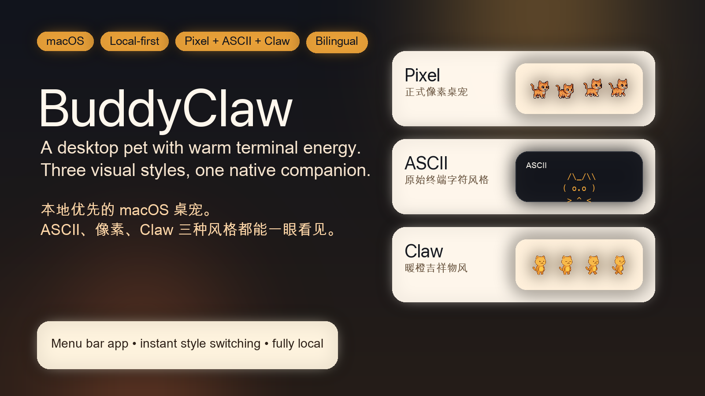
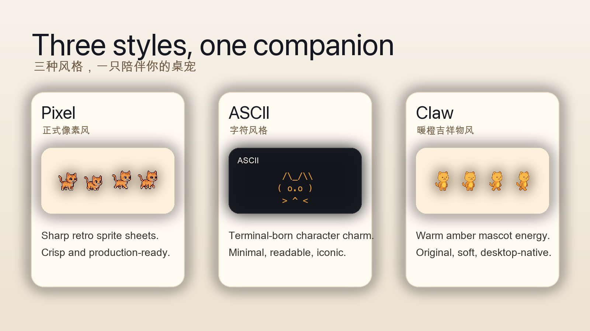
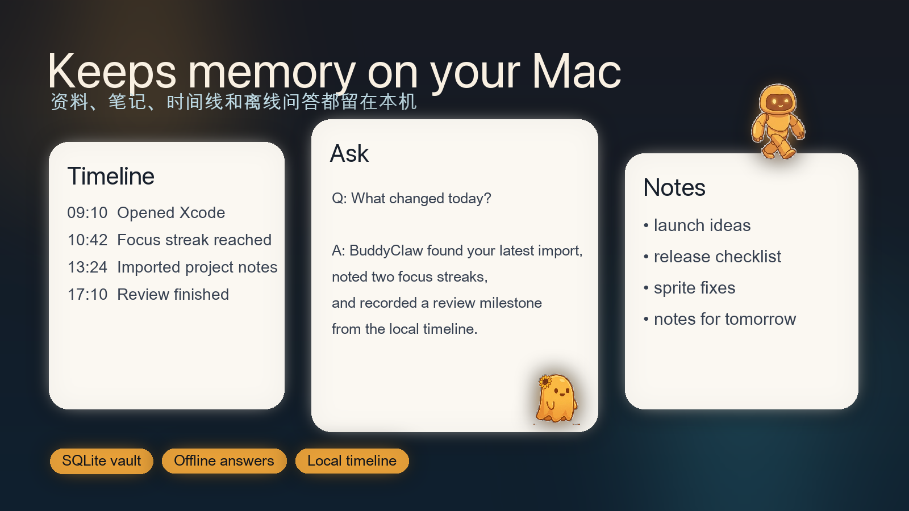
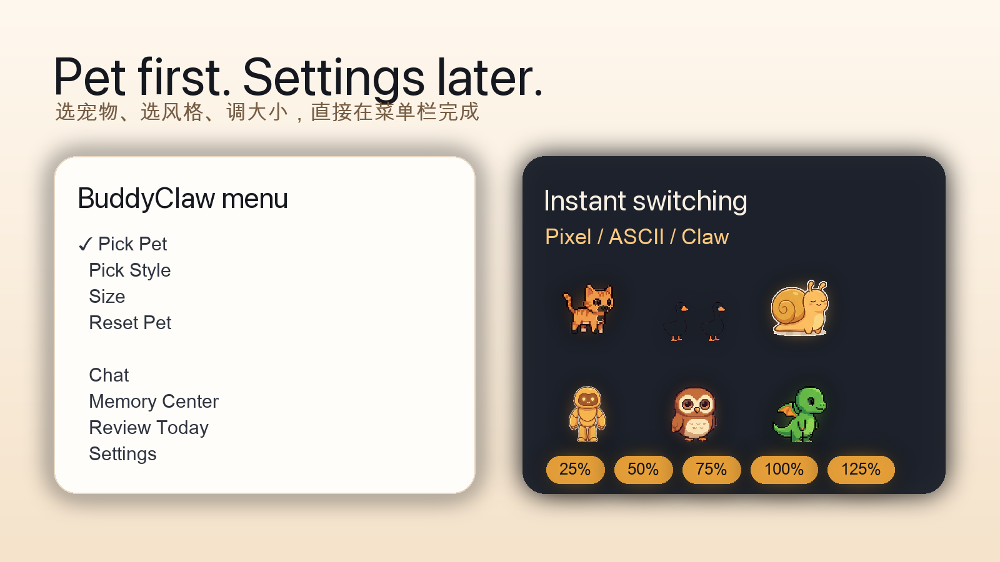
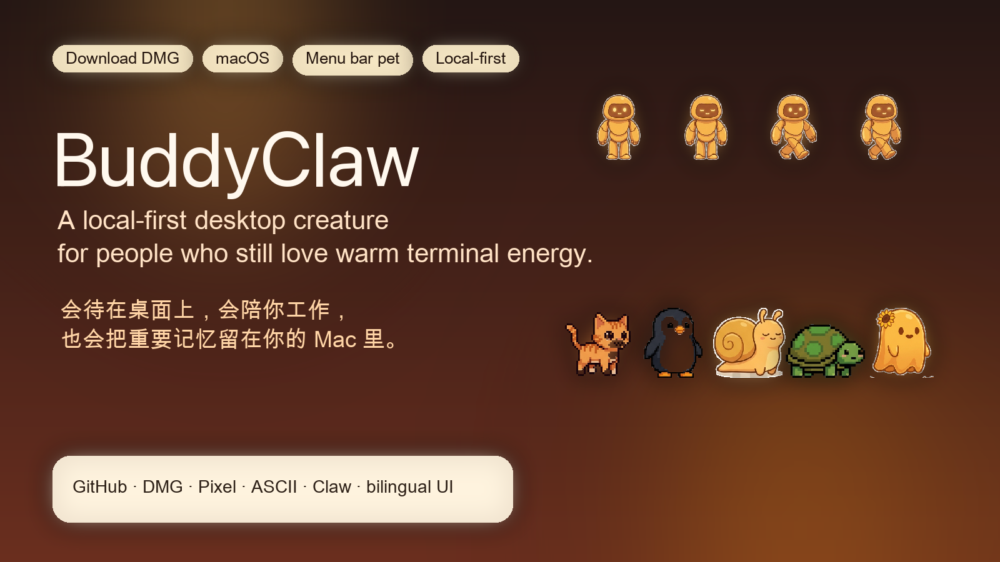

# BuddyClaw



BuddyClaw is a local-first macOS desktop pet that lives in your menu bar, walks on your desktop, remembers what matters on-device, and stays playful instead of pretending to be a cloud chatbot.

BuddyClaw 是一个本地优先的 macOS 菜单栏桌宠。它会待在你的桌面上、陪着你工作、把记忆留在本机里，并且首先是一只“好玩、有性格、愿意常驻”的宠物，而不是伪装成云端聊天窗口。

**Tags:** `macOS` `desktop pet` `local-first` `SwiftUI` `menu bar app` `pixel art` `ASCII art` `offline memory` `bilingual`

[Direct DMG Download](https://github.com/StartripAI/buddyClaw/raw/main/downloads/BuddyClaw.dmg) · [Latest Releases](https://github.com/StartripAI/buddyClaw/releases/latest) · [All Releases](https://github.com/StartripAI/buddyClaw/releases) · [Source Code](https://github.com/StartripAI/buddyClaw)

## GitHub About

**Description**

Local-first bilingual macOS desktop pet with Pixel, ASCII, and Claw styles, menu bar controls, and on-device memory.

**Topics**

`macos`, `desktop-pet`, `swift`, `swiftui`, `menu-bar-app`, `local-first`, `offline-first`, `pixel-art`, `ascii-art`, `companion-app`

## Why BuddyClaw

- Local-first by default: notes, imports, event memory, and offline extractive answers stay on your Mac.
- Fast menu-bar controls: switch pet, style, and size instantly without opening a settings maze.
- Three-style architecture: `Pixel`, `ASCII`, and `Claw`.
- Native desktop feel: menu bar app, floating pet window, speech bubbles, quick reactions, and zero fake cloud mystique.
- Built for people who smile at a certain warm terminal coding companion and want that feeling reborn as its own desktop-native creature.

## What Ships Today

- `Pixel` style is the formal production look.
- `ASCII` style is built in and always available.
- `Claw` style is fully wired in the product architecture and UI; it becomes selectable the moment its dedicated sprite pack lands.
- `Memory Center` lets you import local content, write manual notes, ask offline questions, and review the local timeline.
- System-following bilingual UI: Chinese on Chinese systems, English on English systems.

## At A Glance









## Feature Highlights

### 1. A desktop pet first

BuddyClaw puts the pet experience first:

- pick a pet directly from the menu bar
- switch style instantly
- change size in one click
- reset the current pet without deleting files

### 2. Local memory, not fake cloud magic

BuddyClaw keeps a local SQLite memory vault for:

- imported Markdown, TXT, JSON, and BuddyPack files
- manual notes
- event memories such as app switches, focus milestones, petting, reviews, and offline questions
- daily summaries

Answers are extractive and source-backed. If the app cannot find enough support locally, it says so clearly.

### 3. Three-style product lane

- `Pixel`: crisp sprite-sheet production assets
- `ASCII`: code-rendered fallback with real product entry points restored
- `Claw`: dedicated style lane reserved for a warm orange/yellow mascot aesthetic that quietly tips its hat to a beloved terminal-era vibe without becoming derivative

## Download

The fastest path is the direct DMG stored in the repository, with GitHub Releases reserved for signed/notarized publishing flows.

- Download [BuddyClaw.dmg](https://github.com/StartripAI/buddyClaw/raw/main/downloads/BuddyClaw.dmg)
- Or open [Releases](https://github.com/StartripAI/buddyClaw/releases)
- Drag `BuddyClaw.app` into `Applications`

## Build From Source

### Requirements

- macOS 14+
- Xcode

### Build

```bash
DEVELOPER_DIR=/Applications/Xcode.app/Contents/Developer xcrun swift build
```

### Test

```bash
DEVELOPER_DIR=/Applications/Xcode.app/Contents/Developer xcrun swift test
```

### Local Release Dry Run

```bash
./scripts/release_buddyclaw.sh --codesign-identity - --output-dir ./dist/local --skip-notarize
```

## Product Notes

- BuddyClaw is a menu-bar accessory app, so it does not show in the Dock by default.
- The app validates production pixel sprites before release.
- Release bundles keep runtime assets only and strip authoring docs/scripts from the shipped app.
- `ClawSprites` can be added later without changing the product architecture again.

---

# 中文说明

## BuddyClaw 是什么

BuddyClaw 是一只本地优先的 macOS 桌宠：

- 常驻菜单栏
- 在桌面上悬浮和移动
- 有自己的名字、个性和宠物形态
- 支持本地记忆中心
- 支持离线抽取式问答
- 支持快速切换宠物、风格和大小

它不是“把聊天框塞进桌面”的产品，而是一只真正围绕陪伴感来设计的原生桌宠。

## 这版的核心卖点

- 本地优先：资料、笔记、时间线记忆都保存在本机
- 桌宠优先：菜单栏第一层就是 `选宠物 / 选风格 / 大小 / 重置宠物`
- 双语优先：系统是中文就显示中文，系统是英文就显示英文
- 成品优先：支持 release 打包、DMG 输出、资源校验

## 当前风格系统

- `像素 Pixel`
  现在的正式生产风格，桌宠运行时默认使用它

- `ASCII`
  代码渲染版本已经恢复为正式可选入口，不再是隐藏 fallback

- `Claw`
  风格通路、菜单和设置入口都已经就位；等专属素材包放入后即可直接启用

## 记忆中心能做什么

记忆中心不是主入口，但它保留下来，适合长期使用：

- 导入 Markdown / TXT / JSON / BuddyPack
- 写手动笔记
- 查看时间线事件
- 回顾今天
- 做离线本地问答

BuddyClaw 会明确告诉你回答是否来自本地命中，而不会假装自己是云端模型。

## 安装方式

- 直接下载 [BuddyClaw.dmg](https://github.com/StartripAI/buddyClaw/raw/main/downloads/BuddyClaw.dmg)
- 或进入 [Releases](https://github.com/StartripAI/buddyClaw/releases)
- 将 `BuddyClaw.app` 拖入 `Applications`

## 从源码运行

构建：

```bash
DEVELOPER_DIR=/Applications/Xcode.app/Contents/Developer xcrun swift build
```

测试：

```bash
DEVELOPER_DIR=/Applications/Xcode.app/Contents/Developer xcrun swift test
```

本地打包：

```bash
./scripts/release_buddyclaw.sh --codesign-identity - --output-dir ./dist/local --skip-notarize
```

## 一个小小的气质说明

如果你也喜欢某种温暖、偏橙色、带点终端气质的编码伙伴氛围，BuddyClaw 会让你看出那一点点熟悉感。  
但它最终想成为的，是一只真正属于自己世界观的本地桌宠。
