# DesktopBuddy — macOS 桌面 AI 伙伴宠物技术设计

## Part 1：技术架构设计

### 1.1 技术栈选择与论证

#### 最低系统版本：macOS 14.0 Sonoma

选择理由：

1. 这是你给定的硬约束。
2. 这能让工程直接围绕现代 AppKit / SwiftUI / Swift Concurrency 写法组织，不用为了旧系统兼容加大量分支。
3. `NSWindow.CollectionBehavior`、多 Space 悬浮、全屏辅助窗口、菜单栏应用、`URLSession` 并发流式读写，在 Sonoma 上的行为最可控。
4. 这类“桌面宠物”应用本质上依赖系统窗口层级、多 Space 行为、AppKit/SwiftUI 混编，而不是 iOS 式单场景模型；越新的桌面系统越值得优先优化。

#### Swift 版本、Xcode 版本

- **语言基线**：Swift 5.9+  
- **推荐开发基线**：Xcode 16+  
- **工程风格**：保持 Swift 5.9 语法兼容，不依赖 Swift 6-only 特性

为什么这样定：

- 你的约束是 Swift 5.9+，所以我把代码写在 Swift 5.9 能覆盖的风格范围内。
- 由于 Apple 的分发工具链会持续前移，真正发版时应使用当期可提交的最新版 Xcode；但工程本身不绑死某个“最新 beta 特性”。
- 这让团队既能在今天开发，也能在上架前平滑升级构建工具链。

#### SwiftUI 还是 AppKit？

**最终选择：混合架构（AppKit 为壳，SwiftUI 为内容）**

原因：

- **AppKit 负责**  
  - 透明无边框窗口  
  - 窗口层级与 Space 行为  
  - 菜单栏图标 `NSStatusItem`  
  - 前台应用观察  
  - 全局输入监测  
  - 真实桌面悬浮与定位
- **SwiftUI 负责**  
  - 设置面板  
  - 气泡 UI  
  - 宠物组合视图  
  - 未来主题皮肤、配色与偏好表单

为什么不是纯 SwiftUI：

- 纯 SwiftUI 很适合“窗口里的界面”，不适合“像系统浮层一样”的桌面宠物壳层。
- 宠物窗口需要精细控制 `NSWindow` 行为，而这些都属于 AppKit 的强项。
- 最佳实践是：**Windowing / shell 用 AppKit，content 用 SwiftUI**。

#### 动画引擎选择

| 方案 | 优点 | 缺点 | 结论 |
|---|---|---|---|
| SpriteKit | 天然适合 2D 帧动画、粒子、图层管理 | 对“极轻量单宠物 overlay”来说稍重；与透明桌面壳层整合不如直接 AppKit/SwiftUI 轻 | 可作为 V2 |
| Core Animation + 手写帧切换 | 轻、直接、与 AppKit 贴合、最容易做 deterministic 状态机 | 需要自己管帧序列和状态 | **V1 最优** |
| Metal | 性能极强 | 明显过度设计 | 不选 |
| Lottie | 适合矢量角色动效 | 不适合像素表、换帽子/眼睛/稀有度 runtime 组合 | 不选 |
| HEVC 透明视频 | 视觉高级，适合预渲染 | 不可交互，不适合换装、换眼、稀有粒子、状态机 | 不选 |

**最终选择：Core Animation 思路 + 自定义 spritesheet / ASCII fallback 帧动画器**

理由：

1. 这个应用同时要做“透明 overlay 窗口”与“像素帧动画”；窗口壳层已经是 AppKit，继续用轻量自定义动画器最顺。
2. 需要 runtime 组合帽子、眼睛、稀有闪光、状态机切换；自己控帧比用视频和 Lottie 更自然。
3. V1 只有一只宠物，不需要 SpriteKit 的场景图复杂度。
4. 等 V2 加粒子、技能特效、迷你道具、拖拽交互时，再评估 SpriteKit 值不值得整体迁移。

#### AI 对话后端

**最终选择：Claude API 为主，保留本地 LLM Provider 扩展位**

为什么不是纯本地：

- 桌面宠物的“人格感”来自更强的语言质量、短句控制、语气稳定性和上下文一致性。
- 初版产品最重要的是“人格体验”，不是“完全离线”。

为什么不是只做单一远端死耦合：

- 用户未来可能希望接 Ollama / llama.cpp。
- 因此架构上应该抽象成：
  - `ConversationManager`
  - `ClaudeAPIClient`
  - 未来 `LocalLLMProvider`

**V1 实装**：Claude API  
**V2 扩展**：本地模型 fallback / 切换

#### 数据持久化

**最终选择：Application Support 下 JSON 文件 + Keychain**

组合方式：

- `settings.json`
- `companion.json`
- `growth.json`
- `conversation.json`
- API key 放 Keychain

为什么不用 Core Data：

- 现在的数据模型很小、结构稳定、关系简单。
- 宠物状态、成长值、对话历史并不需要复杂查询。
- JSON 更透明，调试和迁移都更舒服。

为什么不用 UserDefaults 做全部：

- UserDefaults 适合“小量偏好”，不适合完整对话历史和成长状态。
- JSON 文件更适合审计和备份。

#### 网络层

**最终选择：原生 URLSession + async/await + AsyncBytes 流式读取**

理由：

- Anthropic 流式响应本质上是 SSE，`URLSession.bytes(for:)` 足够直接。
- 避免引入 Alamofire 这类额外依赖。
- 原生并发与 macOS app 生命周期更贴合。

#### 自动更新

**最终选择：Sparkle（直接分发场景）**

原因：

- 对原生 macOS 桌面工具，这是最成熟的自动更新方案之一。
- 适合菜单栏 / Dockless / direct distribution 形态。
- 支持 appcast、增量更新、标准用户更新 UI。

#### 分发方式

**最终建议：直接分发 `.dmg` 为主，后续可补 Homebrew Cask；不把 Mac App Store 作为首发主路径**

原因：

1. 这是一个“菜单栏 + 桌面 overlay + 工作状态观察”的工具型 app，direct distribution 更灵活。
2. Sparkle 能直接把发布、更新链路打通。
3. Homebrew Cask 适合面向开发者传播。
4. Mac App Store 不是不能做，但首发阶段会把窗口行为、权限说明、上架审核都变得更重。

---

### 1.2 系统架构图

```mermaid
graph TD
    subgraph AppShell["App Shell / AppKit"]
        A["DesktopBuddyApp.swift"]
        B["AppCoordinator.swift"]
        C["OverlayWindow.swift"]
        D["WindowManager.swift"]
        E["DockPositionTracker.swift"]
        F["MenuBarManager.swift"]
    end

    subgraph UISwiftUI["UI / SwiftUI"]
        G["PetOverlayView.swift"]
        H["SpeechBubbleView.swift"]
        I["SettingsView.swift"]
    end

    subgraph CompanionCore["Companion Core"]
        J["CompanionModel.swift"]
        K["CompanionGenerator.swift"]
        L["SpriteDefinitions.swift"]
        M["AnimationState.swift"]
        N["IdleSequencer.swift"]
        O["SpriteAnimator.swift"]
        P["HeartBurstEffect.swift"]
        Q["EvolutionStage.swift"]
        R["GrowthTracker.swift"]
    end

    subgraph Intelligence["AI & Behavior"]
        S["CompanionPromptBuilder.swift"]
        T["ClaudeAPIClient.swift"]
        U["ConversationManager.swift"]
        V["SoulGenerator.swift"]
        W["WorkStateObserver.swift"]
        X["ReactiveComment.swift"]
    end

    subgraph Persistence["Persistence"]
        Y["StorageManager.swift"]
        Z["KeychainManager.swift"]
    end

    subgraph External["External"]
        AA["Anthropic Messages API"]
        AB["macOS Accessibility / App Activity"]
        AC["Sparkle"]
    end

    A --> B
    B --> C
    B --> D
    B --> F
    B --> Y
    B --> R
    B --> W
    B --> X
    B --> U
    B --> V
    B --> O

    D --> C
    D --> E
    D --> G
    G --> H
    I --> B

    O --> L
    O --> M
    O --> N
    O --> P
    K --> J
    V --> S
    U --> S
    U --> T
    W --> AB
    T --> AA
    B --> AC

    Y --> Z
    Y --> J
    Y --> Q
```

#### 模块边界说明

- **AppKit 层**：真正处理桌面窗口、Space、菜单栏、系统观察
- **SwiftUI 层**：只负责视图内容和设置表单
- **Companion Core**：宠物生成、动画、成长、渲染
- **AI & Behavior**：人格提示词、流式对话、主动评论
- **Persistence**：状态存储与密钥安全

---

### 1.3 目录结构

```text
DesktopBuddy/
├── Package.swift                      # Swift Package 定义与 Sparkle 依赖
├── Info.plist                         # 应用基础配置，含 LSUIElement 等关键键
├── README.md                          # 构建与运行说明
├── TechnicalDesign.md                 # 详细技术设计文档
├── AllCode.md                         # 所有代码文件的完整拼接版
├── Sources/
│   └── DesktopBuddy/
│       ├── App/
│       │   ├── DesktopBuddyApp.swift  # 应用入口与 NSApplication 生命周期
│       │   ├── AppCoordinator.swift   # 全局装配、依赖注入与业务编排
│       │   └── AppStateStore.swift    # 内存态单一数据源，供 UI/服务共享
│       ├── Models/
│       │   ├── CompanionModel.swift   # 稀有度、物种、眼睛、帽子、设置等基础模型
│       │   ├── EvolutionStage.swift   # 进化阶段与成长状态
│       │   └── ReactiveComment.swift  # 主动评论规则引擎与决策结构
│       ├── Windows/
│       │   ├── OverlayWindow.swift    # 透明无边框桌面宠物窗口
│       │   ├── DockPositionTracker.swift # 基于 visibleFrame 推断 Dock 侧与轨道
│       │   └── WindowManager.swift    # 窗口创建、定位、漂浮与移动管理
│       ├── Companion/
│       │   ├── CompanionGenerator.swift # Mulberry32 + hash 确定性生成器
│       │   └── SpriteDefinitions.swift  # 18 个物种 ASCII 帧定义与渲染函数
│       ├── Animation/
│       │   ├── AnimationState.swift   # 动画状态与转换基础
│       │   ├── IdleSequencer.swift    # IDLE_SEQUENCE 心跳序列
│       │   ├── HeartBurstEffect.swift # 抚摸爱心粒子
│       │   └── SpriteAnimator.swift   # 帧切换、ASCII fallback、spritesheet 接口
│       ├── AI/
│       │   ├── ClaudeAPIClient.swift  # Anthropic Messages API 流式客户端
│       │   ├── CompanionPromptBuilder.swift # 灵魂提示词与对话系统提示
│       │   ├── SoulGenerator.swift    # 首次孵化时生成名字与个性
│       │   └── ConversationManager.swift # 对话历史与上下文裁剪
│       ├── UI/
│       │   ├── PetOverlayView.swift   # 宠物主视图，组合精灵、爱心与气泡
│       │   ├── SpeechBubbleView.swift # 语音气泡视图
│       │   └── SettingsView.swift     # 设置面板
│       ├── Services/
│       │   ├── KeychainManager.swift  # API Key 安全存储
│       │   ├── StorageManager.swift   # JSON 状态持久化
│       │   ├── SpeechBubbleManager.swift # 气泡显示队列与渐隐控制
│       │   ├── GrowthTracker.swift    # XP 累积与成长推进
│       │   ├── WorkStateObserver.swift # 前台 app、键盘活跃度、build fail 观察
│       │   └── MenuBarManager.swift   # 菜单栏图标与菜单动作
│       └── Resources/
│           ├── Spritesheets/
│           │   └── README.md          # 后续设计师 spritesheet 放置说明
│           └── Sounds/
│               └── README.md          # 后续音效资源放置说明
└── Tests/
    └── DesktopBuddyTests/
        └── CompanionGeneratorTests.swift # 生成算法确定性单测
```

---

### 1.4 核心模块设计

## 1) 窗口系统

### 模块职责

- 创建桌面宠物透明窗口
- 让窗口跨 Space 可见
- 与 Dock、可视区域、全屏窗口共存
- 承载 SwiftUI 宠物视图
- 定时移动宠物

### 类图

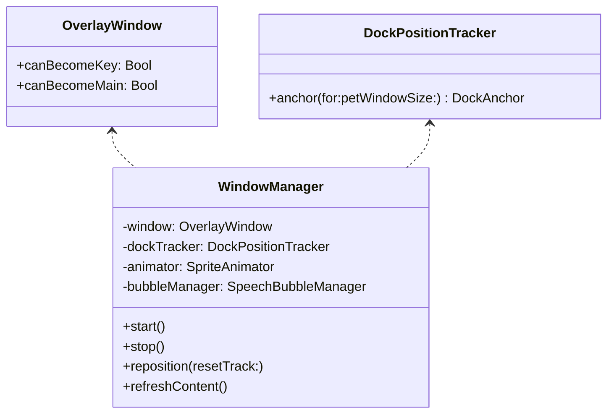

### 核心方法签名

```swift
public final class OverlayWindow: NSWindow {
    public override var canBecomeKey: Bool { false }
    public override var canBecomeMain: Bool { false }
    public init(contentRect: NSRect)
}

@MainActor
public final class DockPositionTracker {
    public func anchor(for screen: NSScreen, petWindowSize: CGSize) -> DockAnchor
}

@MainActor
public final class WindowManager {
    public func start()
    public func stop()
    public func reposition(resetTrack: Bool)
    public func refreshContent()
}
```

### 状态图

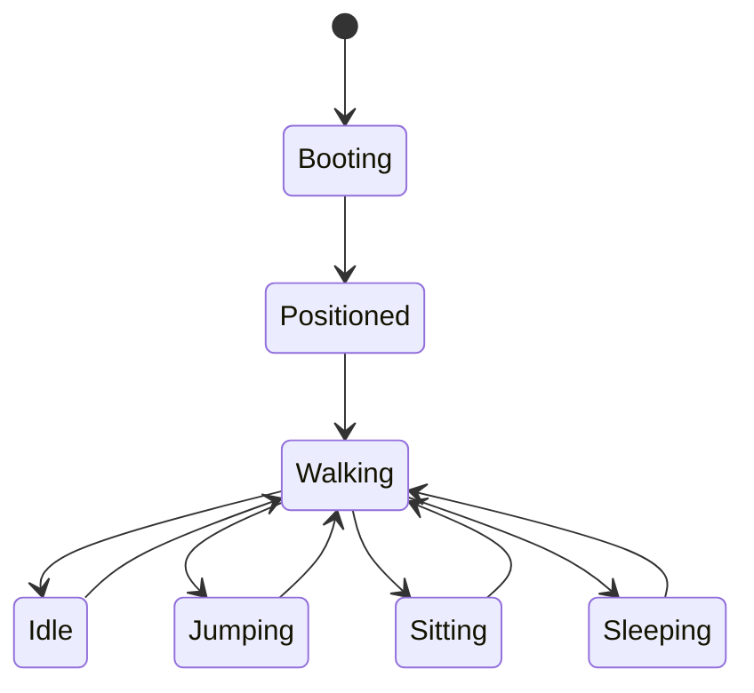

### 设计决策

- 窗口固定透明无边框，不出现在 Dock。
- `WindowManager` 管“壳”；`PetOverlayView` 管“里面显示什么”。
- Dock 在底部时走横向轨道；Dock 在左右时退化成贴边驻留。
- 初版只保留一只宠物窗口；未来支持多宠物时，引入 `OverlayWindowPool` 即可。

---

## 2) 精灵动画引擎

### 模块职责

- 统一管理 idle / walk / sit / sleep / jump / pet / talk / evolve / blink
- 支持 ASCII fallback
- 预留 spritesheet PNG 裁切路径
- 以轻量状态机取代重型 2D 引擎

### 协议/结构图

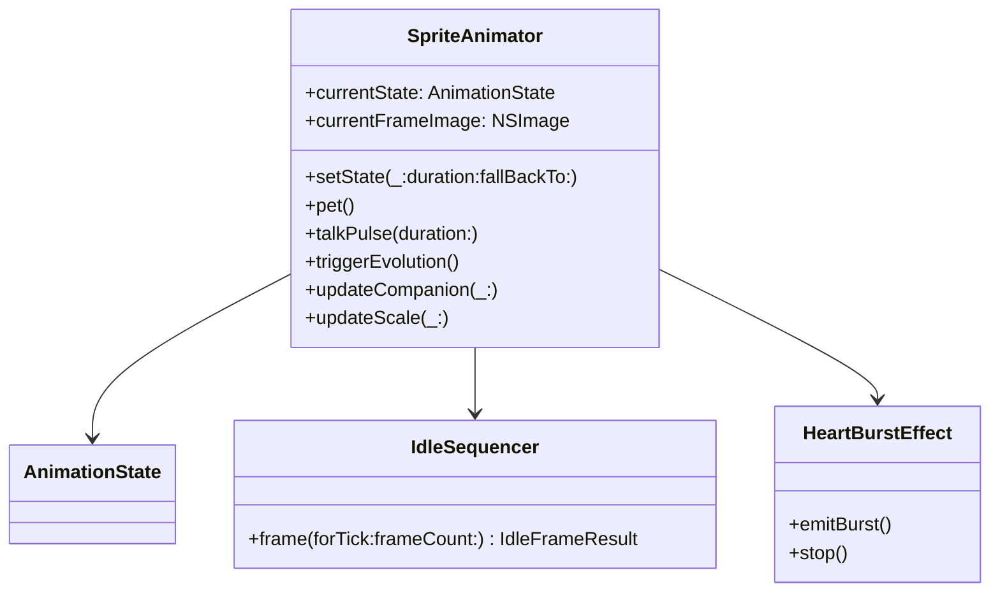

### 核心方法签名

```swift
public final class SpriteAnimator: ObservableObject {
    public func setState(
        _ state: AnimationState,
        duration: TimeInterval? = nil,
        fallBackTo fallbackState: AnimationState = .idle
    )
    public func pet()
    public func talkPulse(duration: TimeInterval = 1.2)
    public func triggerEvolution()
    public func updateCompanion(_ companion: Companion)
    public func updateScale(_ scale: Double)
}
```

### 状态图

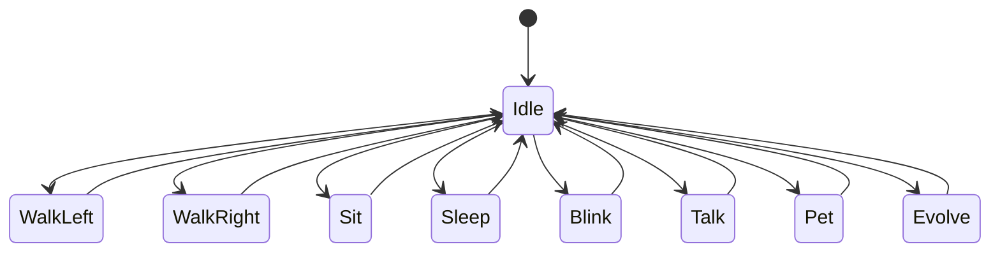

### 设计细节

- `IdleSequencer` 直接复刻 Claude buddy 的 `IDLE_SEQUENCE`。
- `HeartBurstEffect` 把原来终端里的爱心飘动逻辑改成 SwiftUI overlay 粒子。
- `SpriteAnimator` 当前优先渲染 ASCII，等设计师输出 PNG 后可无缝走 spritesheet。
- 一切“要不要进入某动作”都由外层（`WindowManager` / `AppCoordinator`）触发，动画器本身只做“状态渲染”。

---

## 3) 宠物生成系统

### 目标

把 Claude buddy 的“确定性骨骼 + 持久化灵魂”完整移植到 Swift。

### 数据图

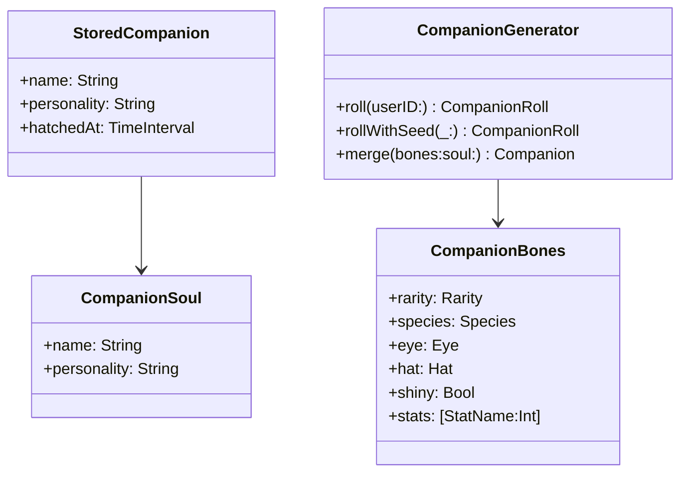

### 核心方法签名

```swift
public final class CompanionGenerator: Sendable {
    public static let salt = "friend-2026-401"
    public func roll(userID: String) -> CompanionRoll
    public func rollWithSeed(_ seed: String) -> CompanionRoll
    public func stableUserIdentifier(settings: DesktopBuddySettings) -> String
    public func merge(bones: CompanionBones, soul: StoredCompanion) -> Companion
}
```

### 流程

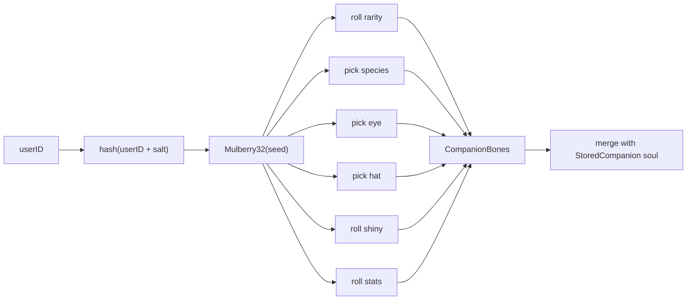

### 关键原则

- **骨骼不落盘**：稀有度、物种、眼睛、帽子、闪光、属性都不持久化。
- **灵魂落盘**：名字、个性、孵化时间存 `StoredCompanion`。
- **反作弊**：用户改 JSON 也伪造不了传奇稀有度。

---

## 4) AI 对话系统

### 模块职责

- 维护上下文
- 为宠物注入个性提示词
- 调 Anthropic Messages API 流式输出
- 把 delta 一边收到一边写进气泡
- 首次孵化时生成名字和个性

### 类图

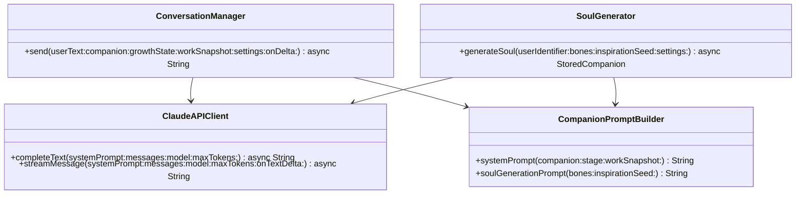

### 核心方法签名

```swift
public final class ClaudeAPIClient {
    public func streamMessage(
        systemPrompt: String,
        messages: [ClaudeRequestMessage],
        model: String,
        maxTokens: Int,
        onTextDelta: @escaping @MainActor (String) -> Void
    ) async throws -> String
}

public final class ConversationManager {
    public func send(
        userText: String,
        companion: Companion,
        growthState: GrowthState,
        workSnapshot: WorkSnapshot?,
        settings: DesktopBuddySettings,
        onDelta: @escaping @MainActor (String) -> Void
    ) async throws -> String
}
```

### 状态图

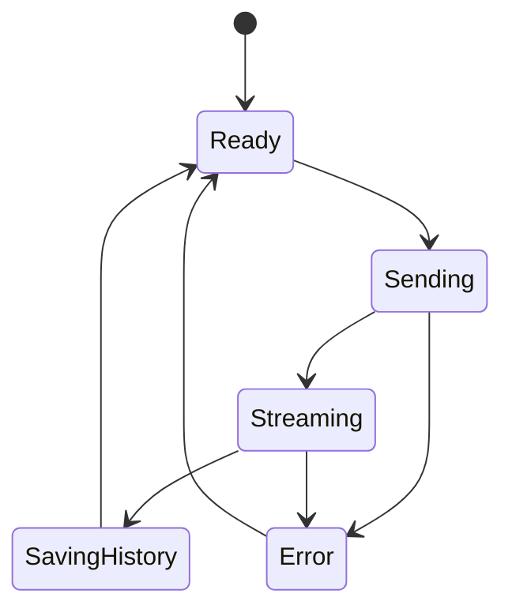

### 设计重点

- `ConversationManager` 只处理“会话”。
- `ClaudeAPIClient` 只处理“HTTP + SSE”。
- `CompanionPromptBuilder` 只处理“人格注入”。
- `SoulGenerator` 只处理“孵化灵魂”。

这四者职责拆开后，未来接 Ollama 只需要新写本地 provider，而不用动 prompt、历史裁剪、UI 流式更新。

---

## 5) 工作状态观察器

### 目标

让宠物“看起来像在陪你工作”，但避免越界装作真的看到了屏幕内容。

### 观测信号

- 前台 app 变化
- 键盘活跃度
- 鼠标/滚轮活跃度
- session 持续时长
- 连续 coding 时长
- app 切换频次
- 对 Xcode 的 best-effort build fail 线索

### 类图

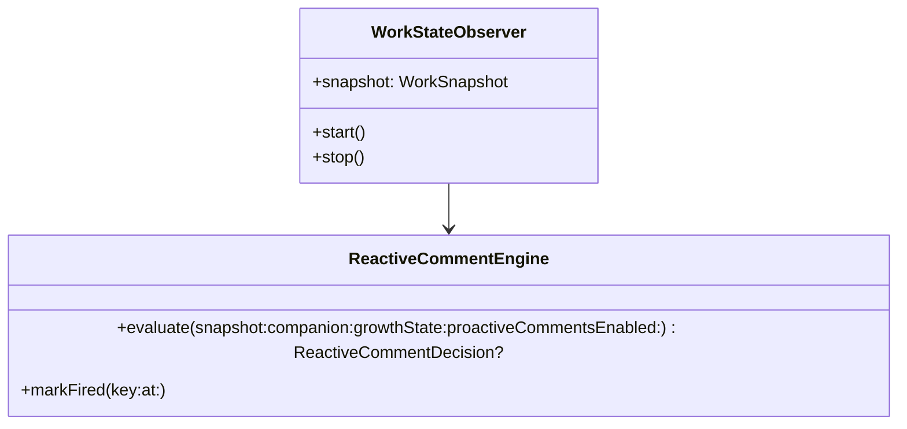

### 核心方法签名

```swift
@MainActor
public final class WorkStateObserver: ObservableObject {
    public var snapshotHandler: (@MainActor (WorkSnapshot) -> Void)?
    public func start()
    public func stop()
    public static func isCoding(bundleIdentifier: String) -> Bool
}
```

### 状态图

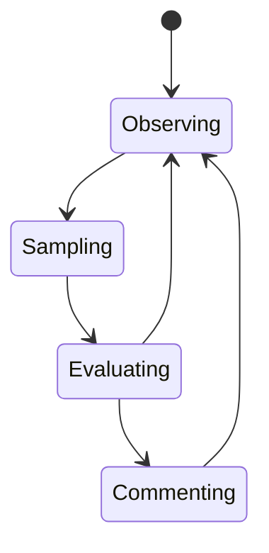

### 设计边界

- 不读你的代码正文。
- 不读屏幕内容。
- 只基于系统级节奏信号做推断。
- 任何“安慰 build 失败”的逻辑都必须写成 **best-effort**，而不是假装确定知道发生了什么。

---

## 6) 成长 / 进化系统

### 模块职责

- 记录 active minutes
- 记录对话次数
- 记录 pet 次数
- 累积 XP
- 判定进化阶段
- 解锁动作

### 类图

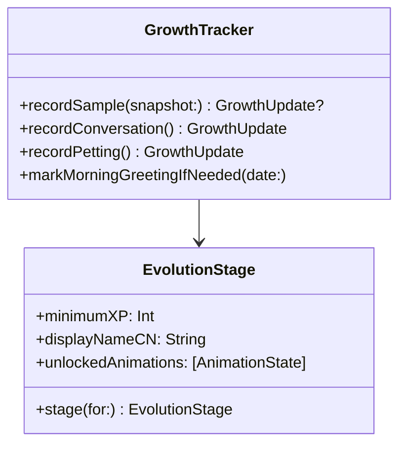

### XP 规则（V1）

- 活跃 1 分钟：+1 XP
- 活跃且在 coding app：+2 XP
- 一次对话：+8 XP
- 一次抚摸：+2 XP

### 阶段定义

| 阶段 | XP 阈值 | 含义 | 解锁 |
|---|---:|---|---|
| hatchling | 0 | 刚出生 | idle / blink / talk |
| curious | 80 | 开始主动回应 | sit / pet |
| trusted | 240 | 熟悉你的节奏 | walk / jump |
| radiant | 560 | 陪伴感变强 | sleep |
| transcendent | 1080 | 旗舰形态 | 全动作 |

---

## 7) 语音气泡 UI

### 模块职责

- 队列显示
- 支持 streaming
- 渐隐
- 自动消失
- 不抢焦点

### 结构图

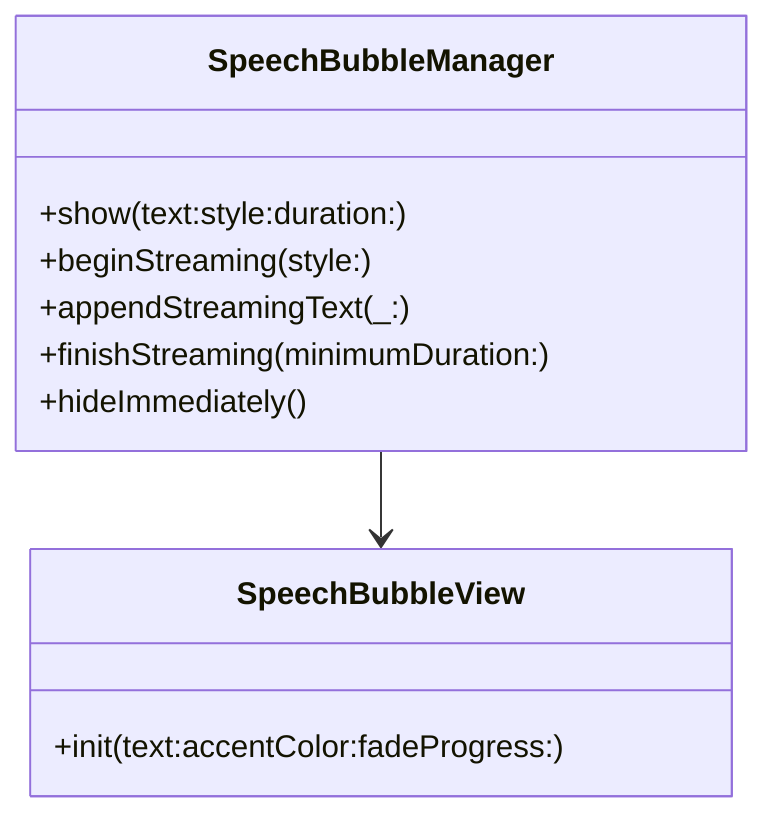

### 行为逻辑

- 普通提示：进队列，显示 4~10 秒
- 流式回复：先 `beginStreaming()`，每个 delta `appendStreamingText()`，结束后 `finishStreaming()`
- `fadeProgress` 驱动缩放与透明变化
- 支持 reaction / system / thought / speech 四类风格语义

### 状态图

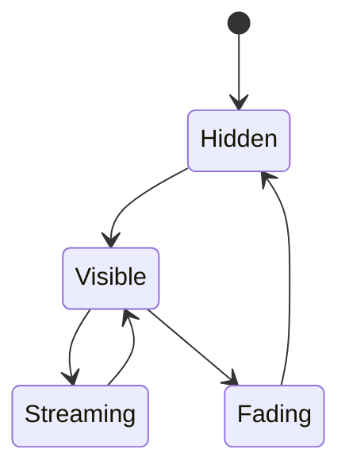

---

## 8) 设置面板

### 内容范围

- Anthropic API Key
- 模型名
- 气泡时长
- 宠物缩放
- 是否静音
- 是否启用主动评论
- 是否启用移动
- 主题
- 用户种子覆盖

### 为什么放 SwiftUI

- 表单密集，SwiftUI 比 AppKit 更快
- 主题、绑定、Picker、Slider 都更省代码
- 通过 `NSHostingController` 直接嵌入 AppKit window 即可

---

## 9) 菜单栏图标

### 模块职责

- 提供 app 唯一可见入口
- 打开聊天
- 打开设置
- 静音开关
- 检查更新
- 退出

### 核心签名

```swift
@MainActor
public final class MenuBarManager: NSObject {
    public var onTalk: (() -> Void)?
    public var onOpenSettings: (() -> Void)?
    public var onToggleMute: ((Bool) -> Void)?
    public var onCheckForUpdates: (() -> Void)?
    public var onQuit: (() -> Void)?
    public func refresh()
}
```

---

## Part 2：完整可执行代码

本部分已在以下两个产物中完整提供：

1. **源码工程目录**：`Sources/DesktopBuddy/...`
2. **全文拼接版**：`AllCode.md`

说明：

- 所有你要求的关键文件都已创建。
- 额外补了 `AppCoordinator.swift`、`AppStateStore.swift`、`KeychainManager.swift` 等配套文件，保证工程具备可运行的完整骨架。
- 当前版本已经内置 **ASCII fallback 渲染**，所以即便还没有设计师交付 PNG spritesheet，也能先跑起来。

---

## Part 3：像素精灵设计规范

### 3.1 Spritesheet 格式规范

#### 推荐单帧尺寸：**64 × 64**

为什么不是 32 × 32：

1. 32 × 32 在非 Retina 时代很经典，但在 Retina 桌面上过于容易显得“细节不够”。
2. 你这只宠物还有帽子、眼睛、稀有闪光、睡觉、说话等状态，64 × 64 更能留出头顶留白和表情空间。
3. 64 × 64 仍然足够小，不会失去“像素宠物”的味道。

**建议工作流**：

- 设计师可以在 **32 × 32 的真实像素网格** 上创作
- 最终导出到 **64 × 64 逻辑格**，按 nearest-neighbor 放大 2x
- 引擎统一按 64 × 64 单元裁切

#### 帧布局

推荐每行一个状态：

| Row | 状态 | 帧数 |
|---:|---|---:|
| 0 | idle | 4 |
| 1 | walk_right | 6 |
| 2 | walk_left | 6 |
| 3 | sit | 2 |
| 4 | sleep | 3 |
| 5 | jump | 4 |
| 6 | talk | 3 |
| 7 | pet_reaction | 4 |
| 8 | evolve | 8 |
| 9 | blink | 2 |

#### 命名规范

- `duck.png`
- `cat.png`
- `robot.png`

统一按物种命名，后续如需皮肤：

- `duck_default.png`
- `duck_legendary.png`

#### 调色板约束（按稀有度）

| 稀有度 | 主色倾向 | 点缀色 |
|---|---|---|
| common | 灰蓝、米白、雾绿 | 少量深灰 |
| uncommon | 清绿、薄荷、浅青 | 柔黄 |
| rare | 蓝、青蓝、月白 | 冰光 |
| epic | 紫、洋红紫、午夜蓝 | 粉紫 |
| legendary | 金、琥珀、暖白 | 少量流光青 |

建议统一约束：

- 单角色主体颜色不超过 6~8 个
- 帽子单独 2~4 色
- 闪光粒子不要超过 2 色
- 阴影尽量用同色系更深值，而不是纯黑

---

### 3.2 必需动画状态与帧数

| 状态 | 帧数 | 说明 |
|---|---:|---|
| idle | 4 | 主循环，轻呼吸/轻晃动 |
| walk_left | 6 | 向左走 |
| walk_right | 6 | 向右走 |
| sit | 2 | 坐下停顿 |
| sleep | 3 | 睡眠 + Zzz |
| jump | 4 | 起跳 / 最高点 / 下落 / 落地 |
| talk | 3 | 嘴巴开合或身体微震 |
| pet_reaction | 4 | 被摸后的开心摇摆 |
| evolve | 8 | 发光、抖动、闪现 |
| blink | 2 | 快速眨眼 |

---

### 3.3 最适合像素化的 8 个物种

从 Claude 原始 18 个物种里，最适合做第一版像素美术的 8 个：

1. **Duck（鸭子）**  
   关键词：圆嘴、摇摆、轻快、邻家感

2. **Cat（猫）**  
   关键词：尖耳、尾巴、傲娇、桌边守护

3. **Dragon（小龙）**  
   关键词：角、翅膀、幼龙感、史诗进化

4. **Penguin（企鹅）**  
   关键词：短胖、摆动、冷静、治愈

5. **Ghost（幽灵）**  
   关键词：漂浮、软边、夜间形态、梦境

6. **Robot（机器人）**  
   关键词：像素眼、机械嘴、赛博、工作搭子

7. **Rabbit（兔子）**  
   关键词：长耳、弹跳、轻盈、友好

8. **Mushroom（蘑菇）**  
   关键词：帽檐、点点、森林、成长感

#### 为什么先不选的几个

- **snail / turtle**：很可爱，但动态表现容易过慢，V1 宠物“桌边活泼感”偏弱  
- **cactus**：轮廓强，但表情和肢体变化空间较窄  
- **blob / chonk**：很适合做彩蛋或隐藏皮肤，但首发主角辨识度略弱  
- **axolotl / capybara**：很潮，但需要更好的头部与鳃/五官像素设计，留到 V1.5 更稳

---

## Part 4：音效设计清单

### 必需音效

1. **出生 / 孵化**
   - 关键词：轻亮、像素魔法、柔和弹出
   - 时长：0.8 ~ 1.5 秒

2. **点击 / 唤醒**
   - 关键词：轻脆、短促、可重复
   - 时长：0.08 ~ 0.2 秒

3. **说话气泡弹出**
   - 关键词：pop、软弹、空气感
   - 时长：0.1 ~ 0.25 秒

4. **抚摸**
   - 关键词：心动、绵软、奖励反馈
   - 时长：0.15 ~ 0.35 秒

5. **进化**
   - 关键词：上扬、发光、成就感
   - 时长：1.2 ~ 2.0 秒

6. **系统通知 / 主动评论**
   - 关键词：不打扰、轻提醒、非警报
   - 时长：0.1 ~ 0.25 秒

### 建议附加音效

- 睡觉呼噜小循环
- 小跳跃落地
- 稀有闪光出现
- 菜单栏开合点击
- 设置保存成功

---

## Part 5：第一版里程碑计划

### MVP（2~3 周）

目标：把“它真的住在桌面上”跑起来。

功能范围：

- 菜单栏应用启动
- 隐藏 Dock 图标
- 透明宠物窗口
- 所有 Space 可见
- Claude buddy 确定性生成
- ASCII fallback 动画
- 点击抚摸
- 双击对话
- Claude 流式回复
- Keychain 存 API Key
- JSON 持久化
- 基础设置面板

### V1.0（4~6 周）

目标：从 demo 升级到可以长期陪伴的产品。

功能范围：

- 设计师正式 spritesheet 接入
- 更完整状态机（睡觉、跳跃、进化）
- 成长系统可见化
- 主动评论规则更稳定
- Sparkle 自动更新
- 更好的窗口轨道和边缘行为
- 轻量音效系统
- 首次孵化体验优化

### V2.0（6~10 周）

目标：真正成为“有灵魂的桌面 AI 伙伴”。

功能范围：

- 多模型切换（Claude / Ollama）
- 更强工作状态洞察
- 宠物道具 / 房间 / 收集
- 多宠物 / 家族系统
- 长期记忆摘要
- 语音输入输出
- 高级粒子特效 / 昼夜模式
- 社区皮肤与稀有皮肤系统

---

## 实施建议总结

### 我建议你按这条顺序推进

1. 先把 **确定性生成 + 透明窗口 + 菜单栏** 跑通  
2. 再接 **Claude 流式对话 + 气泡**  
3. 再接 **工作状态观察 + 主动评论**  
4. 然后换掉 ASCII，为 8 个首发物种做正式像素图  
5. 最后再做进化、音效、Sparkle、分发

### 为什么这样排

因为这个产品的核心不是“功能列表堆满”，而是三件事：

- 住在桌面上
- 像个有性格的生命
- 在对的时机说对的话

只要这三件事成立，它就已经不是装饰，而是一个真正的 AI 伙伴。
